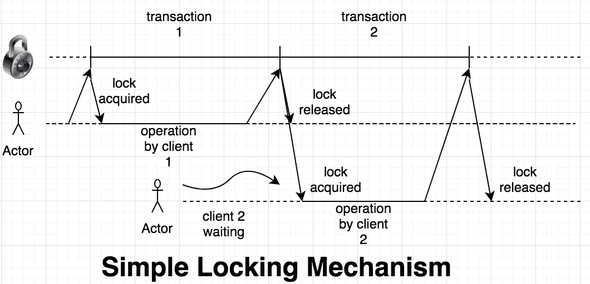

# 用 Redis 和 Python 实现分布式锁

> 原文：<https://medium.com/geekculture/distributed-lock-implementation-with-redis-and-python-22ae932e10ee?source=collection_archive---------12----------------------->

当我们开始水平扩展应用程序时，我们可能会遇到一个需要分布式锁定的问题。

在这篇文章中，我将向您展示如何基于 Redis 和 python 逐步实现分布式锁。

# 最简单的锁

在 Redis 中构建一个基本正确的锁很容易。它包括三个步骤: