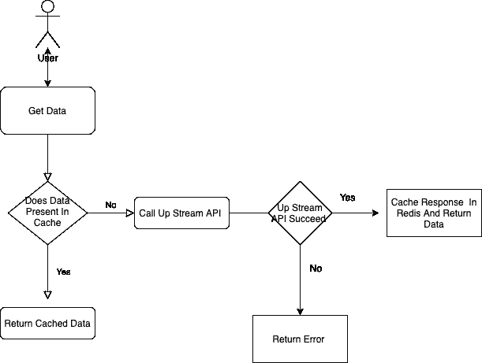
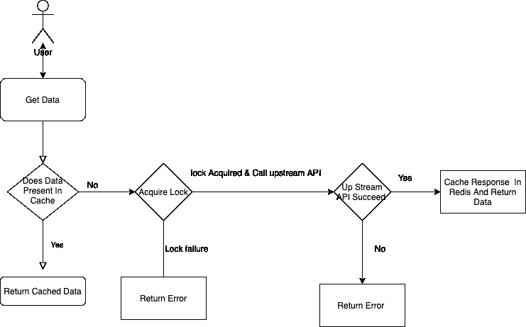

# 使用 Redis 和 Java 的分布式锁

> 原文：<https://medium.com/geekculture/distributed-lock-using-redis-and-java-29072b90e0bb?source=collection_archive---------5----------------------->

#Photo by [FLY:D](https://unsplash.com/@flyd2069?utm_source=unsplash&utm_medium=referral&utm_content=creditCopyText) on [Unsplash](https://unsplash.com/s/photos/lock?utm_source=unsplash&utm_medium=referral&utm_content=creditCopyText)

去年，我有机会研究分布式锁定。通过分布式锁定，我们解决了从多个服务实例刷新 Redis 缓存的问题。

让我们首先讨论我们缓存了什么，以及多个实例是如何试图同时重新加载缓存的。

我们的微服务充当中间件，从多个第三方服务获取数据，并将这些数据转换为我们自己的 json 合同，并将其传递给我们的移动应用程序。

因此，为了避免重复的网络调用并减少延迟，我们决定缓存不经常改变的主数据，使用固定的 TTL。这是我们在缓存之前的缓存流程。

Cache without distributed locking

这种方法有一个问题。因为我们的服务有多个运行在云中的节点，而且我们的服务是水平扩展的。当多个用户请求尝试同时访问相同的数据时，如果 Redis 中不存在缓存，则每个服务节点将尝试重新加载缓存。由于这个问题，我们向上游服务器发送了大量流量，导致 **429“请求过多”。**

因此，为了解决这个问题，我们在缓存工作流中添加了分布式锁定解决方案。其中每个请求将在重新加载/刷新高速缓存之前尝试获取锁。如果任何请求已经获得锁，那么传入的请求将返回错误。我们没有添加重试或等待未能获得锁的请求。我们只是因为错误而失败了。因为我们不想在缓存工作流中增加更多的复杂性，所以由于锁定失败而失败的请求总数与我们的总流量相比非常少。所以我们只是忽略了重审和等待。

引入分布式锁定后的缓存工作流。

Cache with lock

## 我们如何用 Redis 实现简单的锁定。

我们用简单的例子来理解一下。

*   假设一个客户机请求试图访问宏数据。
*   请求将检查数据是否存在于缓存中，如果缓存中有数据，则请求将返回数据
*   如果缓存不存在，那么请求将通过简单地在 Redis 中添加一个额外的键来获得锁，锁持续时间为 TTL。比如锁定持续时间为 30 秒的 MACROS_LOCK。
*   缓存流将调用上游 API，在 Redis 中缓存响应，并删除我们在上一步中添加的锁定键(MACROS_LOCK)以释放锁定。
*   同时，如果任何其他请求到来并试图重新加载缓存，则请求将检查是否有任何其他请求已经获得锁，如果已经获得锁，则请求将返回错误。

## 获取锁

我们已经使用 Redis **的“SET LOCK _ KEY DUMMY _ VALUE NX EX”locking duration”“**命令来获取锁。

让我们深入研究 Redis 命令的细节。

**带有 NX 和 EX 选项的 Redis Set 命令可用于实现简单的分布式锁定。** Set 命令一般用于在 Redis 中添加键值。让我们看看我们用来实现锁的 Set 选项。

`**EX**` ***秒* -设置指定的过期时间，以秒为单位**

`**NX**` **-仅在密钥不存在时设置密钥。**

*   **NX 选项**
    如果我们在 **NX** 选项为真的情况下执行 Set 命令，那么 Redis 将设置密钥并返回 **OK** ，前提是该缓存密钥尚未出现在 Redis 中。
*   **EX 选项**
    Ex 选项用于以秒为单位传递锁定持续时间。我们的锁将在我们用 EX 选项指定的秒后自动释放

让我们从缓存锁定的角度来看这个 Set 命令。在刷新/重新加载缓存之前，每个请求将尝试使用 **EX 和 NX** 选项**在 Redis 中添加带有虚拟值的锁密钥。**

Acquired lock sample code

如果请求从 Redis 获得了 **OK** 响应，则请求已成功获得锁，并可以刷新缓存。如果请求从 Redis 得到的响应是 **NIL** ,那么这意味着一些其他的请求已经获得了锁，请求将会失败并出现错误。

## **释放获得的锁**

释放获取的锁是非常简单的请求，只需删除为获取锁而添加的锁密钥。如果请求刷新缓存所用的时间超过了锁的持续时间，那么当锁密钥 TTL 过期时，Redis 将自动释放锁。

Release acquired lock sample code

这就是我们如何实现分布式锁定来解决 **429“请求太多”的问题。**

快乐编码..！！