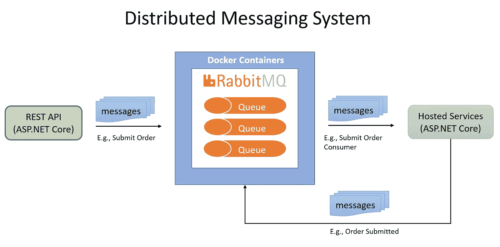

# 分布式消息传递系统——作为消息生产者在 REST API 中发布消息

> 原文：<https://medium.com/geekculture/distributed-messaging-system-publish-messages-in-rest-api-as-a-message-producer-7f8816e1cc33?source=collection_archive---------9----------------------->

## 讨论如何使用带有 ASP.NET 核心的 REST API 向分布式消息传递系统添加消息生产者，以及如何使用 RabbitMQ 向消息代理发布消息。

What Will Be Built (System Diagram by Author)

## 目标