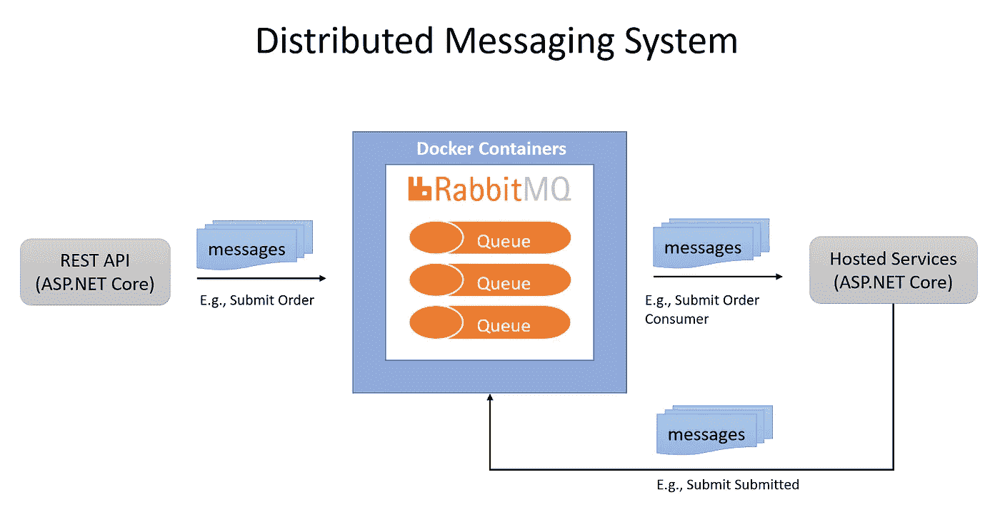

# 分布式消息传递系统—在 ASP.NET 核心中用 Docker 设置消费者和 RabbitMQ

> 原文：<https://medium.com/geekculture/distributed-messaging-system-setup-consumers-and-rabbitmq-with-docker-in-asp-net-core-6133ce666268?source=collection_archive---------6----------------------->

## 讨论如何快速建立一个分布式消息传递系统，包括消费者和 RabbitMQ 与 Docker 在 ASP.NET 核心，希望在不到一个小时。

What Will Be Built (System Diagram by Author)

## 背景