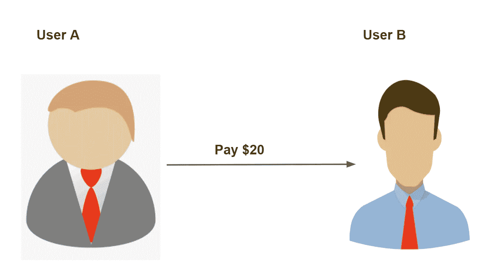
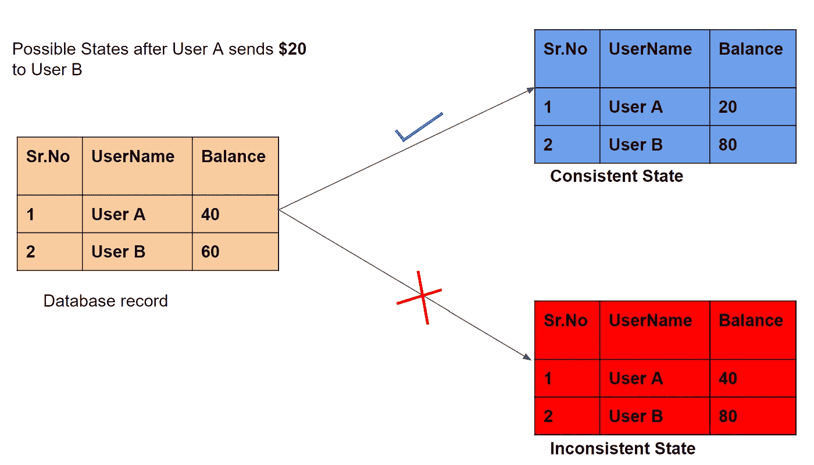
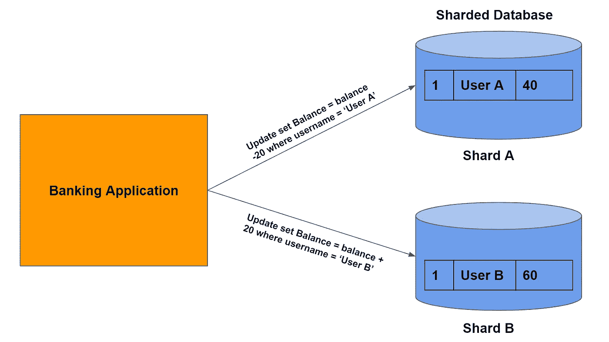
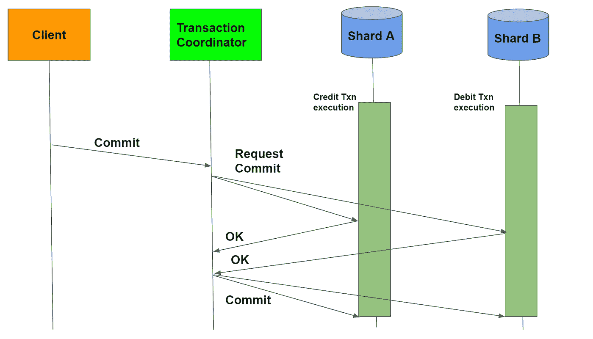
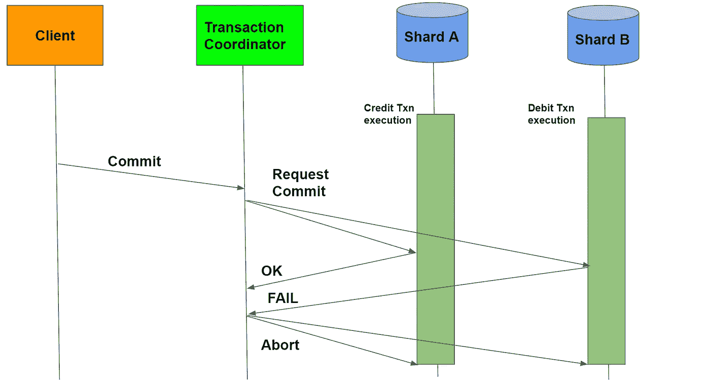

# 分布式事务和两阶段提交

> 原文：<https://medium.com/geekculture/distributed-transactions-two-phase-commit-c82752d69324?source=collection_archive---------1----------------------->

## 剖析两阶段提交


**Disk**

# 介绍

在当今世界，数据正以惊人的速度增长。企业已经构建了创新的解决方案来处理海量数据。数据分布在许多机器或数据库中并不罕见。这种技术被称为' ***分片*** '，有助于构建可扩展的&可靠系统。

科技公司也在采用微服务架构。在这种类型的架构中，每个微服务管理自己的数据库。为了在不同的数据库中添加或修改数据，它调用负责的微服务。

在多台机器上分发数据会带来一系列挑战。单片非分片系统的数据管理非常简单。Postgres、MySQL 等关系数据库。提供现成的 A.C.I.D 属性。

这不适用于分片数据库或分布在微服务中的数据。在本文中，我们将了解处理分布式事务时的原子性。我们将了解一个称为两阶段提交的协议，它可以帮助我们实现同样的目标。那么，我们开始吧。

# 整体系统和非分片数据库

让我们举一个简单的整体银行应用程序的例子。该系统与管理多个表的单个数据库服务器进行交互。假设数据库正在管理用户的余额。该应用程序负责处理用户的银行交易。

当用户`A`向用户`B`转账时，我们需要确保以下事项:-

1.  如果交易成功，系统必须贷记用户`B's`账户&借记用户`A's`账户
2.  事务完成后，数据库服务器可能会崩溃。然而，它必须回到崩溃前的状态
3.  交易失败可能有多种原因。例如:-用户`A` 可能没有足够的余额。在这种情况下，两个用户的帐户都不应该更新
4.  事务完成后，数据库需要处于一致的状态。例如:-用户`B`不应该在用户`A` 没有获得借记的情况下获得贷记



**Transaction of 20$**



**Possible states after the transaction**

如果你用关系数据库，它会保证以上四点。关系数据库使用事务来实现同样的目的。事务是一种抽象&它封装了一个工作单元。事务保证数据库中的原子性。因此，要么所有操作都成功完成，要么都不执行。

简而言之，事务是数据库可以执行的一组 SQL 语句。数据库执行每个 SQL 语句。如果出现故障，它将中止事务。当事务中止时，底层数据不会发生任何变化。从状态的角度来看，这相当于不执行任何语句。

如果所有语句都执行了，则提交事务。一旦事务被提交，底层数据就被修改和持久化。

对于上面的示例，数据库事务将由以下语句组成:

```
**Begin****update set balance = balance + 20 where user = ‘B’;****update set balance = balance - 20 where user = ‘A’;****Commit**
```

假设用户`A`和`B`的初始余额分别为 40 $ & 60。以下是执行上述交易的可能性:-

*   **成功**——在这种情况下，事务将被提交。用户`A's`的余额将是 20 美元&用户`B's`的余额将是 80 美元。如果数据库在此之后崩溃，它将在恢复后回到相同的状态。
*   **失败** -如果在更新用户`A's`余额时出现失败，数据库将中止交易。它将回滚所有的更改。用户的余额不会受到影响。

# 分割银行数据库

我们现在决定扩展我们的数据库，以满足不断增长的客户。数据分布在多个数据库服务器上。因此，用户 A 和用户 B 的数据库记录可能位于不同的碎片中。



**Sharded Database**

在分片数据库的情况下，我们还能保证原子性吗？不，因为只有一个数据库服务器保证原子性。在处理许多数据库服务器时，应用程序有责任使事务原子化。我们将看到我们需要解决哪些不同的错误场景。

我们将不得不在两台独立的服务器上执行这两个 SQL 查询。如果任何一个 SQL 查询失败，都会导致不一致的状态。我们希望防止这种不一致的状态。

我们必须确保事务要么成功完成，要么失败。我们不想让事务中途处于不一致的状态。两阶段提交使得分布式事务本质上是原子的。

# 两阶段提交

我们现在来看看 2 阶段协议的工作原理。我们引入一个名为`Transaction Coordinator`的新实体。这个实体编排事务的提交部分。管理单个事务的其他服务器被称为`Participants`。

在我们的例子中，我们有两个事务`Txn Credit` & `Txn Debit`。`Txn Credit`分别运行于`Shard A` & `Txn Debit`运行于`Shard B`。客户端启动两个事务，并将它们发送给两个碎片。下图说明了这一过程。两个数据库服务器都开始执行事务。


**Client submits both the transactions**

稍后，客户端向`Transaction Coordinator`发送提交消息。事务提交现在被`Transaction Coordinator`分成两个阶段。

在第一阶段，消息被发送到所有的参与服务器。每个服务器都必须用一个`OK`或`FAIL`消息来响应这个消息。如果能够成功执行交易，服务器会回复一个`OK`。如果在执行过程中出现任何错误，将返回一条`FAIL`消息。例如:-如果在借记交易中账户余额为负。

`Transaction Coordinator`等待所有服务器的响应。一旦收到响应，它将决定提交或中止事务。这成为提交的第二阶段。只有当每个服务器都回复了一个`OK`消息时，事务才会被提交。如果至少有一个服务器以`FAIL`消息响应，事务将被中止。

下图显示了每个服务器回复一条`OK`消息的情况。每隔一个服务器从协调器接收一个提交，事务就成功了。



**Commit Txn after receiving OK from both the servers**

在`FAIL`消息的情况下，`Transaction Coordinator`向所有参与者发送中止消息。因此，参与者回滚各个事务。



**Rollback the transaction in case of failure**

上述过程确保了分布式事务的原子性。事务要么在所有服务器上提交，要么在所有服务器上回滚。但是，它不会中途处于不一致的状态。不会出现一个账户被贷记而另一个账户没有被借记的情况，反之亦然。

# 两阶段提交的缺点

我们现在将探讨两阶段提交的缺点。以下是在分布式系统中使用 2-PC 的主要缺点

*   **延迟:**正如我们看到的，事务协调器等待来自所有参与服务器的响应。只有这样，它才能继续第二阶段的提交。这增加了等待时间，并且客户端可能会经历执行缓慢。因此，2-PC 不是性能关键型应用的理想选择。
*   **事务协调器:**事务协调器有时会成为单点故障。事务协调器可能会在向所有参与者发送提交消息之前关闭。在这种情况下，在参与者上运行的所有事务都将处于阻塞状态。只有当协调器出现时，它们才会提交&发送提交信号。
*   **参与者依赖:**慢热的参与者会影响其他参与者的表现。总事务时间与最慢的服务器所用的时间成正比。如果事务在一台服务器上失败，它必须在所有其他服务器上回滚。这可能导致资源浪费。

使用 Saga 模式可以克服 2PC 的所有上述缺点。Saga 模式依赖于最终的一致性来处理分布式事务。我们将在另一篇博文中探讨这种模式。

# 参考

*   [在微服务中处理分布式事务](http://Handling Distributed Transactions in the Microservice world | by Sohan Ganapathy | The Startup | Medium)
*   [分布式交易](https://timilearning.com/posts/mit-6.824/lecture-12-distributed-transactions/)
*   [麻省理工学院讲座——分布式交易](https://www.youtube.com/watch?v=aDp99WDIM_4)
*   [封面图片](https://unsplash.com/images/stock/png)
*   [传奇&微服务](https://microservices.io/patterns/data/saga.html)