# 使用配置、方案和设置捆绑包为多台服务器分发可配置的 iOS 应用程序

> 原文：<https://medium.com/geekculture/distributing-configurable-ios-app-for-multiple-servers-using-configurations-schemes-and-settings-2e48460df18?source=collection_archive---------21----------------------->

几乎每个应用程序都指向一个服务器来获取一些信息，并处理这些信息，以用户友好的方式显示出来。每个应用程序在进入应用商店之前都需要通过一系列验证。对于测试，QA 团队在那里，他们可能会请求构建指向不同的服务器(如登台、生产/发布)。

# **QA 需要在不同服务器上测试怎么办？**

开发人员可能在 Swift 代码库中保留了一个变量，该变量指向一个服务器。当需要给定指向不同服务器的构建时，他们更新该变量，并且仅改变一个变量就重新构建整个应用程序，并且分发指向特定服务器的多个构建。

# **有什么方法可以避免创建多个构建吗？**

如果我们允许我们的 QA 团队成员在一个构建中指定他们想要的任何服务器，会怎么样？是的，周围有工作。我们可以使用设置包来实现。我们将显示不同的服务器列表，QA 可以选择所需的服务器。在选择时，我们会将我们的应用指向该服务器。

**但是，我们不希望将这个设置捆绑包发送给最终用户/客户。对吗？**

是的，当我们将应用程序发送到 app store 时，我们需要删除此设置捆绑包。会处理好的。

# 准备项目

现在，让我们试着创建一个示例项目，并看看我们是如何实现的。创建一个新的演示项目，比如 DemoApp。

我们需要在项目中添加一些配置。对于每台服务器，我们将添加一个配置文件。此外，除了特定于每台服务器的配置之外，我们还需要一个特定于构建的配置文件，以使用户能够指向任何服务器。

**如何添加配置设置文件？**

选择文件→新建→文件。选择 iOS 模板**配置设置文件。**

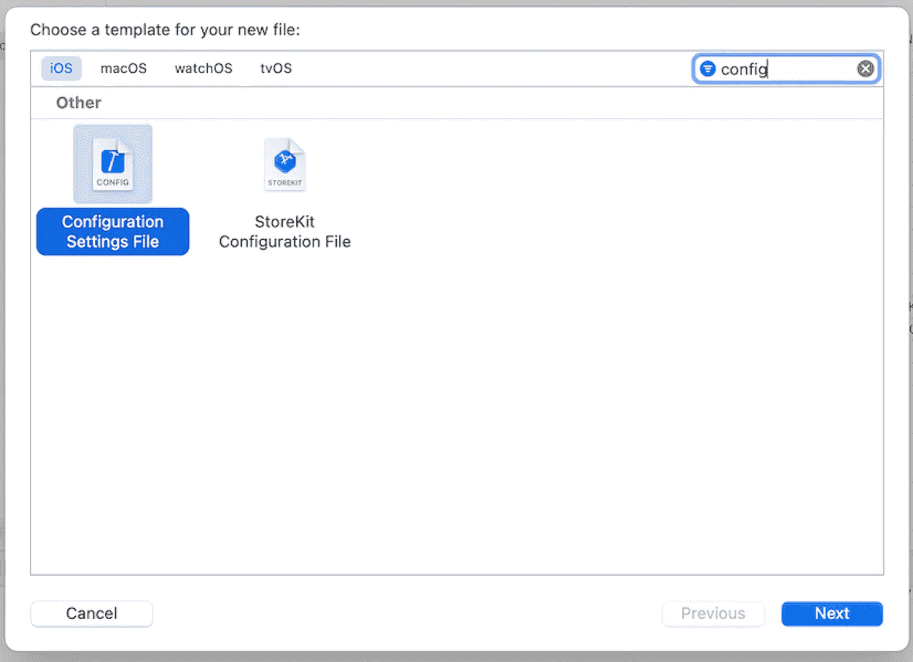

Xcode Config

按下 Next 并将配置文件命名为 **Staging。**(特定于暂存服务器)。类似地，创建更多的配置文件，比如说**开发**，**发布，可配置**。在每个配置文件中，添加一个变量，比如说 **APP_ENVIRONMENT** ，它有一个特定于每个配置的唯一值。请注意，没有必要在目标包中添加 xcconfig 文件。

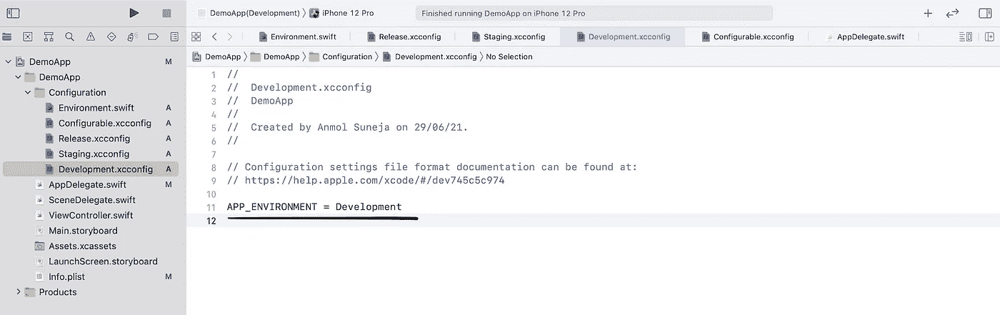

ConfigurationParameter

如您所见，参考上面的快照，我创建了四个配置，每个配置都有一个变量 **APP_ENVIRONMENT** ，该变量具有特定于每个配置的唯一值。

```
1\. Development.xcconfig having APP_ENVIRONMENT = Development2\. Staging.xcconfig having APP_ENVIRONMENT = Staging3\. Release.xcconfig having APP_ENVIRONMENT = Release4\. Configurable.xcconfig having APP_ENVIRONMENT = Configurable
```

在 Info.plist 文件中添加相同的变量以在代码中回读。

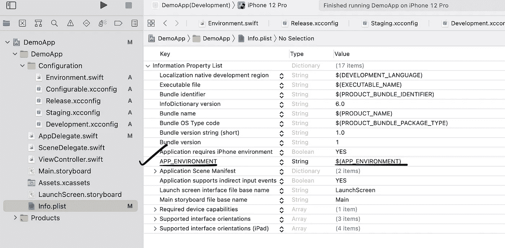

UniqueParameterInfoPlist

我们有 xcconfig 文件，现在将它们分配给项目中的配置。

从左侧菜单面板中选择项目，然后选择项目。在信息选项卡下，您会看到两个默认配置**调试**和**发布**。按+并为每个配置文件添加一对专用的配置。(配对意味着一个通过复制调试配置，一个通过复制发布配置)。

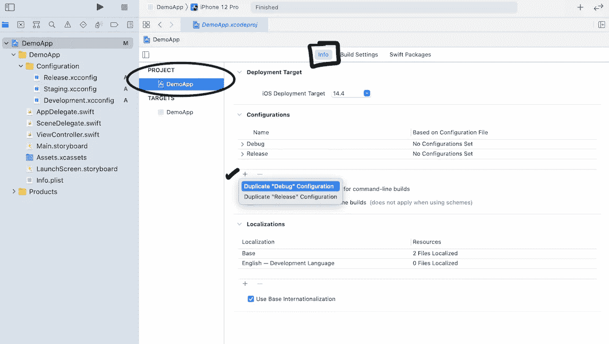

根据需要重命名配置。假设我们有以下配置:

```
1\. Debug and Release : Specific to release server2\. DebugDevelopment and ReleaseDevelopment : Specific to development server3\. DebugStaging and ReleaseStaging : Specific to staging server4\. DebugConfigurable and ReleaseConfigurable : Specific to configurable server. Means which user can configure using settings of app
```

你有没有注意到**没有配置设置？**在上图快照中。我们需要将 xcconfig 分配给配置。通过单击小箭头打开配置，并将 xcconfig 设置为每个特定的配置，如下图所示:

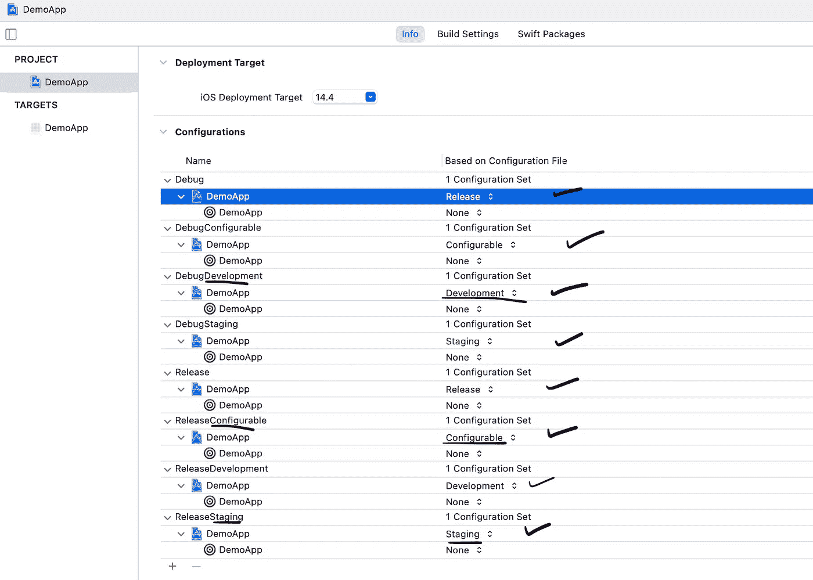

注意暂存 xcconfig 被分配给暂存配置(**调试暂存**和**释放暂存**)。类似地，其他 xcconfig 被分配给它们特定的配置。

到目前为止，我们已经创建了配置，并将具有变量 APP_ENVIRONMENT 的相关 xcconfig 分配给相关配置。**接下来是什么？**

# 为每个配置创建方案..！！

选择显示在运行/播放按钮旁边的演示应用方案，然后选择编辑方案。

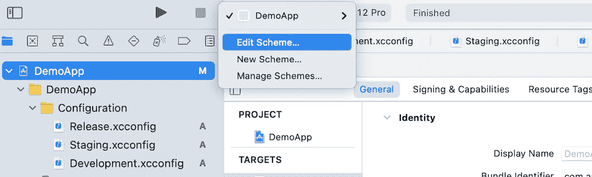

请参见选择重复方案，并为该重复方案命名，例如 DemoApp(登台)。

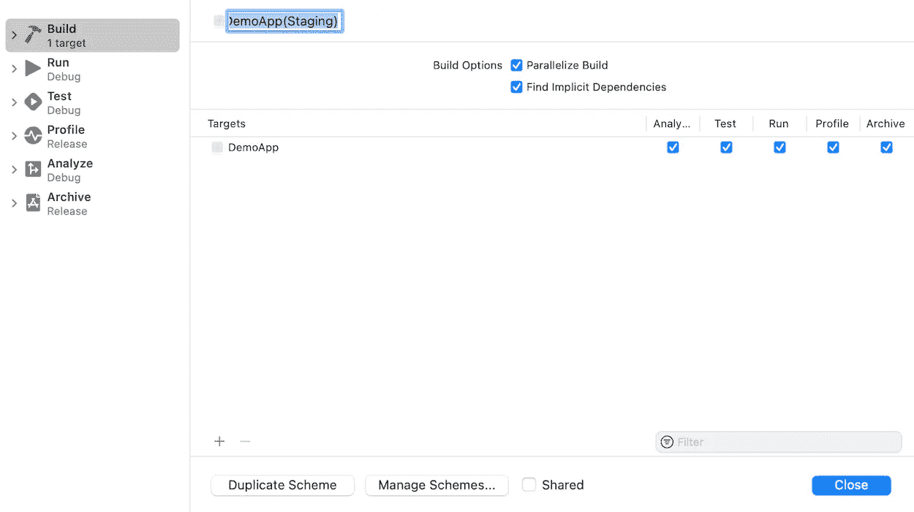

类似地，针对每个配置创建更多的方案。如果选择管理方案，您将看到所有创建的方案。请确保**共享**复选标记被标记，如下图所示:

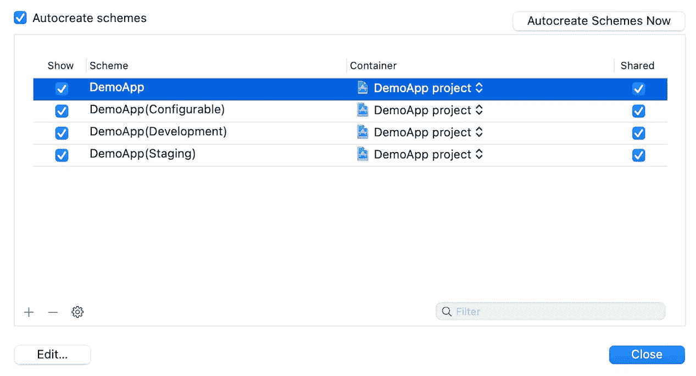

现在，编辑每个方案，并为调试和归档部分分配适当的构建配置。与 **staging** 方案一样，**归档**构建配置应该使用**发布 Staging** 配置，**运行**构建配置应该使用**调试 Staging** 配置，如下图所示:

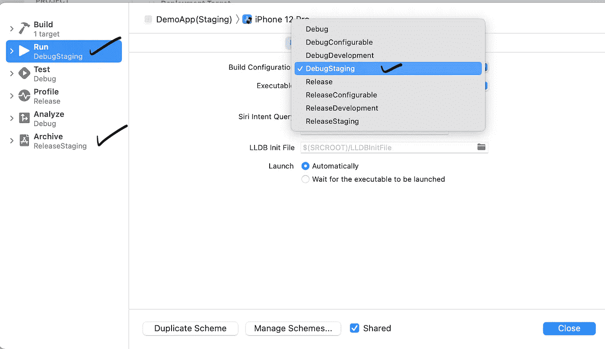

一切都设置好了，现在我们需要在代码中读取 APP_ENVIRONMENT 变量。让我们在项目中添加一个环境文件。

用以下代码更新应用程序委托:

现在，当您使用不同的配置在调试模式下运行应用程序时，您将获得不同的 **APP_ENVIRONMENT** 值，从而能够使用上述代码在应用程序中设置特定的服务器基本 url。

尝试运行应用程序，在控制台上，你应该看到不同的服务器不同配置的基本网址。例如:对于演示应用程序(登台),控制台上会显示以下内容:

```
**The app base url is: https://anmol.com/staging**
```

请注意，如果您正在使用 pods，您需要在设置项目方案和配置后重新安装 Pods。

# 添加用于配置服务器 url 的设置包

选择文件→新建→文件。选择 iOS 模板**设置捆绑。**

将名称保留为设置，并将其添加到目标。

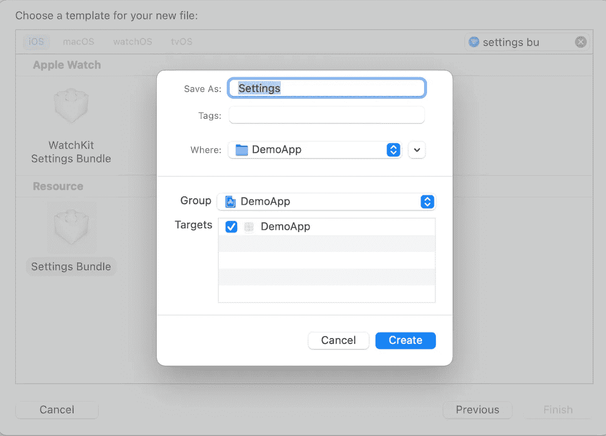

在设置中，更新 Root.plist 文件。在那里，我们将提供带有标识符的多值设置，例如**demo _ app _ server _ preference _ settings**。分配服务器的默认值，比如暂存。按各自的顺序添加标题及其相应的值。


现在，当您运行应用程序时，您将在应用程序设置中看到一个服务器选择列表:

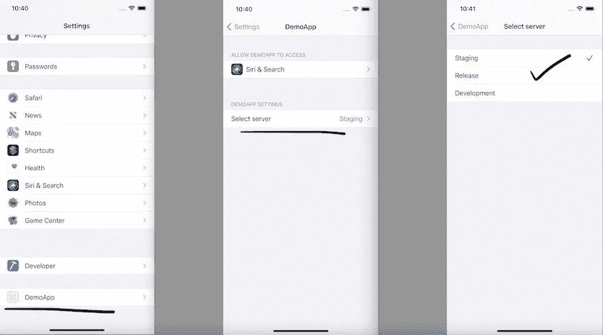

现在，我们需要在 swift 代码库中设置所选的服务器。

让我们更新 **serverBaseUrl** 属性的默认案例代码块，如下所述:

这里有一些表里不一的代码，我们可以改进这一点，但这里只是为了演示的目的，所以请多包涵我一点。

此外，更新应用程序代理，以便每当应用程序进入前台，我们检查最新指定的服务器。

或者，如果您在代码中使用场景委托，您可以使用以下代码更新它:

使用可配置的方案再次运行应用程序，并尝试从应用程序设置中更改服务器。验证控制台日志。它应该是应用程序设置中特定于当前所选服务器的打印服务器基本 url

# **现在，我们有什么？**

我们有不同的配置(发布和调试)指向不同的服务器。如果开发人员想要在特定的服务器上调试/存档，他们只需要选择特定的方案，应用程序就会指向该服务器。

如果开发人员希望向 QA 发布一个版本，那么他们可以使用 DemoApp(可配置)方案进行归档，相同的版本将被指向 QA 从应用程序设置中选择的所需服务器。

# 还剩下什么？

设置包在 DemoApp(可配置)方案之外的方案中没有用。因此，如果与所选方案相关的构建配置不可配置，我们将删除该设置捆绑包，对于我们的方案 DemoApp(可配置)，我们需要删除设置捆绑包。这样做将确保当我们使用 DemoApp 方案(专用于发布)为最终用户/客户准备最终版本时，我们不会在其中包含设置捆绑包。为此添加一个运行脚本。

**通过进入构建阶段添加运行脚本:**

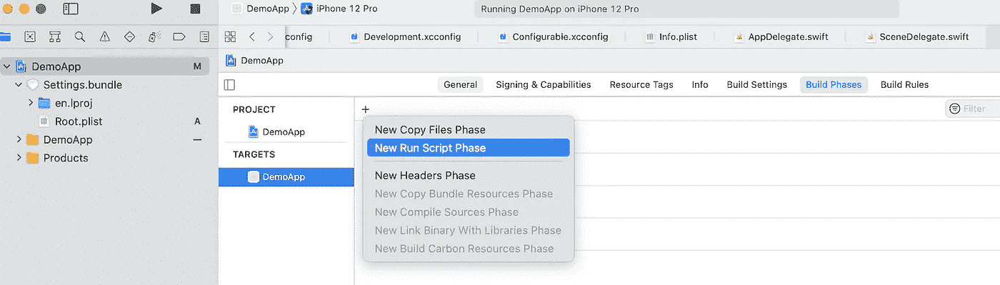

如果愿意，可以将脚本重命名为任何名称。我把它改名为 **SettingBundleRemoveScript。**增加以下内容

```
BUILD_APP_DIR="$BUILT_PRODUCTS_DIR/$PRODUCT_NAME.app"if [ $CONFIGURATION == "DebugConfigurable" ]; thenecho "setting bundle is required"elif [ $CONFIGURATION == "ReleaseConfigurable" ]; thenecho "setting bundle is required"elseecho "settings bundle is not required"rm -rf "$BUILD_APP_DIR/Settings.bundle"fi
```

**这个脚本是做什么的？**如果所选方案使用的当前构建配置是 DebugConfigurable 或 ReleaseConfigurable，则它不执行任何操作，而是移除设置包。

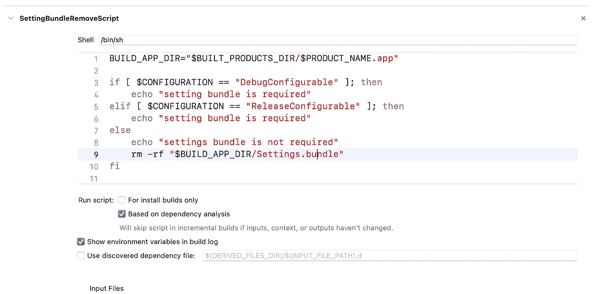

现在，尝试运行应用程序。如果选择 DemoApp(可配置)之外的方案，则不会出现设置包。

# 有什么需要注意的？

这只是一个演示项目。你需要注意某些点，比如从应用程序设置中切换服务器，你需要从以前的服务器注销，并使用最新的指向服务器重新初始化网络服务。

此外，您可以请求 QA，如果他们想要切换服务器，他们应该删除应用程序，然后在重新安装应用程序后，从应用程序设置中选择服务器，并在所需的服务器上进行测试。

# 作为开发人员，您取得了哪些成就？

通过投入这一次的努力，你节省了创建和发布多个构建所消耗的**时间**，这些构建只有一个区别**指向服务器**。

**样板工程**

您可以参考这个 github repo 示例项目:

[](https://github.com/AnmolSuneja/MultiServerBuild) [## AnmolSuneja/MultiServerBuild

### 这是一个示例项目，描述了一种方法，通过这种方法，我们可以让 QA 团队成员测试所需的构建…

github.com](https://github.com/AnmolSuneja/MultiServerBuild) 

希望这能帮助到某个人！！