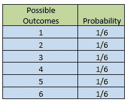

# 统计学中的分布！

> 原文：<https://medium.com/geekculture/distribution-in-statistics-b7bc7243301f?source=collection_archive---------16----------------------->

> **概率分布**

在统计中，概率分布是一个数学函数，它告诉你你的数据是如何分布的，每个事件发生的概率是多少，即一个实验的所有可能结果。

让我们看一个例子来理解它，

**扁鹊。掷骰子所有可能结果的概率是多少？**

Photo by [CHUTTERSNAP](https://unsplash.com/@chuttersnap?utm_source=medium&utm_medium=referral) on [Unsplash](https://unsplash.com?utm_source=medium&utm_medium=referral)

这里我们知道掷骰子的所有可能结果是 1，2，3，4，5，6。那么每个事件发生的概率是 1/6。

概率分布有两种类型，

1.  **离散概率分布**
2.  **连续概率分布**

我们一个一个来看，

> **离散概率分布**

如果随机变量是离散的，那么它的概率分布称为离散概率分布。

举个例子，

*   当我们掷骰子时，我们知道可能的结果是 1，2，3，4，5，6。我们永远得不到像 1.1，2.4，5.2 这样的值
*   同样，当我们扔硬币时，我们知道可能的结果是正面或反面。

Photo by [Andy Henderson](https://unsplash.com/@andyhenderson?utm_source=medium&utm_medium=referral) on [Unsplash](https://unsplash.com?utm_source=medium&utm_medium=referral)

这种类型的可能结果或变量称为离散变量，离散变量的概率称为离散概率分布。

**离散概率分布的类型，**

一.伯努利分布

二。二项分布

三。泊松分布

现在我们将会看到，

> **连续概率分布**

类似地，如果随机变量是连续的，那么它的概率分布称为连续概率分布。

举个例子，

*   在重量级世界锦标赛中，我们会看到人的体重，我们知道体重是一个连续变量。
*   同样在一个篮球队里，我们通常选择那些身高比正常人高的人。我们知道高度是一个连续变量。

Photo by [Steven Abraham](https://unsplash.com/@stevenabraham?utm_source=medium&utm_medium=referral) on [Unsplash](https://unsplash.com?utm_source=medium&utm_medium=referral)

这种类型的可能变量称为连续变量，连续变量的概率称为连续概率分布。

**连续概率分布的类型，**

一.正态分布

二。均匀分布

三。学生 T 分布

四。卡方分布

在下一篇文章中，我们将通过适当的例子看到统计中的所有分布。敬请期待:)

> ***总结***

在这篇文章中，我们看到了什么是概率分布，概率分布的类型，离散和连续的例子。

感谢阅读。请在下面的评论中告诉我，或者如果你有任何疑问，请在 LinkedIn 上联系我。

在[LinkedIn](https://www.linkedin.com/in/sagardhandare/)|[GitHub](https://github.com/SagarDhandare)|[邮箱](mailto:%20sagardhandare3@gmail.com)上找到我

快乐学习！！！^_^