# 统计学:基本术语

> 原文：<https://medium.com/geekculture/distribution-of-sample-statistics-8d8e0cedf019?source=collection_archive---------30----------------------->

在本文中，我们讨论了统计学中的基本术语:总体、样本、参数、统计量。

## **人口**

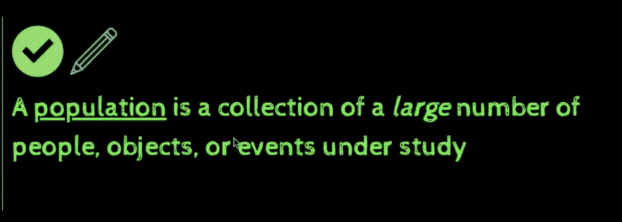

**群体**是被研究的大量人、物体或事件的**集合**和**通常我们在集合中收集相同类型的物体**。这里有几个相同的例子

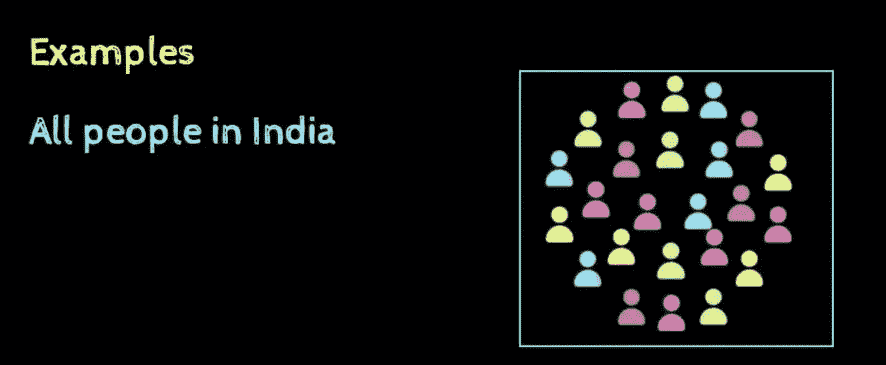

我们可以在一个更大的集合上设置某种资格标准，然后观察下的集合将成为我们的基础人口，例如**如果我们考虑印度总人口中所有将在孟加拉国参加第 10 届考试的学生**，**，那么它将成为这个特定研究的基础人口**

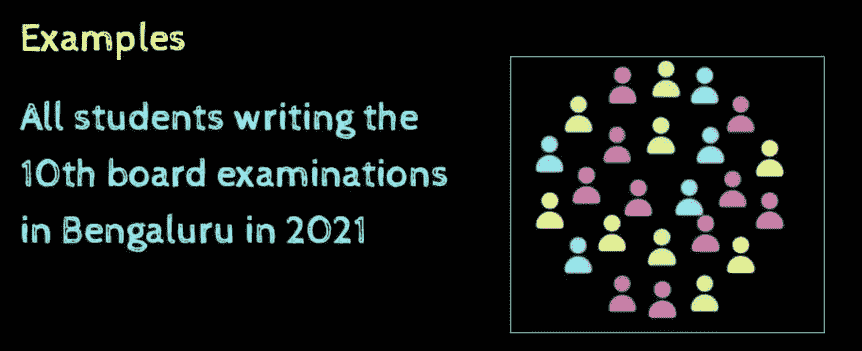

下面是一组对象的示例

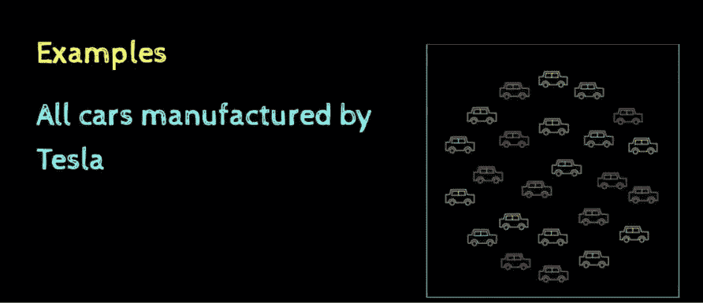

群体也可以是事件，事件在科学中经常发生，例如，科学家们做了非常有趣的实验，看看在物理学的高能领域发生了什么，他们做的一件事是他们进行了这种实验，他们测量了某些事件的发生，可能是粒子的发射，他们记录了下来，所以，在特定的时间，事件 X 发生了一些特征，等等。这些测量中的每一个都可以是总体中的一个元素

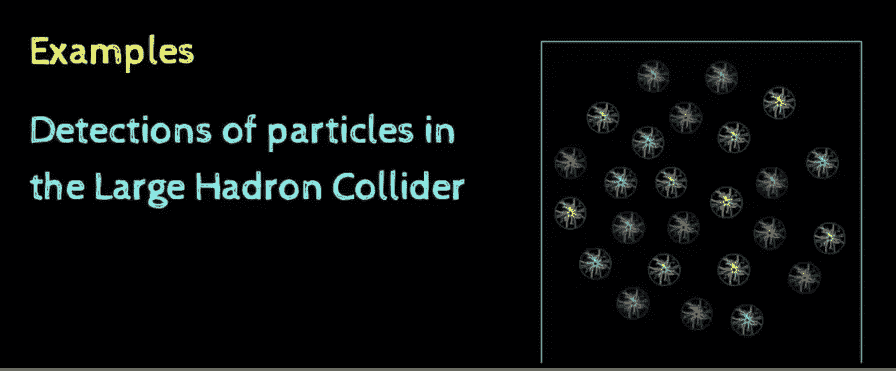

在所有三种情况下:人、物体和事件——这些都是现实中存在或被测量的事物——人存在，特斯拉制造的汽车存在，事件在 LHC 中被检测到，但不一定是这样，我们也可以看看假设的项目。因此，下面是一个更新的人口定义，后面是一个例子

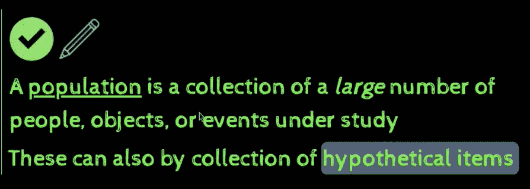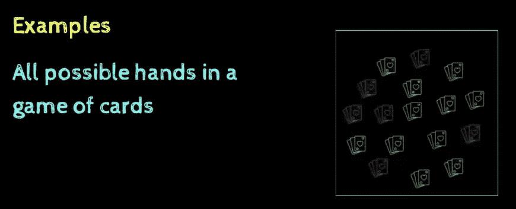

比方说，从一副牌中，我们想要抽取 7 张牌(在这种情况下我们称之为一手牌)，从[计数原则](https://prvnk10.medium.com/why-do-we-need-counting-principles-and-probability-theory-in-data-science-3ba1c123d51f)中，我们知道我们可以以⁵ C₇方式从一副 52 张牌中抽取 7 张牌，并且这些牌中的每一张都将构成群体的一部分。

因此，在这种情况下，这些不同的手牌并不存在，我们正在想象一副牌中所有可能的手牌，这是一个假设的事情，但我们可能仍然有兴趣研究在感兴趣的领域中可能有用的有趣属性，比如对扑克玩家而言。

这里还有一个例子——给定一个蛋白质，我们可以得到一个结构的所有可能的折叠，每个这样的折叠构成一个单位，群体的一个元素，我们不需要制造它们，在自然界中分离它们，我们只能假设性地研究它们，观察所有的折叠，并从中做出一些度量

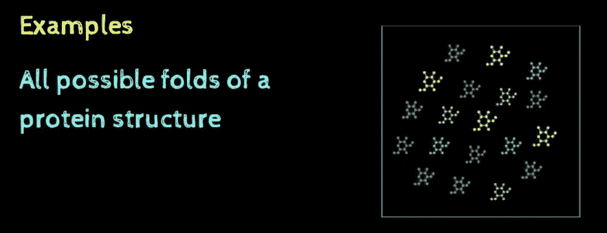

## **参数**

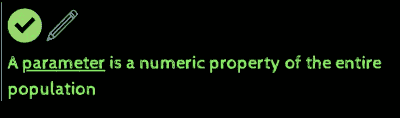

参数是总体的数字属性。我们不是在看总体中的单个项目，而是作为一个整体来考虑整个总体，我们定义参数。让我们举一些例子:

对于人口是印度所有人的情况，**一个参数可以是人均收入**

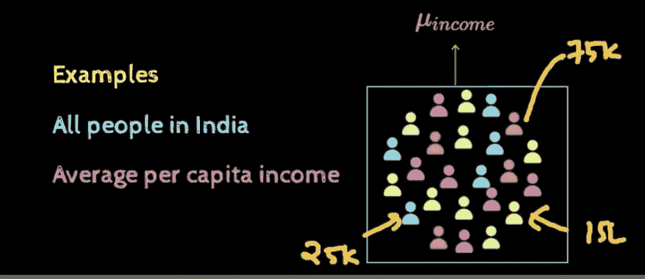

所以，**一个感兴趣的数字属性是均值的中心趋势**。

在另一个例子中，假设我们有某个城市某个学年所有参加十年级考试的学生。因此，不同的学生在同一科目上会得到不同的分数，**我们可以计算分数的平均值**

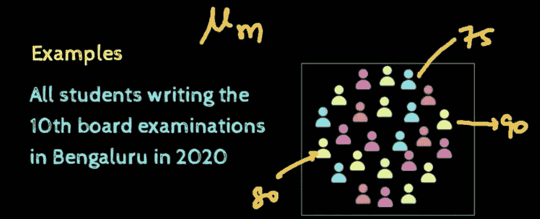

我们还可以定义一个标志(下图中的蓝色)来反映学生是否通过了课程，一旦我们创建了这个标志，**我们就可以计算学生通过课程的比例或分数**。

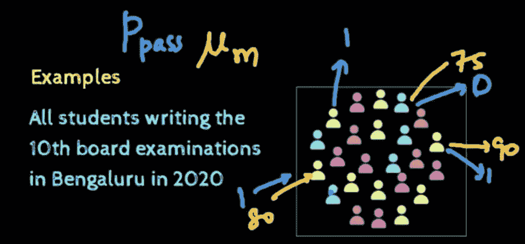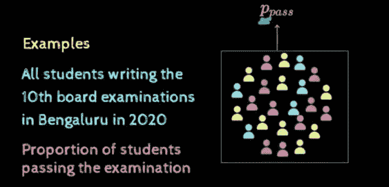

另一个例子是，人口中包含了特斯拉生产的所有汽车**，我们可以计算平均里程数或里程数大于特定值的汽车比例**。我们还可以计算汽车行驶里程的标准偏差(标准偏差是大多数制造业感兴趣的主要指标)

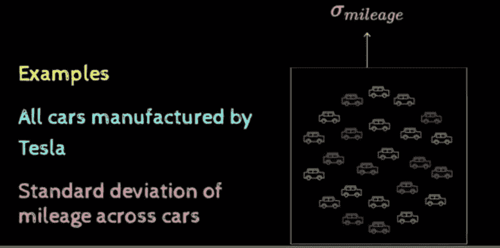

对于大型强子对撞机的情况，**感兴趣的数字属性可以是感兴趣的事件何时发生，我们可能对两个连续事件发生之间的时间和相同事件的平均值感兴趣**

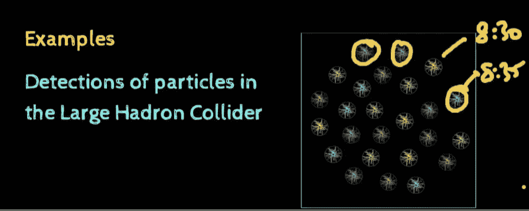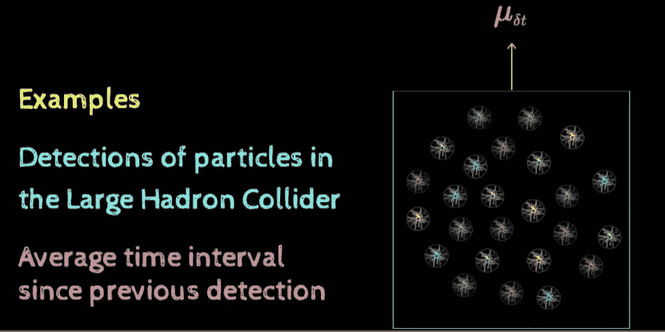

类似地，对于从一副 52 张牌中拿起一手 7 张牌的情况，我们可以首先定义所有可能的结果和**，然后一个感兴趣的属性将是例如一手有方块王的牌的比例**(该属性可以根据要求/兴趣而不同)

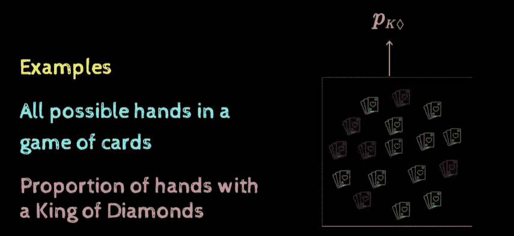

同样，在蛋白质折叠的例子中，我们可能有兴趣知道特定蛋白质作为药物的**平均有效性**，这可以通过考虑总体中的所有项目来计算

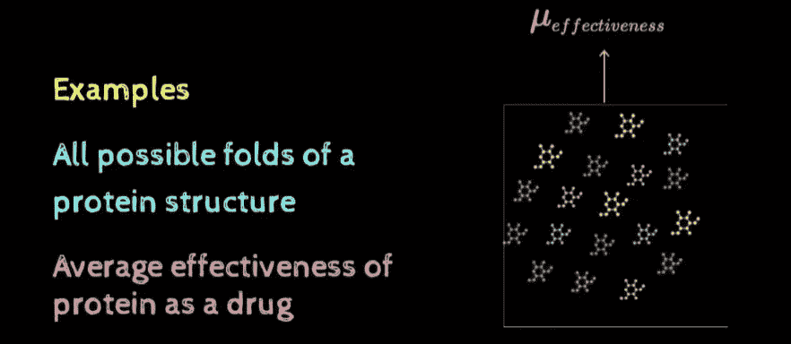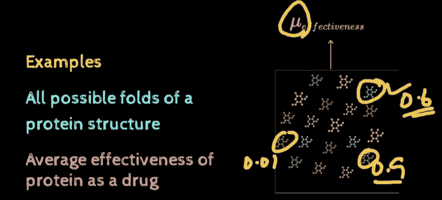

因此，有了参数，**我们就能够用一个数字**简洁地描述或表示整个群体的一些感兴趣的属性，然后可以与他人共享。

## 我们如何知道总体参数？我们如何估计这些参数？

在计算人均收入的情况下，询问 13 亿人的收入是不可行的，特别是因为他们都没有联网。所以，很难衡量，我们可以做一些同样的估计。

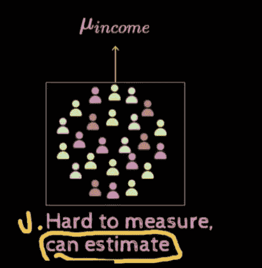

类似地，对于计算平均里程的情况，假设我们有所有从工厂生产出来的汽车，计算平均值不像计算人均收入的情况那样困难，但这仍然是一个有点困难和昂贵的过程(联系车主，收集数据，确保数据中没有错误，等等)。)

在我们假设的例子中(从一副 52 张牌中挑选一手 7 张牌)，我们可以使用概率理论精确地计算比例:

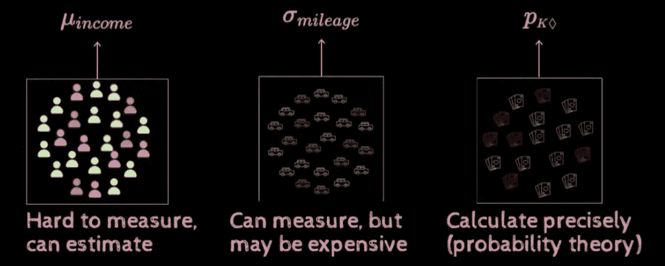

因此，我们看到在计算群体参数时存在**个不同的挑战** **:群体规模可能非常大，或者即使群体规模在一个很窄的范围内，由于数据收集费用的原因可能很难收集数据，或者可能有一个未知的随机过程产生数据，并且计算分数可能是不可行的**

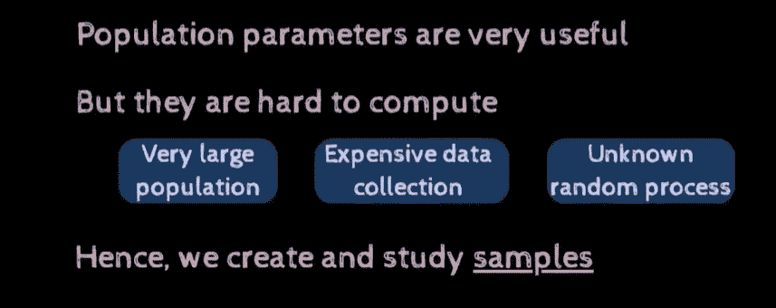

与我们知道随机过程的抽卡示例不同，在某些情况下，我们可能不知道随机过程，我们可能知道生成数据的潜在过程，但我们可能对过程本身一无所知，并且我们可能无法计算比例。因此，出于所有这些原因，我们创造和研究样本，这就是统计数据适合的情况。

## 样品

如上所述，群体参数是有用的，但是由于各种原因，它们可能难以获取。为此，我们创建并研究样本:

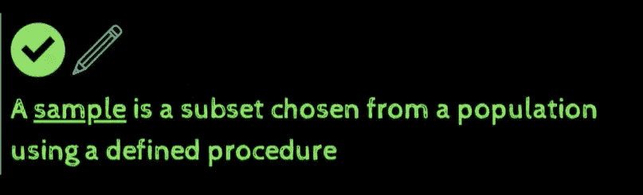

因此，**有一个被研究的人群，我们首先定义一个抽样程序，我们得到的任何子集都称为样本**。

让我们通过举一些例子来具体化这个想法(让我们举上面讨论的所有例子，并尝试在这样的场景中创建样本):

对于印度所有人的示例，我们可以定义如下样本:

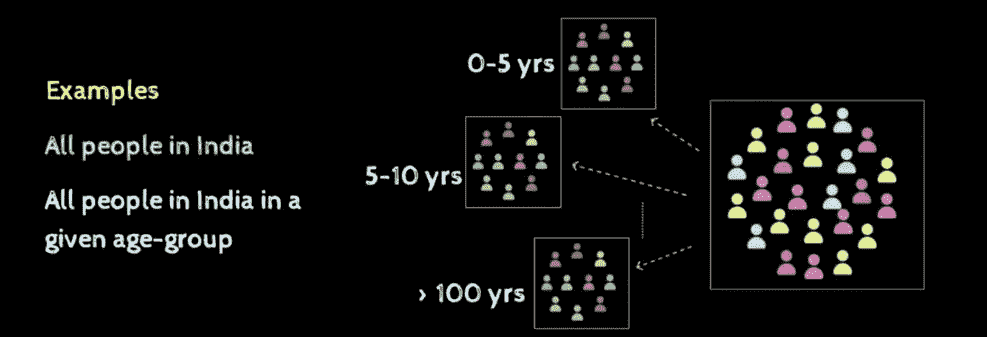

**我们可以定义特定年龄组的人，因此这里的程序是找到一个人的年龄，然后确定他们所属的样本**，在上面的片段中，我们定义了一个年龄组，从 0-5 岁(婴儿)，我们有一个年龄组，从 5-10 岁，等等，我们可能有一个年龄超过 100 岁的人的组。

**基本想法是，我们有一个程序，使用它我们可以收集样本作为总体的子集**。

**我们将以我们感兴趣的方式创建样本**例如，如果我们正在研究哪个年龄组的收入范围，在这种情况下，像 0-5 岁、5-10 岁这样的年龄组没有多大意义，我们只根据具体情况定义相关的类别。

让我们看下一个例子，人口是 2021 年在孟加拉鲁鲁参加第十次班级考试的学生

在这里**一种方法可以是基于学校的抽样**，因此从总人口中，我们可以为特定的学校创建较小的样本。**同样，有一个已定义的程序，使用该程序我们从总体中获取子集，并以与业务案例相关的方式创建样本**。比方说，我们正在观察学校的表现，学生在学校水平上的通过率

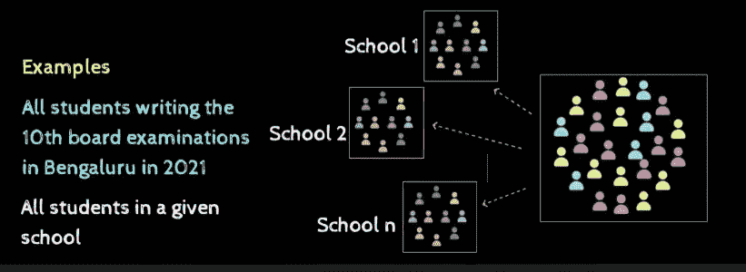

让我们以公司生产的**汽车为例，一个商业案例可以是比较来自不同工厂和**的汽车的性能，然后我们可以在工厂层面进行采样**(比如哪个工厂的感兴趣指标的方差较小等等)**

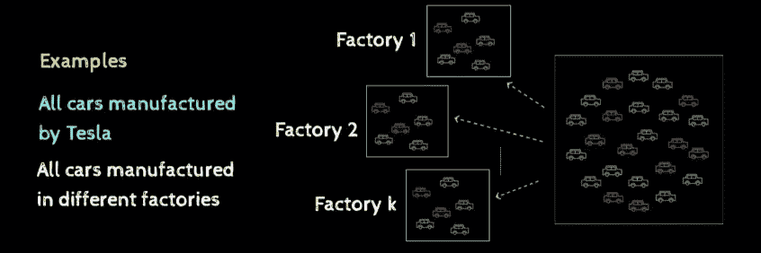

这是一种抽样策略，即在前面的例子中，着眼于工厂层面或衡量学校层面的绩效。**我们可能会定义多个样本，每个样本都有完全不同的策略**，下面是一个例子:

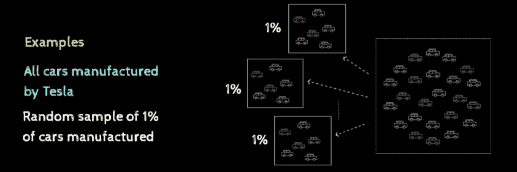

我们可以进行**随机抽样**，这样第一个样本可以是该公司生产的随机 1%的汽车，类似地，我们有另一个样本反映从人口中随机选择的另外 1%的汽车，等等。让我们看看我们对这些样本有什么兴趣，但在此之前，让我们看看这种方法如何符合样本定义:

因此，随机选择的 1%肯定会成为总人口的一个子集，这里的过程可以说是一个哈希函数将汽车的唯一标识符(比如因子中分配的唯一标识每辆汽车的汽车编号)映射到一个两位数(00-99 之间)

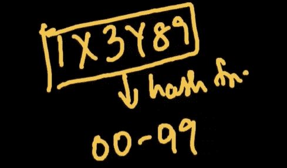

现在我们可以定义一些随机规则，比如如果哈希输出是 05，那么这辆车属于样本 1，等等。所以，这可能是这个场景中的一个程序。因为这种方法满足样本的定义，所以这是一种有效的方法。

现在，这种抽样策略的使用在很大程度上取决于手头的业务用例，**一般来说，随机抽样是非常有用的统计数据，在现实世界的问题中**。

因此，对于相同的人群，我们讨论了两种抽样策略，在实践中，我们可以根据业务案例定义更多的策略。

对于大型强子对撞机的例子，我们有科学家识别的事件，**一种采样策略是由科学家定义样本，因此由科学家识别的所有事件都属于一个样本，依此类推**。

同样有一个明确的程序，样本是人口的子集

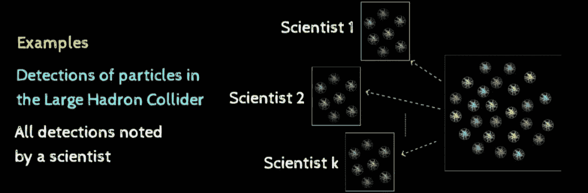

让我们假设一个例子，其中我们有一副牌，群体由 7 张牌的所有可能的手牌组成，因此群体中将有⁵ C₇物品

在这种情况下，一种采样方式是随机洗牌并创建一手牌，比如说，如果我们决定在一个样本中需要 5 手牌，我们可以洗牌 5 次并创建 5 手牌，这将是一个样本的一部分

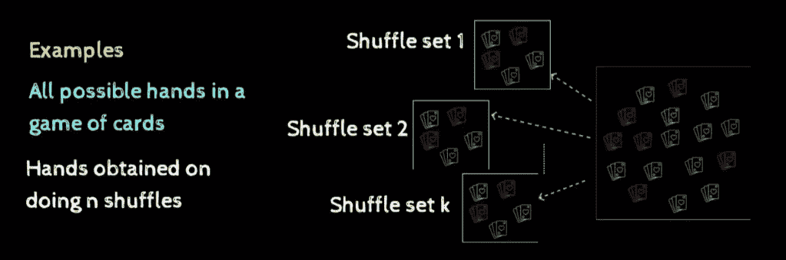

**完全相同的手很有可能会出现在不同的样本中，因此总体中的相同物品可能会出现在多个样本中**这没什么，我们只是定义了一个生成总体子集的过程，这些样本可能有相同的物品。

既然我们已经定义了样本的含义，并且举了一些相同的例子，下一件有趣的事情就是定义一个统计量。

## 统计的

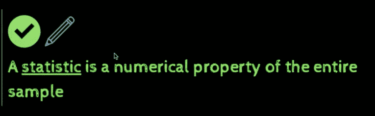

统计是整个样本的数字属性。这与总体的参数是平行的。

之前讨论参数时，我们查看了整个人口的平均人均收入，这里我们可以取样本中所有人的平均人均收入。因此，如果我们的样本包括 10 万人(在本例中)，那么计算样本的平均人均收入比计算整个人口的平均人均收入(约 13 亿)要容易和可行得多。

这个统计量可以针对我们拥有的每个样本单独计算

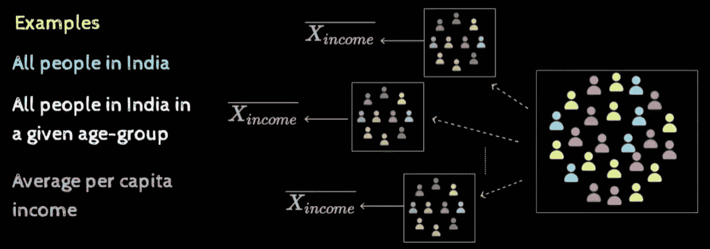

同样，对于我们有 2021 年在**班加鲁鲁参加第十次考试的所有学生的情况，我们可以计算每个样本的学生的通过比例/百分比**

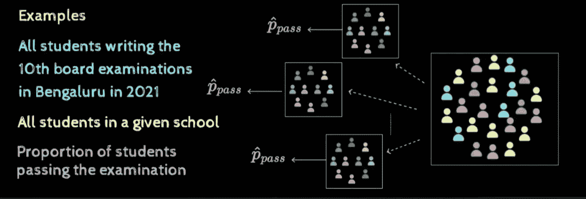

类似地，我们可以计算每个样本的统计量，感兴趣的统计量取决于手头的业务案例。

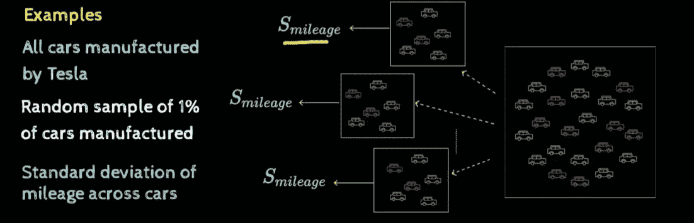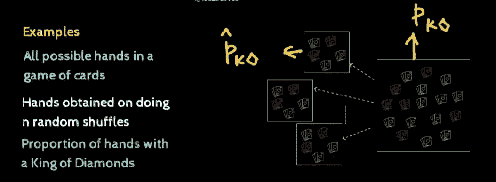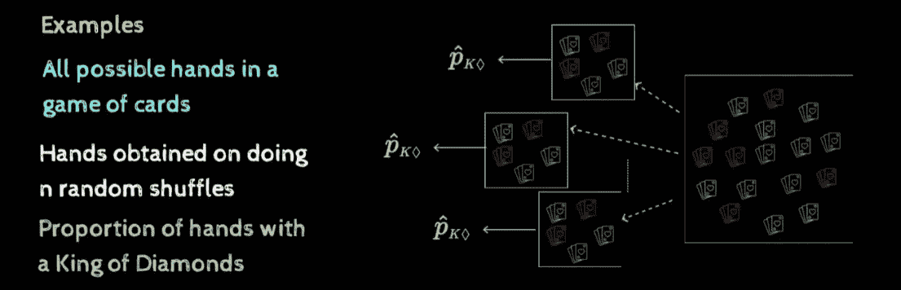

参考资料:[帕德海](https://padhai.onefourthlabs.in/)