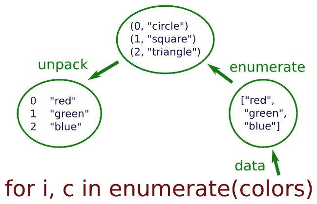

# 放弃循环计数器，改用这个

> 原文：<https://medium.com/geekculture/ditch-loop-counters-use-this-instead-c8e288d2697b?source=collection_archive---------6----------------------->

用 enumerate 编写更多 pythonic 代码

尽管避免循环计数器通常是最好的，但有时它们还是有用的。

幸运的是，你不必忘记到目前为止所学的一切——你可以使用`enumerate`功能。这使我们能够访问 Pythonic for 循环中的循环计数。

# 枚举列表