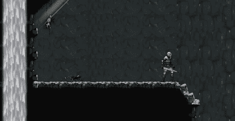

# 从敌人的基本阶级中分离出来

> 原文：<https://medium.com/geekculture/diverging-from-base-enemy-class-f44fe88c765a?source=collection_archive---------18----------------------->

目标:利用目前介绍的任何东西来建造蜘蛛敌人

在这篇文章中，我将展示我是如何从目前为止介绍的所有成分开始构建蜘蛛敌人的。

在深入研究如何做和为什么做之前，让我们先做一些设计。蜘蛛敌人将具有以下特征:

1.  比其他敌人弱很多，就…