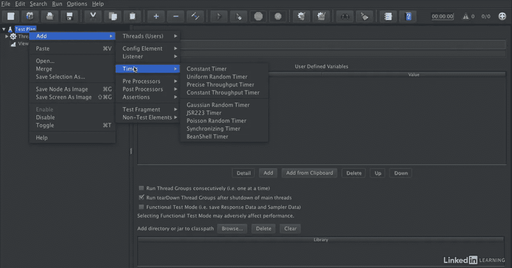
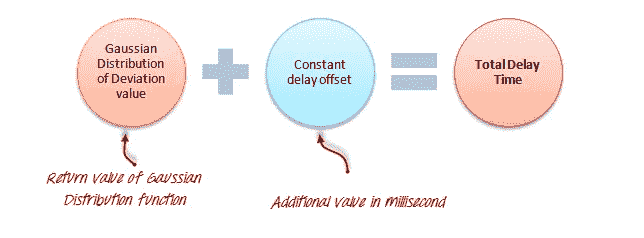
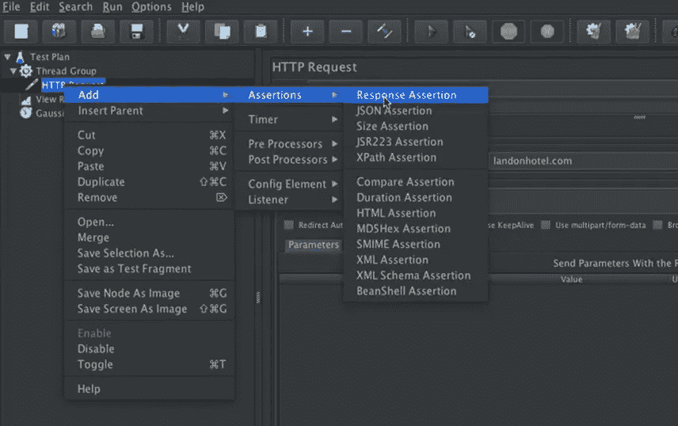
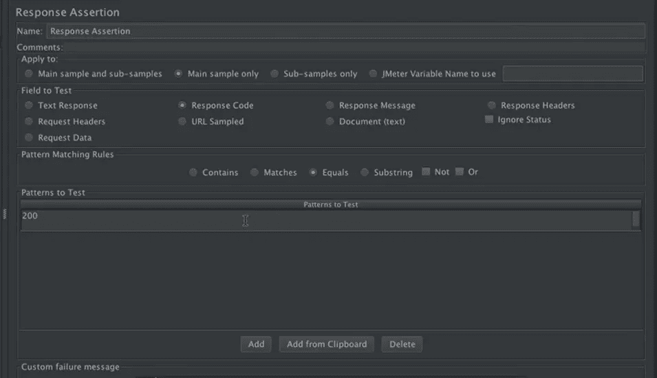
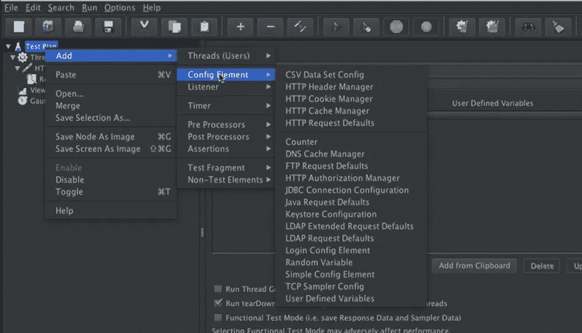
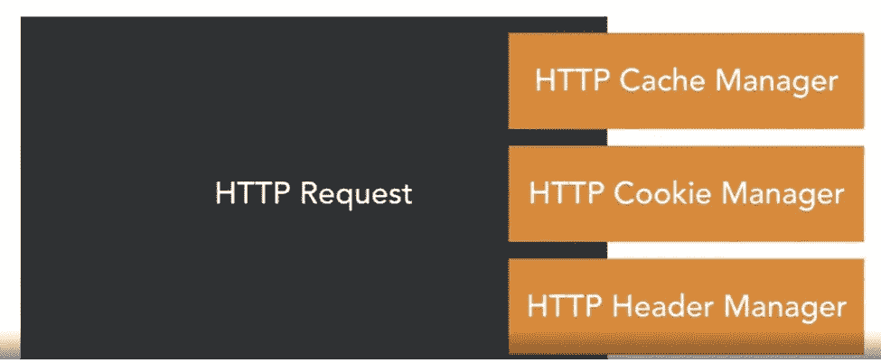

# 深入阿帕奇 JMeter！

> 原文：<https://medium.com/geekculture/diving-deep-into-apache-jmeter-2fd61d6970d2?source=collection_archive---------41----------------------->

Photo by [Thomas Kelley](https://unsplash.com/@thkelley?utm_source=medium&utm_medium=referral) on [Unsplash](https://unsplash.com?utm_source=medium&utm_medium=referral)

在开始之前，这篇博客的先决条件是了解 Apache JMeter 的基础知识和运行负载测试所需的基本组件。如果你是 JMeter 的新手，想了解一些基础知识以及如何在 JMeter 中运行你的第一个测试，请参考我的[博客](https://anubhavkaro.medium.com/performance-testing-of-apis-using-apache-jmeter-e1c9fb0077cc)，它为这个博客设置了背景。

我们开始吧！🚀

# 定时器

嗯，如果你在 JMeter 中编写一个普通的测试，它看起来就像一个机器人在给定的时间段和条件下以一种均匀的方式发送多个请求。信不信由你，事情就是这样。如果我们想要复制现实生活中的场景，并在测试场景中引入一些随机性，该怎么办？这就是计时器的用武之地。
计时器有助于在测试中引入随机性。它们帮助我们以任意的方式配置请求的拥塞，这样它就复制了现实生活中的场景。

> 负载测试！测试自动化

在测试自动化中，我们希望测试尽可能快地完成，而在负载测试中，我们让 API 承受一个负载，这个负载模拟了现实生活中人与 API 的交互。Jmeter 中有各种类型的定时器，您可以通过右键点击测试计划，然后点击 timers 来查看它们。

对于我们这里的例子，我们将继续高斯随机定时器。[高斯](http://hyperphysics.phy-astr.gsu.edu/hbase/math/gaufcn.html)随机定时器将每个用户请求延迟**随机**时间量。当您尝试配置它时，我们需要配置两个字段，这有助于为测试引入随机性。

1.  偏差
2.  恒定延迟偏移

让我们将偏差设置为 0.5 秒，恒定延迟偏移设置为 1 秒。这实际上意味着，它会在循环的每一步之间引入随机性。在每个动作之后，用户(这里是我们的测试)会在执行下一个动作之前随机暂停 0.5 到 1.5 秒。

Effect of adding a Gaussian Random Timer

# 断言

顾名思义，如果您已经编写过任何单元测试，这一部分可能已经很清楚了。JMeter 中的 ***断言*** 用于验证发送给服务器的请求响应。断言是在运行时用请求的实际结果验证预期结果的过程。

我们可以在各种事物上添加断言:

1.  站点或 url 中的文本
2.  响应代码
3.  头球
4.  请求数据
5.  重新寄送

## 如何添加断言？

右键单击要添加断言的组件，对于我们的示例，我们将把它添加到 HTTP 请求中。在我们的例子中，我们将添加一个响应断言。

Response assertion to check if the status code returned is 200

响应断言允许您添加模式字符串，以便与服务器响应的各个字段进行比较。
例如，你向网站[http://www.google.com](http://www.google.com/)发送一个用户请求，然后得到服务器响应。您可以使用响应断言来验证服务器响应**是否包含**预期的模式字符串(例如“OK”或 200)。

# HTTP 管理器

Photo by [Richy Great](https://unsplash.com/@richygreat?utm_source=medium&utm_medium=referral) on [Unsplash](https://unsplash.com?utm_source=medium&utm_medium=referral)

因为 JMeter 不是一个浏览器，HTTP 协议有时可能很复杂，所以它利用 HTTP 管理器来获得一些关于 HTTP 相关问题的帮助。HTTP 管理器允许管理和操作诸如缓存、cookies 和头之类的东西。有时，如果不配置 HTTP 负载测试，很难运行它们。

浏览器向服务器发送一个带有一些附加信息的 HTTP 请求头。需要这些附加信息来满足服务器响应特定请求的要求。每次浏览器向服务器发送请求时，都会附上带有接受语言、接受编码、用户代理、引用等信息的标题。
JMeter 提供了一个“HTTP Header Manager”元素来附加请求中的附加信息。

要添加一个 HTTP 管理器，右键单击测试计划并转到 config elements:

这里有多种类型可供选择:

1.  HTTP 缓存管理器:它帮助操作随请求发送的缓存，在测试期间保留或删除缓存。
2.  HTTP Cookie 管理器:它帮助管理 HTTP 请求中使用的 Cookie。它还有助于身份验证。
3.  HTTP 头管理器:它帮助管理出站 HTTP 请求的头。我们可以把它们储存起来以备后用。

添加这些有助于我们更好地管理 HTTP 请求。

这里提到了 HTTP 头管理器的一些重要输入字段:

*   ***名称*** *:* 提供元素名称
*   ***评论*** *:* 提供任意评论(如果有)
*   ***存储在标题管理器中的标题:*** 将随请求一起传递的标题字段列表。

您可以在下面添加通用标题字段:

*   ***Accept-Language:***定义浏览器在响应中首选接收的页面语言。如 en-GB、en-US；q=0.8，en；q=0.6
*   ***Accept-Encoding:***Accept-Encoding 头告诉服务器在向客户端发送响应之前应该选择哪种编码方式。例如 gzip、deflate
*   ***用户代理:*** 用户代理允许定义在浏览器中正确显示的客户端类型和接收页面版本。如 Mozilla/5.0(Windows NT 6.1；WOW64) AppleWebKit/537.36 (KHTML，像壁虎一样)Chrome/56 . 0 . 2924 . 87 Safari/537.36
*   ***Referer:*** 表示从某个页面切换时，发送了特定的请求。例如，当你发送一个推荐网址给你的朋友注册时(比如优步)，他的注册会让你免费搭车。referrer URL 包含您的代码，让您受益匪浅。
*   ***内容类型:*** 显示内容的类型。例如 application/JSON；字符集=UTF-8
*   ***接受:*** 浏览器接受并显示无任何问题的响应类型。例如应用程序/JSON，文本/普通，*/*
*   ***来源:*** 父 URL
*   ***<安全检查> :*** 该选项仅适用于安全通信。标签名可以是 cfadmin、csrftoken、Authorization 等。

我希望这对于那些想要定制和个性化他们的 JMeter 测试计划到下一个水平的人来说是很棒的。我将在下一篇文章中重点介绍 Jmeter CLI。现在，让我们在这里结束它。如果您想提供反馈或有任何疑问，请通过推特联系我。和平👋