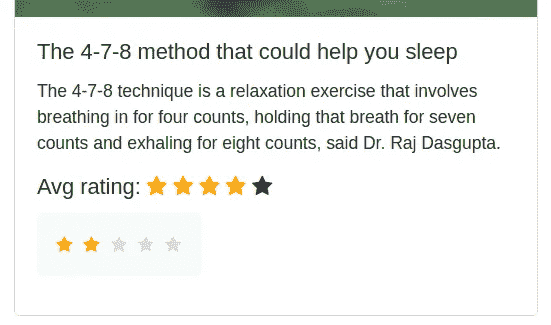

# Django:实施星级评定

> 原文：<https://medium.com/geekculture/django-implementing-star-rating-e1deff03bb1c?source=collection_archive---------0----------------------->

如何在 Django 中实现评级机制

这是一篇关于如何在 Django 中创建一个简单的交互式开始评级机制的短文。

我们在这里要做的是允许每个用户对一个帖子进行评级，每个用户的投票不应超过 1 票。我们还将使用聚合有效地计算平均评分。

# 我们的模型