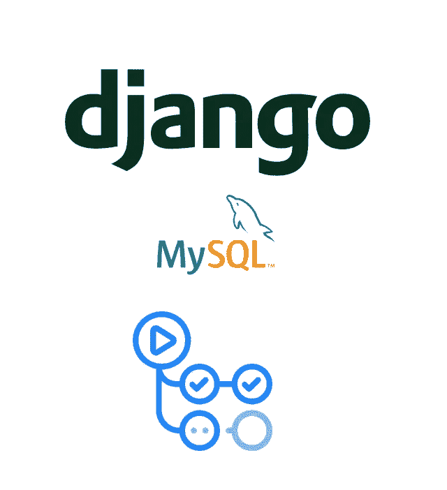

# Django+MySQL CI/CD 和 GitHub 操作

> 原文：<https://medium.com/geekculture/django-mysql-ci-cd-with-github-actions-303605697653?source=collection_archive---------29----------------------->

## 边吃薯片边给你的 Django 项目添加 GitHub 动作。



# 介绍

如今，当我们开发一个 web 应用程序时，我们通常使用 CI(持续集成)和 CD(持续部署)来自动化测试和部署过程。

为了运行这样的自动化，我们过去使用 Jenkins [ ]和 Travis [ ]。然而，在这十年中，有很多工具满足了我们的需求，其中之一就是 GitHub Actions。作为一名 web 开发人员和 GitHub 爱好者，我希望使用 GitHub Actions，因为它不仅可以轻松地与 GitHub 项目集成，还可以展示我根据需要定制 GitHub Actions [ ]的能力。因此，我想分享我在一个使用 MySQL 作为数据库的 Django 项目中应用 GitHub 操作(尤其是 CI)的笔记。

# GitHub 操作简介

就像其他 CI/CD 平台一样，GitHub Actions 是 CI/CD 的另一个平台。但是，它具有以下特性:

1.  **与 GitHub 服务高度集成。** GitHub 动作可以被任意的 GitHub 事件调用。因此，如果您将 repos 托管在 GitHub 上，您可以考虑使用 GitHub 操作来获得更好的开发体验。
2.  **社区驱动的工作流程。** GitHub Actions 允许你创建自己的工作流程，并发布到市场上与他人分享。例如，当我将一个水晶项目从 Travis 切换到 GitHub Actions 时。该项目需要与自定义域和不同的回购名称设置建成网站的光盘。GitHub Pages action [⁴]的工作在无痛工作流切换方面给了我很大帮助。
3.  **允许自托管机器。您不仅可以在 GitHub 上运行 GitHub 操作，而且您的自托管机器也有更灵活的配置和更好的价格！官方文件[⁵]有很好的解释教你如何做到这一点。**

因此，有很多社区，如 Julia Language [⁶]将其 CI/CD 工作流切换到 GitHub Actions 上。更重要的是，这些社区发明了大量的定制工作流，以方便他们自己和开发人员将来使用他们的项目。

# 用 MySQL 在 Django 上应用 GitHub 动作

在这一段中，我列出了如何将 GitHub 动作应用到 Django 项目中的步骤。

> *你可以在* [*这里*](https://github.com/Cuda-Chen/django-mysql-github-actions-demo) *看到完整的示例项目。*

# 1.创建 Django 项目

首先，通过键入以下命令创建 Django 项目，即`example`:

```
$ django-admin startproject example
```

然后将 MySQL 设置添加到`example/settings.py`的`DATABASES`变量中:

```
DATABASES **=** {
    'default': {
        'ENGINE': os.environ.get('DBENGINE', ''),
        'NAME': os.environ.get('DBNAME', ''),
        'USER': os.environ.get('DBUSER', ''),
        'PASSWORD': os.environ.get('DBPASSWORD', ''),
        'HOST': os.environ.get('DBHOST', ''),
        'PORT': os.environ.get('DBPORT', ''),
    }
}
```

出于演示的目的，我使用环境变量来存储数据库的设置。

# 2.创建 Django 应用:`users`

通过键入以下命令创建一个名为`users`的 Django 应用程序:

```
$ django-admin startapp users
```

# 3.在`users`中添加单元测试

因为我们要运行 CI，所以我们应该添加一些单元测试代码。

在`users/tests.py`用以下代码替换现有代码:

users/tests.py

# 4.添加 GitHub 操作配置项

主菜来了！但在添加 GitHub Actions 的配置之前，这里有一些我遇到的常见错误，作为对你的善意提醒:

*   分支:一定要确定你想触发 GitHub 动作的分支，否则你会搞不清楚为什么 GitHub 动作不起作用。在这种情况下，我想在 pull 请求或 push 到`main`分支时触发 GitHub 动作。
*   **env** :当我使用环境变量进行数据库设置时，请确保在您将要使用数据库的每个步骤中都设置环境变量，例如数据库迁移和运行单元测试。
*   **DB 端口**:如【⁷】所示，GitHub Actions 为您定义的每个 GitHub Actions 服务分配随机端口。为了无故障地访问这些服务(例如数据库)端口，您必须使用`jobs.<job_id>.services.<service_id>.ports`语法。

然后，下面是添加 GitHub 动作配置的步骤:

1.  创建名为`.github/workflows`的目录。
2.  在`.github/workflows`目录中，添加`django-ci.yml`(我们的 GitHub 动作配置)，如下:

.github/worflows/django-ci.yml

# 5.推送至 GitHub，尽情享受！

完成以上步骤后，将我们的项目推送到 GitHub，GitHub Actions 就开始工作了！

# 琐事:添加 GitHub 动作徽章来显示 CI 状态

GitHub Actions 提供了状态徽章，用于轻松显示 CI 状态。通常，您可以像这样在`README.md`中添加徽章:

```
[](https://github.com/<your-user-name>/<your-project-name>/actions/workflows/django-ci.yml)
```

# 结论

在这篇文章中，我将介绍如何应用 CI/CD 管道。我还介绍了什么是 GitHub Actions 及其特点。然后，我使用 MySQL 制作了一个 Django 演示项目，以展示运行 GitHub 动作的进程，并留下一些标记以避免常见的陷阱。

# 参考

【[https://www.jenkins.io/](https://www.jenkins.io/)

【[https://travis-ci.org/](https://travis-ci.org/)

【[https://github.com/features/actions](https://github.com/features/actions)

https://github.com/marketplace/actions/github-pages-action[⁴](https://github.com/marketplace/actions/github-pages-action)

[⁵][https://docs . github . com/en/actions/hosting-your-own-runners/about-self-hosted-runners](https://docs.github.com/en/actions/hosting-your-own-runners/about-self-hosted-runners)

https://julialang.org/[⁶](https://julialang.org/)

【⁷】[https://docs . github . com/en/actions/reference/workflow-syntax-for-github-actions # example-using-localhost](https://docs.github.com/en/actions/reference/workflow-syntax-for-github-actions#example-using-localhost)

*原载于 2021 年 5 月 31 日*[*https://cuda-Chen . github . io*](https://cuda-chen.github.io/devops/2021/05/31/django-mysql-github-actions.html)*。*