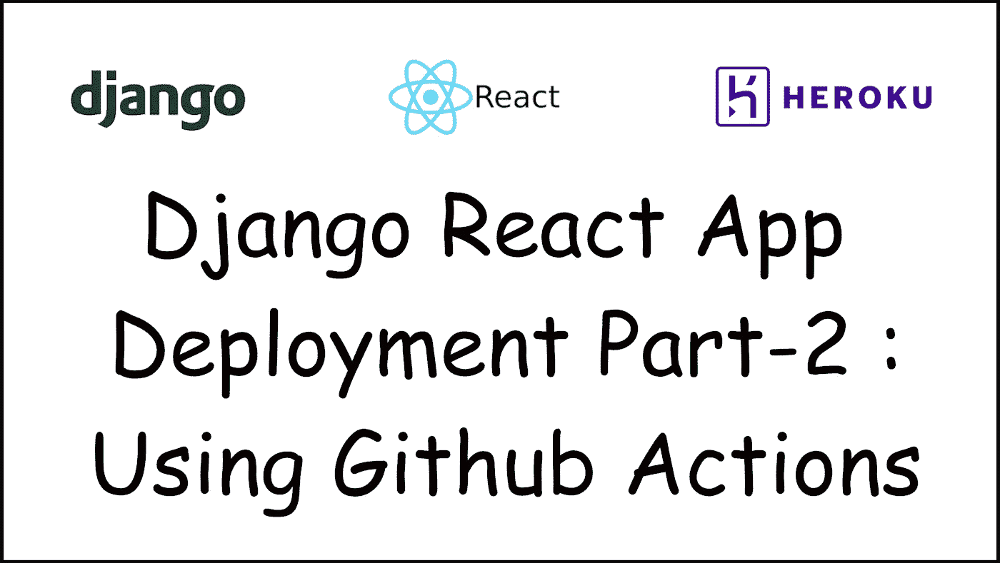
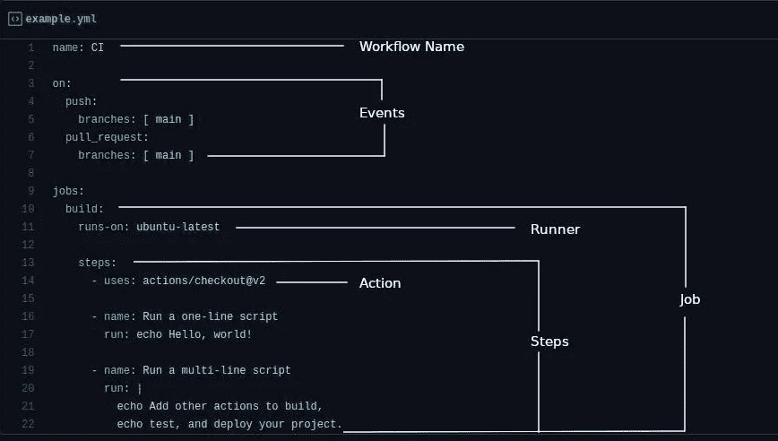
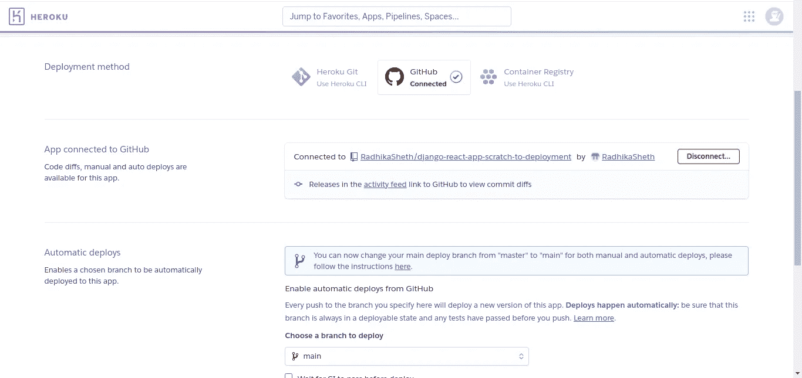
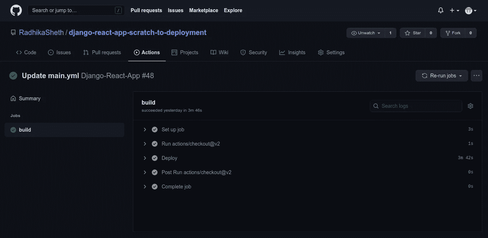

# Django React 应用程序部署第 2 部分—使用 Github 操作

> 原文：<https://medium.com/geekculture/django-react-app-deployment-part-2-using-github-actions-a14ff6c2e6d?source=collection_archive---------12----------------------->

在本文中，我们将了解 GitHub 操作，以及如何使用 GitHub 操作在 Heroku 上部署 Django react 应用程序。

在这里获取这个项目的代码[。](https://github.com/RadhikaSheth/django-react-app-scratch-to-deployment)

 [## Django React 应用程序—从零开始到部署第 1 部分

towardsdev.com](https://towardsdev.com/django-react-app-from-scratch-to-deployment-part-1-8a2fa9a97f1) 

在进入 Github Actions 的技术诀窍之前，先来认识一下我们的 doggo 开发者格兰芬多！

他是一个热情的程序员，但他对 CI/CD 一无所知，他总是手工构建和部署代码。让我们告诉他如何使用 Github Actions 节省制作时间！

# **什么是 Github 动作？**

Github Actions 使我们能够自动化我们的构建、测试、打包、发布和部署过程。

它是 GitHub 内置的 CI/CD 工具。但是 CI/CD 到底是什么？

CI/CD 在软件开发生命周期中带来了巨大的效率。**持续集成(CI)** 通过执行构建、测试和打包过程，确保代码变更和代码更新的可靠性。

Image source: www.synopsys.com

**连续交付/部署(CD)** 一旦代码成功完成测试，就可以实现自动化的生产部署。

Github Actions 由**事件驱动的工作流**组成，可以根据发生的事件执行特定的自动化任务。

# Github 操作的组件:

让我们借助一个例子来理解它们:

从创建一个 YAML(YAML 不是标记语言)文件开始。github/workflows 目录。我们把它命名为' example.yml '

**工作流:**对于这个案例，example.yml 文件就是我们的工作流。工作流中的任务(构建、测试、部署)是自动化的。我们可以根据自己的需求构建工作流程。

“example.yml”的第一行表示我们为工作流指定的名称。

**事件**:事件触发工作流。我们可以根据发生的事件来执行任务。例如:如果一些代码被推送到 XYZ 分支，运行这个特定的代码。事件可能发生的所有分支都可以写入事件名称下的数组中。

**作业:**单个流道下可以执行多项作业。我们可以同时运行多个作业，也可以按顺序运行。默认情况下，作业并行运行。在本例中，我们只有一个作业“构建”。

**Runner:** 它指定我们的作业将在哪个机器(Ubuntu/Windows/Mac)上执行。默认情况下，指定的跑步者将是 GitHub 托管的跑步者，但我们也可以使用我们托管的跑步者。例子中提到的 runner(runs-on: ubuntu-latest)是 GitHub 提供的默认。

**步骤:**步骤是执行所需命令代码的独立任务。一个步骤可以是一个 shell 命令或一个“动作”。动作被认为是工作流的最小块。我们可以使用 GitHub 提供的动作，也可以使用我们自己的动作。

在上述示例中的“步骤”下:

提到的第一个动作`uses: actions/checkout@v2`是强制性的，该步骤在工作流程中至少应出现一次。这将检查您的存储库并将其下载到 runner。此操作将使我们能够对回购中的代码使用操作。

我们可以用`name: 'My action name'`来表示步骤的名称，后面跟着相应的动作或命令。

您可以在 repo 的“操作”选项卡下运行工作流。

要从 Actions 选项卡手动运行工作流，请在 events 下添加`workflow_dispatch` 。

# 在 Heroku 上部署 Django-React 应用程序:

要在 Heroku 上部署应用程序，需要 Procfile。

检查您的回购是否已经包含 Procfile。如果没有，请参考我的上一篇文章，了解如何准备好 Django-react 应用程序部署。

 [## Django React 应用程序—从零开始到部署第 1 部分

towardsdev.com](https://towardsdev.com/django-react-app-from-scratch-to-deployment-part-1-8a2fa9a97f1) 

让我们实现 GitHub 操作，使部署过程更容易、更快。

要在 Heroku 上部署一个应用程序，创建一个应用程序并将您的 GitHub 存储库连接到它。

在下创建工作流。github/工作流。

我们将使用以下 repo 将应用程序部署到 Heroku。

 [## 部署到 Heroku - GitHub 市场

### 这是一个非常简单的 GitHub 操作，允许您部署到 Heroku。该操作通过运行以下内容来实现…

github.com](https://github.com/marketplace/actions/deploy-to-heroku) 

此操作将执行从构建到部署的所有任务。

相同的过程可以通过在传统方法中执行不同的动作(例如构建、测试、部署)来执行。

为了允许回购人在 Heroku 上部署我们的应用程序，我们需要共享我们的 Heroku 应用程序的一些凭证。

向工作流添加私有凭证的最佳方式是使用 Github Secrets。Github Secrets 非常容易创建，经过加密以保持安全性，并存储在您的 repo 中。Github secrets 存储为一个 key:value 对，可以从 Settings->Secrets from your repo 中创建。

所需的凭据包括:

*   您的 Heroku 应用名称
*   Heroku API 密钥*要获取 Heroku API 密钥，请进入 Heroku- >帐户设置- > API 密钥。*
*   您用来创建 Heroku 帐户的电子邮件。

在您的 repo 中创建新的秘密，并将上述凭证存储为键:值对。

您可以向该操作添加更多配置。在上面的代码中，我在带有组件的*下添加了`donotautocreate: true`。这将避免自动创建 Heroku 应用程序。详情请参考[此处](https://github.com/marketplace/actions/deploy-to-heroku)了解。*

在您的工作流程中添加带有语法`${{secrets.YOUR_SECRET_NAME}}`的秘密。通过指定这一点，我们要求动作`akhileshns/heroku-deploy`使用我们的应用程序凭证并完成部署过程。

我们可以走了！

在工作流中指定事件，或者转到“操作”选项卡并手动运行工作流以查看结果。

绿色的滴答声说明了一切！转到您的 Heroku 应用程序，检查已部署的更改。

我们的任务完成了！

现在，每当我们的 doggo 开发人员 Gryffindog 对代码进行更改时，只要将代码推送到 repo，GitHub actions 就会帮助自动测试代码并将其部署到生产环境中，从而节省他的时间！

你去格兰芬多！⚡

检查已部署的网站:

 [## 霍格沃茨的咒语

### 使用 create-react-app 创建的网站

spells-at-hogwarts.herokuapp.com](https://spells-at-hogwarts.herokuapp.com/addSpell) 

参考资料:

*   https://github.com/marketplace/actions/deploy-to-heroku
*   【https://docs.github.com/en/actions 