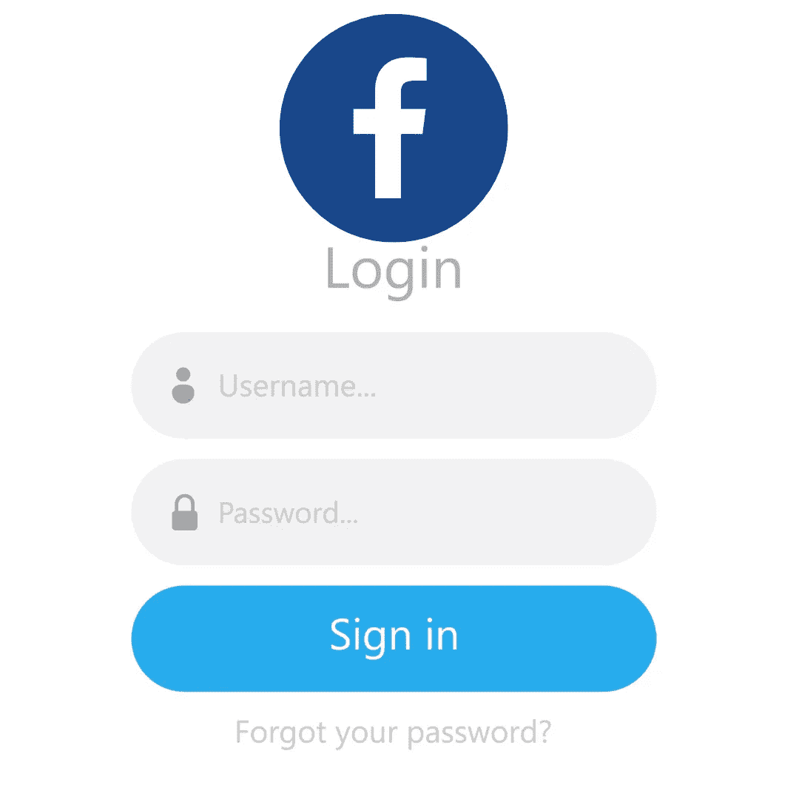

# Django 社交认证:登录脸书

> 原文：<https://medium.com/geekculture/django-social-authentication-sign-in-with-facebook-eb52c384e1d?source=collection_archive---------8----------------------->

## 如何在 Django web apps 中使用脸书登录和注册



Login with Facebook Using Django Framework

你好，Django 开发者..！！

我叫 Rohit Kumar Thakur。我一般写 React Native、Django、数据科学、机器学习和 Python。

在本文中，我将向您展示如何在 Django 应用程序中使用社交认证。当您构建 web 应用程序时，添加脸书身份验证是您可以添加的最常见的功能。它将帮助用户轻松登录您的网站。所以，不浪费任何时间，让我们开始这个项目。

下面是本文的分步视频教程:

# 项目设置

*   我总是建议在虚拟环境中开始一个 Django 项目，因为这是一个练习的好习惯。
*   选择一个目录。在该目录中打开终端或命令提示符窗口，并启动一个虚拟环境。激活虚拟环境。我写了一篇关于如何在 Windows 和 Linux 中启动虚拟环境的文章。需要帮助可以查一下。
*   激活虚拟环境后，安装以下 python 库:

```
pip install django
pip install social-auth-app-django
```

*   启动 Django 项目:

```
django-admin startproject facebook
cd facebook
python manage.py startapp mainApp
```

*   在您喜欢的文本编辑器中打开此项目。我是说 VS 代码。xd:)

# 密码

***settings.py***

```
INSTALLED_APPS = [
    'django.contrib.admin',
    'django.contrib.auth',
    'django.contrib.contenttypes',
    'django.contrib.sessions',
    'django.contrib.messages',
    'django.contrib.staticfiles',    
    'social_django',        **#add this**
    'mainApp',              **#add this**
]MIDDLEWARE = [
    'django.middleware.security.SecurityMiddleware',
    'django.contrib.sessions.middleware.SessionMiddleware',
    'django.middleware.common.CommonMiddleware',
    'django.middleware.csrf.CsrfViewMiddleware',
    'django.contrib.auth.middleware.AuthenticationMiddleware',
    'django.contrib.messages.middleware.MessageMiddleware',
    'django.middleware.clickjacking.XFrameOptionsMiddleware',
    'social_django.middleware.SocialAuthExceptionMiddleware', **#add this**
]TEMPLATES = [
    {
        'BACKEND': 'django.template.backends.django.DjangoTemplates',
        'DIRS': [],
        'APP_DIRS': True,
        'OPTIONS': {
            'context_processors': [
                'django.template.context_processors.debug',
                'django.template.context_processors.request',
                'django.contrib.auth.context_processors.auth',
                'django.contrib.messages.context_processors.messages',
                'social_django.context_processors.backends',    **#add this**
            ],
        },
    },
]
**#Add this at the bottom in settings.py
#social app custom settings** 
AUTHENTICATION_BACKENDS = [
    'social_core.backends.facebook.FacebookOAuth2',
    'django.contrib.auth.backends.ModelBackend',
]LOGIN_URL = 'login'
LOGIN_REDIRECT_URL = 'home'
LOGOUT_URL = 'logout'
LOGOUT_REDIRECT_URL = 'login'SOCIAL_AUTH_FACEBOOK_KEY = "#############"
SOCIAL_AUTH_FACEBOOK_SECRET = "############"#for extra info
SOCIAL_AUTH_FACEBOOK_SCOPE = [
    'email',
]
```

在 **settings.py.** 中，我们需要在 INSTALLED_APPS、中间件和模板部分添加几行代码。之后，我们必须在底部添加几行代码，如上所示。

***views.py***

```
from django.shortcuts import render
from django.contrib.auth.decorators import login_required# Create your views here.def login(request):
    return render(request, 'login.html')[@login_required](http://twitter.com/login_required)
def home(request):
    return render(request, 'home.html')
```

在 views.py 中，首先，我们将导入所有需要的库。之后，编写两个函数来渲染登录和主屏幕。

现在在 mainApp 目录中。制作一个新的目录**模板**。在模板目录下，新建三个文件:**base.html**、**login.html**、**home.html**

也做一个静态文件夹。在 mainApp 目录中。并且在静态目录里面，制作一个文件“ **index.css**

如果愿意，您可以自定义 CSS 部件。但是对于最小的 UI 引用，您可以将以下代码添加到 index.css 文件中。

```
.container-fluid {
    height: 100vh;
    background-color: #fff;
    display: flex;
    justify-content: center;
    align-items: center;
}.container-fluid > div {
    width: 85%;
    min-width: 300px;
    max-width: 500px;
}.card{
    width: 100%;
    background-color: #282c34;
}.social-container {
    display: flex;
    flex-direction: column;
    justify-content: center;
}.btn a, .btn a:hover {
    color: white;
    text-decoration: none;
}
```

***base.html***

```
 
<!DOCTYPE html>
<html lang="en">
    <head>
        <meta charset="UTF-8" />
        <meta name="viewport" content="width=device-width, initial-scale=1.0" />
        <meta http-equiv="X-UA-Compatible" content="ie=edge" />
        <link href="[https://cdn.jsdelivr.net/npm/bootstrap@5.1.3/dist/css/bootstrap.min.css](https://cdn.jsdelivr.net/npm/bootstrap@5.1.3/dist/css/bootstrap.min.css)" rel="stylesheet" integrity="sha384-1BmE4kWBq78iYhFldvKuhfTAU6auU8tT94WrHftjDbrCEXSU1oBoqyl2QvZ6jIW3" crossorigin="anonymous">
        <link rel="stylesheet" href="" />
        <title>Django Social Auth</title>
    </head>
    <body>
        <div class="container-fluid"> 
            <div>
                <h1 class="text-white text-center"></h1>
                <div class="card p-5">
                     
                    
                </div>
            </div>
        </div>
    </body>
</html>
```

这是 base.html 档案的代码。我们将在 login.html 和 base.html 获取参考和相对标签元素。

***login.html***

```

Sign in 
 
    <div class="row">
        <div class="col-md-8 mx-auto social-container my-2 order-md-1">
            <button class="btn btn-primary mb-2">
                <a href="">Login With Facebook</a>
            </button>
        </div>
    </div>

```

***home.html***

```
 
     HOme  
     
        <div class="row">
            <div class="col-sm-12 mb-3">
                <h4 class="text-center">Welcome {{ user.username }}</h4>
            </div>
        </div>
    
```

这是登录和主屏幕的基本代码。成功登录后，我们将在主屏幕上显示用户名。

***Facebook/URLs . py***

```
from django.contrib import admin
from django.urls import path, include
from django.contrib.auth import views as auth_views
from mainApp import viewsurlpatterns = [
    path('admin/', admin.site.urls),
    path('login/', views.login, name='login'),
    path('logout/', auth_views.LogoutView.as_view(), name='logout'),
    path('social-auth/', include('social_django.urls', namespace='social')),
    path("", views.home, name='home'),
]
```

在主目录中添加 URL。

# 配置脸书开发人员控制台

现在我们只需要做一件事。让我们设置[脸书开发者账户](https://developers.facebook.com/)。我推荐你在 **19:42** 之后观看视频。这里的视频是。

*   在脸书搜索开发者，或者在 Meta 搜索开发者
*   点击“开始”
*   确保您有一个有效的脸书帐户。
*   单击继续注册您的应用程序。
*   添加您的详细信息，如电话和电子邮件。单击继续
*   选择学生或开发者并完成注册。
*   点击创建应用程序
*   选择消费者并点击继续。
*   显示名称:“测试应用”
*   输入你的脸书密码并创建你的应用
*   点击设置->基本
*   应用程序域:本地主机
*   隐私政策网址:[http://example.com/](http://example.com/)
*   数据删除网址:[https://example.com/](https://example.com/)
*   点击保存更改
*   向下滚动并点击添加平台
*   选择网站，然后单击下一步
*   网站网址: [http://localhost:8081/](http://localhost:8081/)
*   点击保存更改
*   复制客户端应用程序 id 和客户端应用程序密码，并将其粘贴到此处

```
SOCIAL_AUTH_FACEBOOK_KEY = "#############"
SOCIAL_AUTH_FACEBOOK_SECRET = "############"
```

*   如果您检查了视频，请确保点击订阅按钮。我制作了很酷的 Django 和 react 本地应用程序。你的支持会令人钦佩。

* * *确保您在同一个 chrome 配置文件浏览器中登录到同一个脸书配置文件。这意味着，由于脸书隐私政策，你不能在其他脸书个人资料上测试此应用程序，我们将在本地主机上使用此应用程序。

现在，打开您的终端或命令提示符，迁移 Django 应用程序。

```
python manage.py makemigrations
python manage.py migrate
python manage.py runserver
```

现在点击“用脸书登录”按钮。你现在可以走了。

[**Github 代码链接**](https://github.com/imrohit007/Facebook-Django-Authentication)

现在，鼓掌，鼓掌，鼓掌！并关注更多关于 Django 框架的基于项目的文章。

感谢阅读。