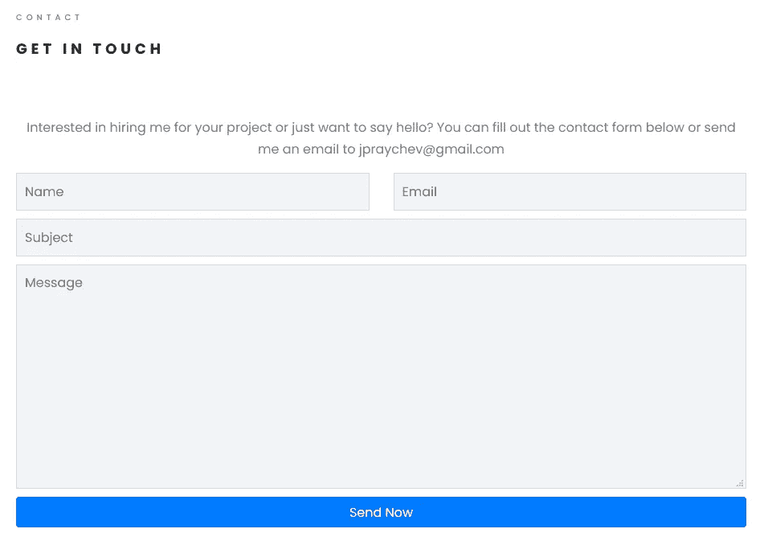

# Django 教程:构建联系应用程序的电子邮件通知

> 原文：<https://medium.com/geekculture/django-tutorial-building-email-notification-to-contact-application-e60f91071e40?source=collection_archive---------4----------------------->

在之前的[文章](/geekculture/django-tutorial-building-a-portfolio-application-contact-application-ac128d7b7b89)中，我们构建了一个联系人应用程序，用户可以通过网站上的表单提交他们的请求。提醒一下，这是表单的样子。

Fig. 1\. Standard contact form for an application

当用户提交表单时，Django 的`form_valid()`方法会验证并保存表单。通过利用这种方法，以及`form_invalid()`我们可以发送不同的通知…