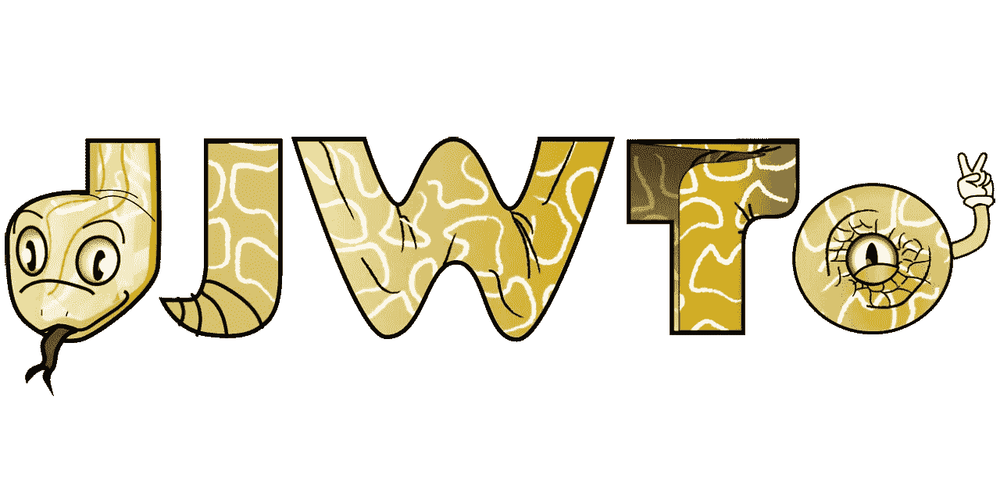
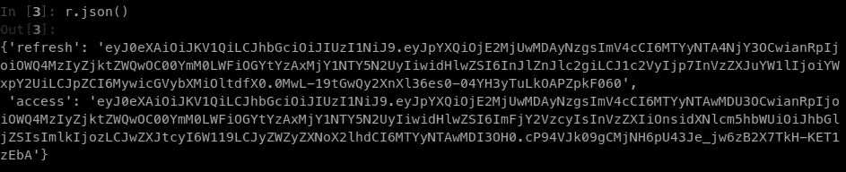
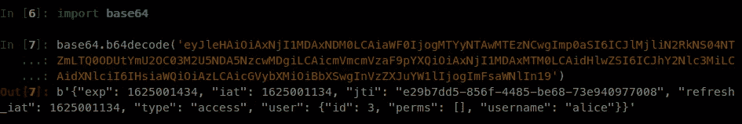
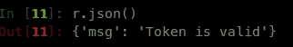
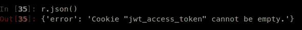

# djwto: Django 与 JWT 的认证

> 原文：<https://medium.com/geekculture/djwto-django-authentication-with-jwt-3ff6a6141fa6?source=collection_archive---------28----------------------->

## 使用 JWTs 介绍 auth 层的替代实现。



我通常写数据科学项目。所以它回避了这个问题:“为什么这篇文章是关于在 Django 上添加一个基于 JWT 的认证层？”

嗯，我可以说的是，在我们工作的每个项目中，为客户提供某种简单而有效的在线门户的需求变得非常明显，在那里他们可以与 ML 模型进行交互。

这基本上就是我开发 djwto 的旅程的场景，DJ WTO 是 Django 的另一个 JWT 认证实现。构建前端的一个步骤是建立一个合适的授权层，我们选择使用 *JWT* s 来完成。

目前已经有很多很棒的软件包了， *djwto* 基本上增加了一些新的特性，同时以简单和轻量为目标。一些新的可能性包括:

*   djwto 提供了将访问令牌分成两部分的选项(这是其名字的主要灵感)，其中一部分是解码后的有效载荷。
*   使用无记名令牌或 cookies。
*   CSRF 受到默认保护。
*   提供*装饰器*来保护视图(完全认证和授权层)。
*   完全可定制。

在本帖中，让我们来看看对 *djwto* 的简要介绍，以及它如何帮助开发者在他们的项目中添加 auth 层。我们将构建一个 Django 项目，并与前面提到的一些特性进行交互。

# 1.环境

我们首先需要一个 Django 项目，所以让我们创建一个(接下来假设使用一个基于 unix 的系统)。将目录更改为空目录，并运行命令:

放心使用另一个版本的 Python(可以是 3.7 也可以是 3.9)；这是我们目前掌握的情况:

```
.
├── djwto_project
│ ├── asgi.py
│ ├── __init__.py
│ ├── settings.py
│ ├── urls.py
│ └── wsgi.py
└── manage.py
```

现在让我们修改`urls.py`以包含 *djwto 的*URL:

也可以修改`settings.py`来配置 *djwto* 应该如何运行。这里有一个简单的例子:

首先，我们将`"djwto"`添加到`INSTALLED_APPS`(这里添加`"sslserver"`也只是为了测试 https，实际上没有必要)。

每个设定值在很大程度上应该是直观的。其中有几个值得进一步讨论:

*   `DJWTO_SIGNING_KEY`应该包含用于编码令牌的密钥，默认情况下应该作为环境变量提供。如果使用非对称加密，那么也应该设置`DJWTO_VERIFYING_KEY`。
*   `DJWTO_MODE`设置客户端如何处理*jwt*。 *djwto* 使用两个令牌工作:*访问*和*刷新*。它们本质上是一样的东西，但前者是短暂的，应该通过使用后者来“刷新”，后者则是长期的。操作方式可以是下列方式之一:
    - `**JSON**`:将*jwt*作为常规*JSON*返回给客户端。
    -`**ONE-COOKIE**`:jwt*存储在 cookies 中。
    - `**TWO-COOKIES**`:与之前类似，但这次*访问*令牌被分成两部分。一个未编码，因此其有效载荷可由客户端访问。*

*在官方[文档](https://djwto.readthedocs.io/en/latest/settings.html)中可以找到每个设置的进一步说明。*

*数据库中还需要一个用户；请随意使用您最喜欢的方法创建一个。让我们首先运行迁移:*

```
*export DJWTO_SIGNING_KEY=’test key’ && python manage.py makemigrations
python manage.py migrate*
```

*然后让我们使用`shell`:*

```
*python manage.py shell*
```

*运行以下命令:*

*现在数据库包含了用户 *alice* ，我们将使用它进行身份验证。*

*最后，让我们为我们的项目创建一个新的应用程序，在这里我们将与 *djwto 进行交互。*只需在您的终端中运行:*

```
*python manage.py startapp testapp*
```

*现在让我们来测试一下 djwto。*

# *2.运行 djwto*

*首先，让我们使用`requests`库，向用户 *alice* 发送一个登录 POST 请求，看看情况如何。首先，我们需要运行服务器:*

```
*export DJWTO_SIGNING_KEY=’test key’ && python manage.py runsslserver 0.0.0.0:8002*
```

*这里我们导出了签名密钥的值，并使用`sslserver`进行 https 加密管理，所有这些都在端口`8002`上(试图选择一个有点不寻常的端口)。*

## *2.1 登录*

*下面是发送一个`login`请求的 Python 代码*

*现在，如果运行 *djwto* 的模式是 JSON，那么结果应该是在响应中检索到*访问*和*刷新*令牌:*

**

**refresh and access tokens returned in JSON mode.**

*让我们继续更改 *djwto* 运行的设置，并将其模式设置为双 COOKIES 选项:*

```
*#./djwto_project/settings.pyDJWTO_MODE = ‘TWO-COOKIES’*
```

*相同的代码现在将返回不同的内容。`sess`变量将包含带有`csrftoken`和*jwt*的 cookies:*

```
*sess
<RequestsCookieJar[ Cookie(name=’**csrftoken**’, value=’mzv…’), Cookie(name=’**jwt_access_payload**’, value=’eyJ…'), Cookie(name=’**jwt_access_token**’, value=’eyJ’, rest={‘HttpOnly’: None}),    Cookie(name=’**jwt_refresh**’, value=’eyJ’, path=’/api/token/refresh’, rest={‘HttpOnly’: None})]>*
```

**jwt_access_payload* 包含令牌有效负载的`base64`编码值。事实上，为了检索原始值，只需解码它:*

**

*Decoding the access JWT token.*

*前端客户端可以直接使用这个值(仍然要注意不要在那里存储敏感信息)。*

*现在让我们看看如何执行令牌验证来确认*jwt*仍然是好的。*

## *2.2 验证*

*假设令牌已经创建，有时需要检查它们在某个时候是否仍然有效。假设我们处于 JSON 模式:*

*注意，令牌被简单地添加到报头`AUTHORIZATION`中，遵循承载模式。这应该会返回:*

**

*Valid response*

*对于一个 COOKIE 或两个 COOKIE 模式，下面是如何做到这一点:*

*注意 *csrf 令牌*在报头`X-CSRFToken`中发送，同时还有一个`REFERER`指示请求来自哪里(由于 Django 的安全系统，这是必要的)。*

*验证*刷新*令牌有点不同:*

*所有终点的其余部分在官方[文档](https://djwto.readthedocs.io/en/latest/endpoints.html)中有完整记录。*

# *3.保护视图*

*djwto 通过要求 jwt 在输入请求中可用来提供对视图的直接保护。为了进行测试，让我们在我们的 *testapp* 中创建一个视图，如下所示:*

*注意`@method_decorator(auth.jwt_login_required)`和`auth.jwt_perm_required`。当用这些来装饰视图时，只有当请求包含一个认证的 *JWT* 时，视图才会被处理。*

*在 *testapp* 中创建一个文件`urls.py`，这样我们就可以路由到那些视图，就像这样:*

*更新项目 URL 文件以包含新添加的 testapp:*

```
*# ./djwto_project/urls.py
from django.urls import path, includeurlpatterns = [
    path('', include('djwto.urls')),
    path('', include('testapp.urls'))
]*
```

*现在我们可以向服务器发送 GET 请求了:*

*哪个返回:`"worked!"`。如果我们从请求中删除 jwt，会发生以下情况:*

**

*View is fully protected by the JWTs.*

*包含`jwt_login_required`的每个视图现在都受到完全保护；这同样可以用于用户权限。*

# *4.用户化*

*djwto 旨在实现可定制化。让我们看一个例子。使用我们的 *testapp，*让我们更新文件`apps.py`以更改创建令牌时处理用户的方式:*

*注意，我们导入了`djwto.tokens`并更改了处理用户的函数。现在，当用户登录时，一个新的字段`email`将出现在令牌中；您可以更改其行为以更好地满足您的需求。以下是新令牌的结果示例:*

```
*{
    "aud": "aud",
    "exp": 1624259339,
    "iat": 1624229339,
    "iss": "iss",
    "jti": "900f4f1a-3e0f-4843-9997-9fd8d032684e",
    "refresh_iat": 1624229339,
    "sub": "sub",
    "type": "access",
    "user": {
        "email": "alice@djwto.com",
        "id": 1,
        "perms": [],
        "username": "alice"
    }
}*
```

# *5.结论*

*简而言之，这就是 djwto。官方回购中充分记录了许多其他功能:*

*[](https://github.com/WillianFuks/djwto) [## 威廉福克斯/djwto

### 姜戈的 JWT 认证。在 GitHub 上创建一个帐户，为 WillianFuks/djwto 的发展做出贡献。

github.com](https://github.com/WillianFuks/djwto) 

在那里你会发现更多关于信号、端点、定制、管理双 cookies 设置等等。请随意查看！*