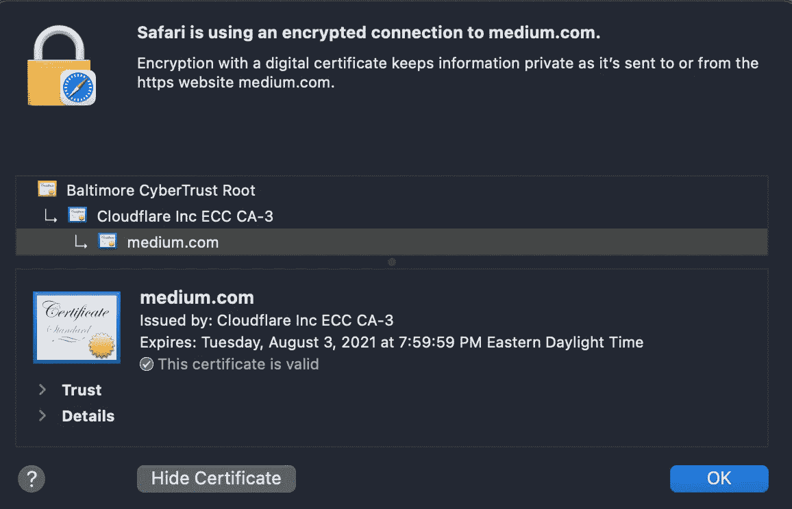

# DLT，什么是工作或赌注的证明？

> 原文：<https://medium.com/geekculture/dlt-what-is-proof-of-work-or-stake-41ca9cbdb8a3?source=collection_archive---------13----------------------->

Photo by [Dominik Vanyi](https://unsplash.com/@dominik_photography?utm_source=medium&utm_medium=referral) on [Unsplash](https://unsplash.com?utm_source=medium&utm_medium=referral)

在我之前关于 DLT 的文章中，我提到了工作证明的概念，并顺便提到了利益证明。在这篇博客中，我详述了这些概念，以及它们是如何成为无信任分布式共识的基础的。

首先，我们必须描述我们试图解决的问题是什么。比特币旨在解决在一群不信任的代理人之间建立信任的复杂问题。

那么这个问题是什么呢？一个人问你借点钱，并同意明天还你。因为你信任他们，你借给他们十美元。第二天你要求还钱，他们回答说他们从未向你借过钱。你是做什么的？没有交易记录；你没有多少追索权。你将来可能会变得不那么信任别人。下次输入这种类型的交易时，您需要第三方来跟踪交易。当借款人违约时，你可以引入第三方来证明交易发生了。如果借款人拒绝还钱，你可以去法律系统，要求他们代表你进行干预。理想情况下，第三方是一个值得信任的人，比如说律师，交易可以被公证以证明其真实性。想象一下，你想和与你不在同一个国家的人一起大规模地做这件事。有不同的法律体系，不同的追索权，哦，令人头痛。

分布式账本旨在用所有权身份、加密公证和建立信任的方式来取代法律结构。第一部分相当简单。我们每个人都有自己的身份；以私钥的形式；我们可以使用这个身份来“签署”任何任意数据。

 [## 公钥加密-维基百科

### 公钥加密，或非对称加密，是一种使用成对密钥的加密系统:公钥…

en.wikipedia.org](https://en.wikipedia.org/wiki/Public-key_cryptography) 

最简单的是，公共钥匙的持有者可以非常有把握地证明签名属于私人钥匙的持有者，而且只属于一个私人钥匙。这个数字签名是一个引人注目的概念，因为它允许任何拥有私钥的人声明他们拥有该私钥。将公钥给任何人都是安全的，因为没有办法获取公钥并创建私钥副本。只要确保你没有丢失你的私人钥匙！

身份自然产生公证；如果一方签署了消息，第三方可以副署已签署的消息。如果你信任公证方的身份，你有他们的公钥，你知道他们是谁；他们可以对原当事人进行陈述，比如我认识这个人，你可以信任他们。每当你访问一个加密的网站时，你可以在整个互联网上观察到这种信任的概念；你依赖于通过信任链公证的证书。这个链的顶端是根实体；在本例中，它是“巴尔的摩网络信任根”

Certificate Chain of Trust

这种信任链仍然给我们留下了一个问题。如果你不知道或者不愿意信任任何一个中心方，你如何公证交易，使其不可辩驳？经典的区块链通过一种叫做采矿的过程解决了这个问题。采矿可以大致分为两类，工作证明和利益证明。我们稍后会谈到这一点。

首先，我们应该解决房间里的大象，即所谓的基于许可的区块链。在过去的几年中，这些链的许多例子如雨后春笋般涌现，通常作为不可信的区块链的高性能替代品。采矿的本质是需要时间和成本。这些基于权限的链标识了一个或多个在链上执行消息公证的可信组。如果出现错误或改变主意，这些受信任的公证人可以改写历史，如果他们是坏演员，他们可以代表他人行骗。在我们最初的例子中，一个糟糕的公证人有可能站在借钱的人一边。

从信任的角度来看，人们可以认为基于许可的链并不比由第三方管理和操作的数据库更好。在这些情况下，数字账本仍然有好处；例如，每一方都有一份完整的分类帐，交易是标准化的，交易的加密签名。数字签名本身就是一个令人信服的理由，想想检查人类签名和它的数字对应物。与 DLT 相比，复杂性、性能和操作方面的考虑在传统数据库中通常更容易解决。

我们现在回到采矿。本质上，挖掘是一种操作，它表明一个参与者(习惯上称为节点)已经建立了足够的信任，可以签署一组事务(区块链中的块)来声明这些事务是一致的并且没有重复花费。双重消费在“现实世界”中是一个简单的概念；如果我给你一张一美元的钞票，我只能给你一次那张钞票，除非你后来把它还给我。在数字世界，这是一个更加复杂的问题。经典数据库通过实现事务来解决这个问题。您会经常听到这被称为 ACID 事务性保证。

 [## 酸-维基百科

### 在计算机科学中，ACID(原子性、一致性、隔离性、持久性)是数据库的一组属性…

en.wikipedia.org](https://en.wikipedia.org/wiki/ACID) 

在传统的复式记账系统中，分类账记录资产从一个账户(或钱包)到另一个账户(或钱包)的移动。对于跟踪单一货币的分类帐，您可以实施两个主要属性。首先，分类帐会在所有移动事务处理中保留分类帐中任何给定资产的总数。除非支持特定的单边事务，否则不能创建或销毁。第二，您可以确保只有当源 wallet 有可用的资产实例时，才能将资产从一个 wallet 移动到另一个 wallet。在多钱包交易中，所有钱包在交易后必须保持平衡。这些规则可以推广到多资产交易，确保交易的成本(每项资产转换为共同资产的价值)总和为零。多资产模型是一个更长的主题。

对于 DLT，所有代币(或资产)的转移都必须遵守上述规则。通常，该链支持的唯一单边事务是通过挖掘过程创建新令牌。那么分布式账本是如何做到这一点的呢？

我们首先处理工作证明，因为它是最成熟的系统。在工作证明中，系统中的每个挖掘节点相互“竞赛”,以提出足够复杂问题的解决方案。对于比特币，该问题计算块中数据的哈希，并添加一个“nonce”(整数)值来计算块的加密哈希。当上述最终散列在其二进制表示中具有特定数量的前导零时，挖掘成功。随机数被重复更新，直到找到解决方案。实际上，要比这复杂一点，会出现多个散列。

 [## SHA-256 算法-加密-bitcoinviki

### SHA-256 是国家安全局设计的 SHA-2 加密哈希函数的成员。SHA 代表安全散列…

en.bitcoinwiki.org](https://en.bitcoinwiki.org/wiki/SHA-256) 

每个挖掘器能够在一秒钟内执行固定数量的散列计算。计算节点的硬件设置了这个限制。调整问题的难度，使所有矿工的散列率之和在大约十分钟内找到一个块。网络调整难度以考虑当前的散列率。在撰写本文时，比特币网络的哈希速率为每秒一亿八千万个 terra 哈希。这个散列率是一个巨大的计算能力，并且指向了比特币的一个重要争论，它对环境的影响。然而，随着可再生能源的价格低于其他形式的能源，采矿利润提供了转向价格最低的能源的动力；这一点的真实性将在未来几年得到验证。

比特币挖矿协议中经常发现的一个“缺陷”是让哈希运算陷入瘫痪。这个特性导致了散列能力的显著集中，并且可以说挫败了链的一些分散设计。将哈希聚合在一起称为池挖掘。单独采矿实际上毫无价值；网络中的任何单个节点在汇集的哈希之前找到自己的解决方案的几率都微乎其微。池共享来自挖掘的奖励，与捐赠给池的散列率成正比。虽然你不会得到大的支付，你可以得到一个小数目每次池地雷块。少量的池(8)构成了散列能力的绝大多数。如果这些池合谋在一起，他们有机会选择未来的链规则。

 [## 硬币舞

### 硬币之舞-按矿池划分的总比特币散列率(今天，所有链)汇总

硬币.舞蹈](https://coin.dance/blocks/allhashtoday) 

当重写链的历史或控制足够的散列率(大于百分之五十一)来改变协议以使一方受益于另一方比获取挖掘奖励更昂贵时，工作证明提供了信任和完整性。采矿奖励被定义为比特币协议的一部分，包括新铸造的硬币和区块中处理的交易费用。目前，一个区块的采矿奖励是 6.25 BTC，外加交易费。这个奖励是每块三十多万美元。每天有 144 块被印刷出来，创造了将近 4500 万美元的矿业收入。

矿工有强烈的动机去做正确的事情。这种经济激励也鼓励矿商投资更多的采矿硬件，并有助于确保没有一个集团拥有该链的多数控制权。正是采矿的“成本”提供了这种保证。随着比特币价值的增加，挖掘更多比特币的动机也在增加。

以太坊等较新的链使用不同的算法实现工作证明。今天有许多选择，最值得注意的是那些从移动内存中的数据的成本(这就是 Etherium 的工作方式)与原始计算能力中获得工作的选择。通过“带宽”限制 Etherium 等工作链的证明，可以在最终用户商用硬件(GPU)上进行有利可图的挖掘。为了在开采比特币中获利，人们必须投资定制 ASIC 硬件。

股权证明是一种新兴的工作证明的替代品，它试图解决当前几代链条中普遍存在的能源消耗(和硬件竞赛)问题。为了证明利益，采矿者张贴(或标上)一定数量的链币，以便他们以交易费的形式获得签署区块的奖励，如果他们以不符合链规则的方式签署区块，他们将失去他们的利益。即。没有双重消费。

让我们尝试一个简单的思维实验。考虑一个有七个人的房间，每个人在房间中间的桌子上放一张百元大钞。这笔钱是他们的股份；现在，七个人中有两个人同意了一项交易，一个人会借给另一个人十美元，第二天归还。他们把协议写在一张纸条上，放在赌注桌上。我们现在从房间里的七个人中随机选择一个来公证这份文件。他们阅读文件，并在上面签名，表示这是一笔有效的交易。其他六个人可以检查文档并验证交易条款是否符合房间的规则。假设每个人都同意，交易是有约束力的。房间里的每个人都会因为确认交易而获得一小笔报酬。进行交易的人提供费用。这项费用为锁定资产作为股权提供补偿。

现在，假设被选中进行验证的人是参与交易或共谋的两个人之一。他们签署了文件，尽管它违反了房间的规则。现在，当房间里的其他人确认交易，并且超过 50%的房间表示该合同无效时，交易被撤销。属于验证者的赌注从桌上拿走，在其他六个人之间平分。第七个人不再有股份，不能再参与验证，他们失去了 100 美元的股份。因为股份的价值超过了交易的价值，所以说谎不符合这个人的利益。

当你有超过百分之五十的参与者诚实行事时，这个系统就起作用了。为此，他们可以保留自己的股份，并为自己的行为获得合理的补偿。而对于一个交易，欺骗系统可能是值得的；当你看总数的时候，诚实的行为绝对符合他们的利益。

关于赌注证明，一个有趣的观察是，它需要你押的物品是有价值的。这种观察是以太坊开始使用工作证明系统的核心原因之一，现在以太已经得到了高度重视，它正致力于转向利益证明。

我们还没有看到风险价值高的大规模股权证明系统，在接下来的几年里，我们将看到它们如何取代工作证明。

我希望下一次讨论智能合约时，这篇博客能帮助解释一些术语。

 [## DLT，为什么工作证明(works)

### 考虑有两个矿井；我的可以开采黄金或白银。开采黄金需要同样的努力…

medium.com](/geekculture/dlt-why-proof-of-work-works-11d8a2ccc5d1)  [## 利害关系证明| ethereum.org

### 证明交叉链接终结性堆栈使您可以更轻松地运行节点。它不需要在以下方面进行巨额投资…

ethereum.org](https://ethereum.org/en/developers/docs/consensus-mechanisms/pos/)  [## 工作证明

### 工作证明是一种很难(成本高、耗时)产生但对其他人来说很容易验证的数据…

en .比特币. it](https://en.bitcoin.it/wiki/Proof_of_work)  [## DLT 的崛起？介绍

### 序言《区块链》第一次引起公众注意是在 2008 年，通过笔名为 Satoshi 的一篇论文…

medium.com](/geekculture/the-rise-of-dlt-f83f63196dd6)