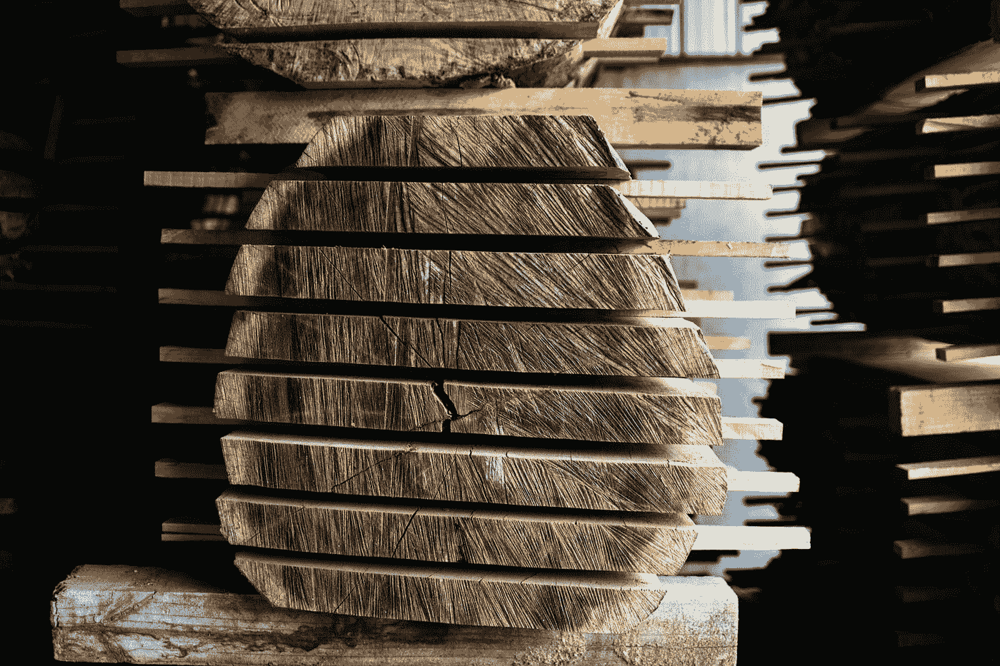
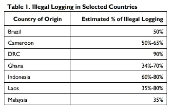
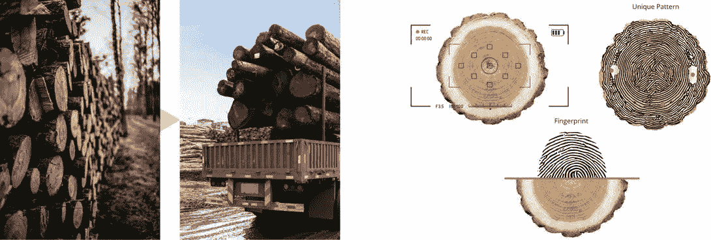
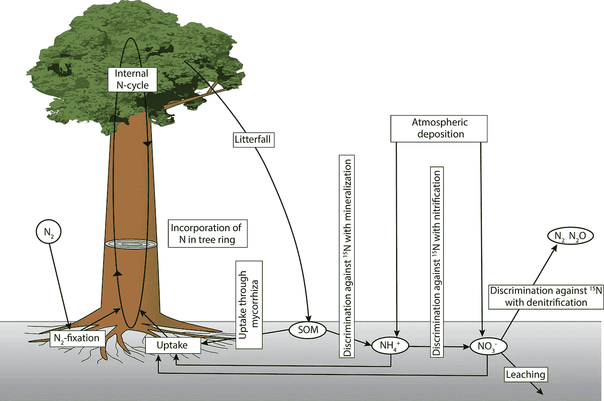
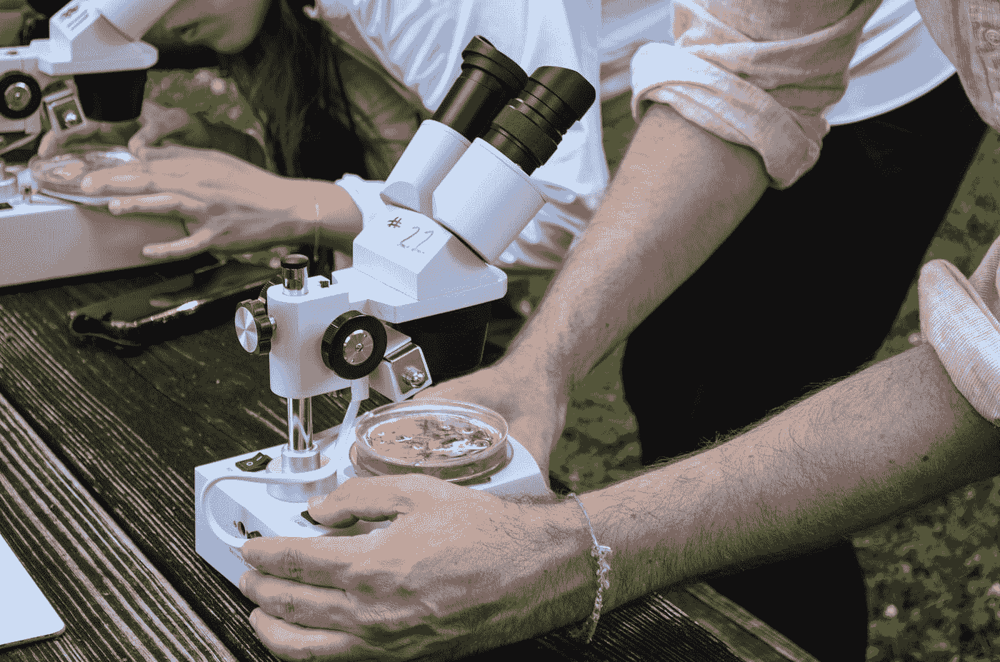

# DNA 和人工智能有助于打击非法伐木。

> 原文：<https://medium.com/geekculture/dna-ai-helping-to-combat-illegal-logging-3fe1d920062c?source=collection_archive---------57----------------------->

Photo — [Sarah Worth](https://unsplash.com/@thewoodproject?utm_source=medium&utm_medium=referral)

## 从基因检测到视觉指纹，技术进步正在帮助打击木材盗窃。

木材价格一直在以令人难以置信的速度上涨，并在去年创下新纪录。随着美国木材产量达到 13 年来的最高水平，以及[创纪录的木材价格](https://fortune.com/2021/03/20/lumber-prices-2021-chart-when-will-wood-shortage-end-price-of-lumber-go-down-home-sales-cost-update-march/)，木材需求的增加和供应的短缺导致了非法采伐的增加。

# 这是一个全球性的问题

非法采伐是一个全球性的问题，被定义为*违反国家法律的木材的收获、运输、购买和/或销售。*据估计，多达 [30%的国际贸易木材](http://congressionalresearch.com/RL33932/document.php?study=Illegal+Logging+Background+and+Issues)产品来自非法渠道，在许多不发达国家，非法木材占木材出口的[70%以上](https://globalforestatlas.yale.edu/forest-use-logging/logging/illegal-logging)。

[International Illegal Logging](https://fas.org/sgp/crs/row/IF11114.pdf)

根据国际刑警组织(INTERPOL)的数据，全球非法采伐木材的市场价值估计在每年 510 亿到 1520 亿美元之间。

由于需求增加和价格上涨，非法木材贸易持续增长，该行业的盗窃和欺诈行为也可能增加。

幸运的是，技术的进步给市场带来了新的工具，有助于打击非法采伐木材。

# 打击非法伐木的新技术

近年来，市场上出现了许多新方法和新技术，有助于打击木材非法贸易。从收获到最终产品，这些新技术可以追踪原木和加工过的木材，直至其原产地。

[TimberFingerprint.com](https://timberfingerprint.com)

## 木材指纹

木材的许多方面使其独一无二。例如，在原木横截面上发现的年轮对每棵树来说都是独一无二的。这种独特的年轮图案可以提供对历史气候的洞察，也可以用来唯一地识别一棵树。

通过使用人工智能成像技术，从环纹的独特特征中生成[木材指纹](https://timberfingerprint.com)。

然后，这些木材指纹可以与现有的木材指纹数据库进行匹配，这有助于执法部门节省大量时间和精力，将原木与它们所来自的树桩进行匹配。

就像常规的“指纹识别”一样，木材指纹识别是唯一识别原木的一种方法。这是一个便宜且易于使用的工具。然而，这种方法有其局限性，因为一旦处理了日志，它就不是一种可行的识别方法。

Photo by [National Cancer Institute](https://unsplash.com/@nci?utm_source=medium&utm_medium=referral) on [Unsplash](https://unsplash.com?utm_source=medium&utm_medium=referral)

## 遗传分析

一旦原木被加工，将加工过的木材产品寻回原产地的挑战就变得更加困难。幸运的是，科学家已经能够找到利用基因分析追溯木材的物种甚至地理来源的方法。

这种方法的成功很大程度上取决于所提供样品的质量(木材经过的加工量)以及是否存在与之匹配的现有参考样品。

从样品中捕获遗传序列，并将该序列与已知群体的数据库进行比较。这种类型的遗传分析可用于识别植物群体，直到个体植物。

虽然这种方法可以提供非常高的精度，但它的成本很高。

[Stable Isotopes](https://besjournals.onlinelibrary.wiley.com/doi/10.1111/1365-2435.12889)

## 稳定同位素分析

另一种鉴别加工木材的方法是通过分析木材中的稳定同位素。稳定同位素是原子的非放射性形式，具有独特的属性，使它们能够用于许多方面，从水和土壤管理到环境研究，甚至法医(如在这种情况下)。

随着树的生长，它吸收这些独特的稳定同位素，形成一种独特的原子特征。将这种原子特征与已知的稳定同位素进行比较，这些稳定同位素在世界各地以各种分布和模式出现，这被用来确定其来源。

这些独特的特征通常可以被确定到一个独特的地理区域，如山谷或山脉。这种分析通常在木材已经加工成最终产品的供应链末端进行。

Photo by [Sara Cottle](https://unsplash.com/@saralea?utm_source=medium&utm_medium=referral)

## 纤维分析

在木制品被深度加工且不适合 DNA 或稳定同位素分析的情况下，可以使用纤维分析。

这是提取木质纤维和检验样本以确定其独特解剖特征的地方。该技术使用高倍显微镜来识别纤维独特的微观特征。

纤维具有独特的解剖学特征，这使得它可以追溯到木材来源、属，甚至可能追溯到植物的种类。

# 技术有助于打击非法伐木

木材价格上涨和供应不足将继续给市场带来压力，并助长非法采伐。幸运的是，新技术可以提供帮助。

然而，为了使这些工具有效，它们需要得到执法部门的支持，包括适当的培训和资金。

执法部门和行业领袖采用和利用新技术将有助于打击非法伐木和非法木材贸易。