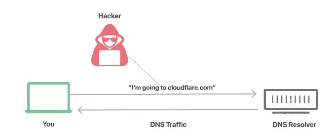
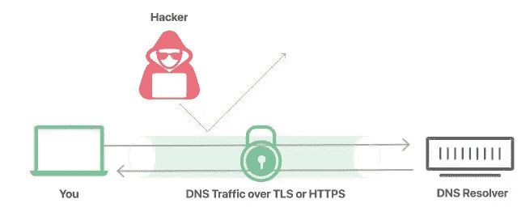

# HTTPS 域名系统 Vs DNS 域名系统

> 原文：<https://medium.com/geekculture/dns-over-https-vs-dns-over-tls-cbfc96c283db?source=collection_archive---------1----------------------->

DNS 查询从客户端浏览器发送到 DNS 解析器，将域名转换为 IP 地址。到目前为止，在上一篇文章中，我们已经看到，即使我们使用 DNSSEC，DNS 查询也没有加密。因此，入侵者可以看到您的 DNS 查询并分析您的浏览模式。

When DNS queries are sent in plain text. ([Picture Source](https://cf-assets.www.cloudflare.com/slt3lc6tev37/5Cgzkxb8COyIZ9evqqGFyF/384df7ee28643474080bbcd564fc3cfa/dns-traffic-unsecured.svg))

DoH 和 DoT 与 DNSSEC 有什么不同？

DNSSEC 是一组添加到 DNS 查询和响应中的安全扩展，用于验证根、TLD 和权威 DNS 服务器的身份。我们在上一篇文章中已经看到，DNSSEC 提供了 DNS 查询和响应的认证和完整性，但是它不加密 DNS 查询和响应。DNSSEC 被设计用来【防御 ***缓存中毒攻击*** 。在 DoH/DoT 的帮助下，我们可以加密 DNS 查询和响应，使 DNS 流量更加安全。

为了解决这个问题，开发了两种新的协议-DoH(HTPPS 上的 DNS)和 DoT(TLS 上的 DNS ),这两种协议对 DNS 流量进行加密，防止入侵者入侵。

When DNS query is sent over DoH or DoT ([Picture Source](https://cf-assets.www.cloudflare.com/slt3lc6tev37/7qcyOJwWyOt4EVJykiIRTn/30e34453409eb42fa1ec36680609ad8d/dns-traffic-over-tls-https.svg))

**DoT(DNS over TLS)是什么？**

DoT**(TLS 上的 DNS)**是一种通过 TLS 加密 DNS 查询和响应的标准。TLS 是传输层上的协议，负责提供加密功能。DoT**(TLS 上的 DNS)**在 DNS 传输层使用的 UDP 协议之上添加 TLS 协议，为 DNS 查询和响应提供加密和验证功能。它确保 DNS 查询和响应是安全的，不会被外部入侵者伪造。

在这种结构中，DNS 查询没有改变。DoT **(DNS over TLS )** 使用标准端口 853 进行通信。组织很容易将 DNS 流量与其他常规 HTTP 流量隔离开来，因为它使用专用端口。虽然 DNS 流量是加密的，但是它们可以监控端口 853 上的传入和传出 DNS 流量。这为组织提供了监控 DNS 流量的工具。DNS 服务器和客户端浏览器都应该支持 DoT 通过 TLS 发送 DNS。

**什么是 DoH(HTTPS 域名系统)**

DoH**(HTTPS 上的 DNS)**也是 DoT 的替代方案，用于加密 HTTPS 上的 DNS 查询和响应。它也可以理解为 DNS over HTTPS over TLS，因为 HTTPS 使用 TLS 作为其底层服务。DoH **(DNS over HTTPS)** 使用 HTTP 协议而不是直接 UDP 协议。DNS 包被封装在 HTTP 包中，然后它添加 TLS 层并将它们发送到传输层。DoH **(DNS over HTTPS)** 使用与 HTTPS 相同的端口 443。因此，组织很难将 DNS 流量与正常的 HTTPS 流量分开，因为两者都使用同一个端口。但它为用户提供了更多的隐私，因为 DNS 流量被伪装成 HTTPS 流量。DNS 服务器和客户端浏览器都应该支持 DoH 通过 HTTPS 发送 DNS。

# DoT 和 DoH 哪个更好？

这仍然是一个争论，因为两个协议是分开开发的。从网络安全的角度来看，DoT 更好，因为它使组织能够监控和阻止加密的 DNS 流量，这对于阻止恶意活动非常重要。同时，DoH 查询被封装在 HTTPS 流量中，这意味着如果不阻止所有其他 HTTPS 流量，它们就不会被轻易阻止。但是 DoH 为用户提供了更好的隐私。

Google chrome、firefox 和 edge 浏览器目前也支持 DoH 和 DoT 流量。