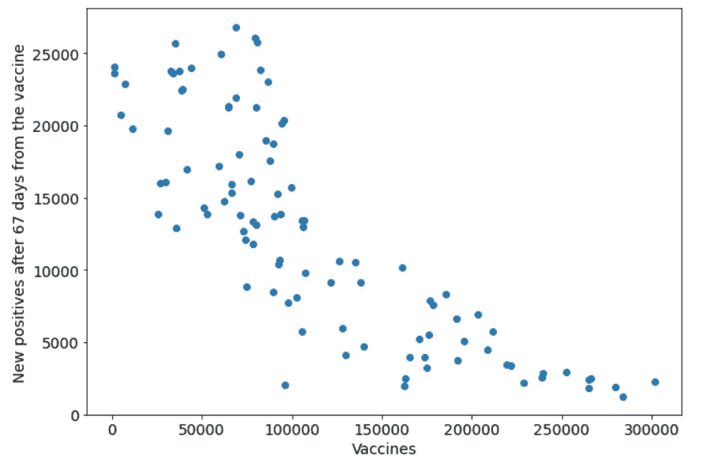

# 新冠肺炎疫苗真的使曲线变平了吗？

> 原文：<https://medium.com/geekculture/do-covid-19-vaccines-really-flatten-the-curve-cb27cd699d14?source=collection_archive---------18----------------------->

## 意大利疫苗接种活动与新冠肺炎感染相关性的统计分析

疫苗被认为可以降低新冠肺炎病毒感染的影响。实际上是真的吗？在这篇文章中，我展示了一些结果，这些结果指出了疫苗接种与癌症发病率下降之间的相关性。