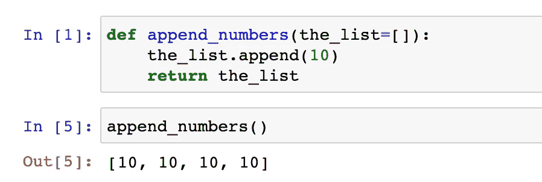

# 不要在 Python 中使用可变对象作为默认参数

> 原文：<https://medium.com/geekculture/do-not-use-objects-as-default-arguments-in-python-1c940212db2e?source=collection_archive---------2----------------------->

## Python 的这种特性会导致程序出现一些意想不到的行为。

比方说，您想要一个向列表追加一些数据的函数。如果列表没有通过，则将相同的数据追加到新创建的列表中。