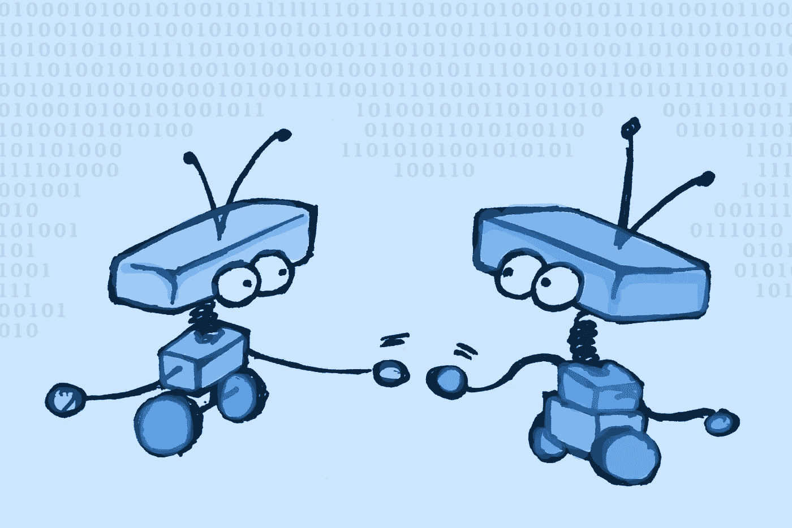

# 机器人有比赛吗？

> 原文：<https://medium.com/geekculture/do-robots-have-a-race-994307983acc?source=collection_archive---------23----------------------->

## 尽管它们具有机械的本质，但人们似乎给机器人强加了种族身份。这是个问题。

Lighter-colored robots often pass as white or Asian, while darker ones pass as Black or Latin. Image by author

 做 谷歌图片[搜索](https://www.google.co.uk/search?hl=en&authuser=0&tbm=isch&source=hp&biw=1440&bih=716&ei=lCY4XZaAMrGOlwS_oqnoCQ&q=robot&oq=robot&gs_l=img.3..35i39l2j0l8.50.532..855...0.0..1.177.909.1j6......0....1..gws-wiz-img.....0.jXFv2GYqR3Y&ved=0ahUKEwiWmtHVoM3jAhUxx4UKHT9RCp0Q4dUDCAU&uact=5)的“机器人”，你会发现主要是白色或金属的装置。在电影中没有什么不同，无论你是在看*银翼杀手*、*星球大战*、*终结者*，还是老好人*大都会*。几乎所有电影中的机器人都是白色的…