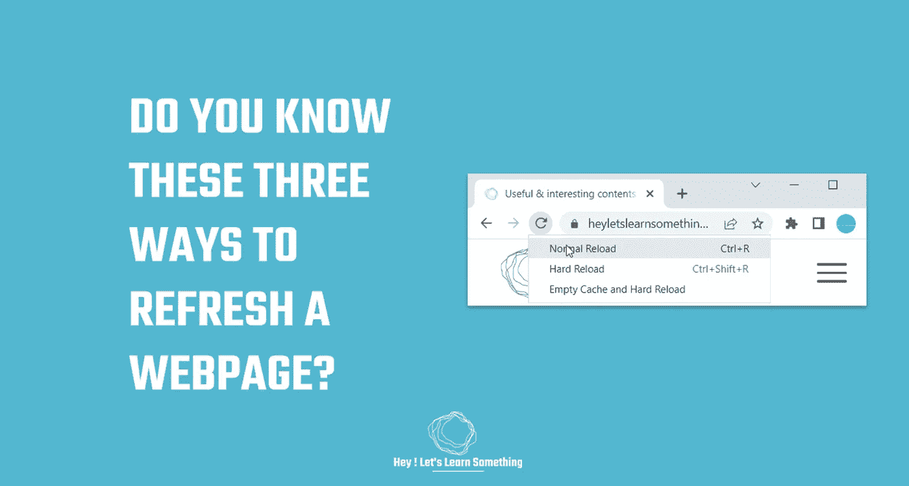

# 你知道如何刷新网页吗？

> 原文：<https://medium.com/geekculture/do-you-know-how-to-refresh-a-webpage-a633e946d830?source=collection_archive---------19----------------------->

这是你浏览器上隐藏的重新加载菜单

听起来很简单，你知道如何刷新或重新加载网页吗？嗯，不是说快捷键 F5 或 Ctrl + F5，而是其他一些在浏览器上刷新页面的方法。基本上，在 chrome、Edge 和 Brave 浏览器上，你可以选择三种不同的方式来重新加载页面(好的方面是这非常容易做到)。这可能非常…