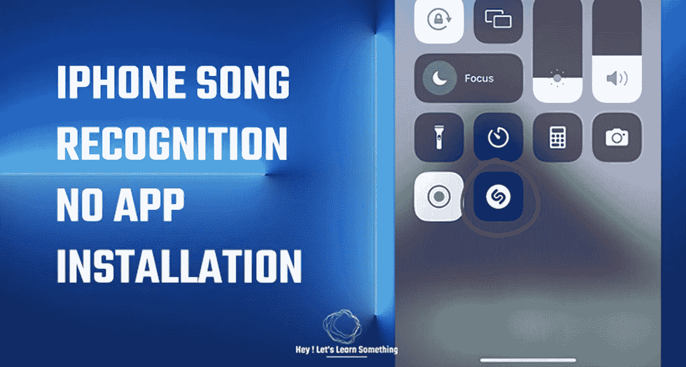

# 你知道 iPhone 内置了音乐识别功能吗？

> 原文：<https://medium.com/geekculture/do-you-know-iphone-has-a-music-recognition-feature-built-into-it-9f34d3c486e4?source=collection_archive---------13----------------------->

无需安装第三方应用程序即可在 iPhone 上查找任何歌曲名称。

如果你运行的是 iOS 14.2 或更高版本，那么你的 iPhone 有内置的音乐识别应用程序。以前我们需要下载并安装 Shazam 应用程序来识别播放的歌曲，但现在苹果公司在新的 iOS 中添加了相同的应用程序。这意味着你不…