# 你知道关系数据库也可以处理 JSON 数据吗？？

> 原文：<https://medium.com/geekculture/do-you-know-relational-database-can-also-deal-with-json-data-7503a342a73f?source=collection_archive---------10----------------------->

JSON (JavaScript Object Notation)自其 JavaScript 起源以来已经走过了漫长的道路，现在已经成为简单而深刻的结构化数据的事实上的机器对机器数据交换标准。JSON 数据的叶节点只是数字、文本、布尔值或空值形式的标量，而树结构由键值映射(也称为“对象”)和数组组成。

JSON 是一种基于文本的格式，需要解析才有用，而且它缺乏一种符合模式的内置机制。大多数编程语言，包括 web 浏览器中的 JavaScript，都可以解析 JSON，它被广泛用于 REST 和 GraphQL APIs。

另一方面，JSON 文档是一个平面的二维树，没有到其他文档的链接。如果这种结构没有得到加强，大量的数据很快就会成为负担，而访问数据库的编程人员(或人员)可以管理这些数据。

相反，非常严格的行列关系数据库表可以通过引用变成高维数据。它实际上是一棵所有叶子的树，因为列中的数据通常是完全标量的。关系数据库的刚性允许智能索引、存储、确保数据和引用结构完整性的约束、唯一性保证以及防止数据丢失。

PostgreSQL 中的 JSON 支持
JSON 支持在 9.2 版本中被添加到 PostgreSQL 中，并且已经得到了相当大的扩展。

JSON 数据在 PostgreSQL 中可以以两种方式存储:JSON 和 JSONB，以便为这些数据类型开发高效的查询技术。

数据类型 JSON 和 JSONB 接受几乎相同的一组值作为输入。最重要的实际区别是效率。JSON 数据类型存储输入文本的精确副本，处理函数必须在每次执行时重新解析该副本；然而，JSONB 数据是以分解的二进制格式存储的，由于额外的转换开销，这种格式的输入速度稍慢，但处理速度明显更快，因为不需要重新解析。JSONB 也支持索引，这是一大优势。

JSONB 类型将维护标记之间语义上无关紧要的空白，以及 JSON 对象中键的顺序，因为它存储输入文本的精确副本。同样，如果同一个键在 JSON 对象的值中出现了几次，那么所有的键/值对都会被保留。(处理例程将最近的值视为活动值。)JSONB 则相反，不保存重复的对象键，不保留空白，不保留对象键的顺序。如果在输入中提供了重复的键，则只保存最后一个值。在本文中，我们将详细讨论 JSON 类型。

让我们从一个带有 JSON 类型列的表开始，并使用 JSON 以字符串形式插入一些数据:

1.  **创建表:** emp_json 包含两个字段，`id`是主键，`details`是 json 类型。

```
create table emp_json( id serial primary key,
                       details json not null);
```

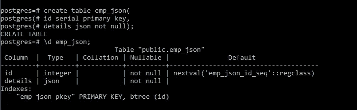

**2。将数据插入表格:**

在将数据插入 JSON 列之前，必须确认数据是有效的 JSON 格式。下面的 INSERT 语句在 emp_json 表中创建新行。

```
insert into emp_json(details) values('{"name":"BLAKE", "job":"analyst", "pay_details":{"sal":50000, "comm":500}}');--insert multiple records
insert into emp_json(details) values
('{"name":"ROYCE", "job":"clerk", "pay_details":{"sal":5000, "comm":200}}'), 
('{"name":"RACHEL", "job":"manager", "pay_details":{"sal":6000, "comm":600}}'),
('{"name":"GRAM", "job":"clerk", "pay_details":{"sal":5500, "comm":500}}'),
('{"name":"ADAM", "job":"analyst", "pay_details":{"sal":55000, "comm":500}}');
```

**3。JSON 数据提取:**

使用 SELECT 语句查询 JSON 数据，这与搜索其他本地数据类型是一样的:

```
select * from emp_json;
```

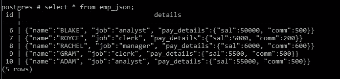

PostgreSQL 生成 JSON 格式的结果集。

PostgreSQL 有两个查询 JSON 数据的本地操作符: `->`和`->>`。

操作符 `->`返回 JSON 对象字段的键。
操作符`->>`返回 JSON 对象字段的文本。
要从 emp_json 获取 json 格式的所有名称，请在以下查询中使用运算符- >:

```
select details->'name' as Name from emp_json;
```

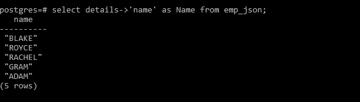

下面的查询使用操作符`->>`以文本形式获取所有姓名:

```
select details->>'name' as Name from emp_json;
```

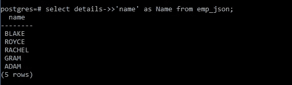

因为->操作符返回一个 JSON 对象，所以您可以将它与-> >操作符结合使用来获取特定的节点。例如，以下语句返回 id 和他们的薪水:

```
select id, details->’pay_details’->>’sal’ as Salary from emp_json;
```

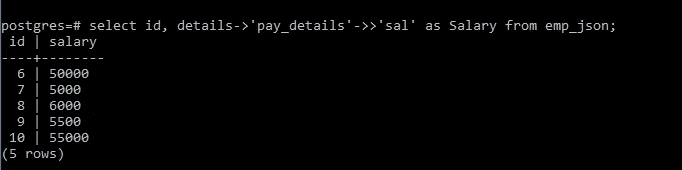

**4。如何在 WHERE 子句中使用 JSON 操作符:**

为了过滤返回的行，我们可以在 WHERE 子句中使用 JSON 操作符。例如，我们可以使用下面的查询来检索 job analyst 值大于 5000 的所有 id:
值得注意的是，在与 5000 比较之前，我们使用了类型转换将 qty 字段更改为整数类型，因为`->>`返回文本字段。

```
select id, details->'job' as job, 
details->'pay_details'->>'sal' as salary 
from emp_json where 
details->>'job' = 'analyst' 
or
cast(details->'pay_details'->>'sal' as integer) >5000;
```

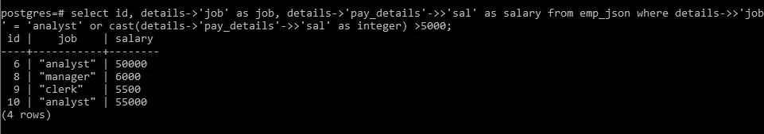

**5。JSON 数据上的聚合函数:**

```
select 
max(cast(details->'pay_details'->>'sal' as integer)),  min(cast(details->'pay_details'->>'sal' as integer))
from emp_json;
```

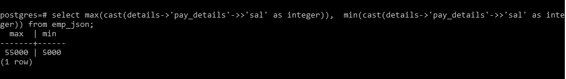

6。Postgres 内置 JSON 函数:

**6.1 json_typeof():**

该方法返回一个字符串，表示最外层 JSON 值的类型。数字、布尔值、空值、对象、数组和字符串都是可能的。

以下查询返回详细信息的数据类型:

```
select json_typeof(details ) from emp_json;
```

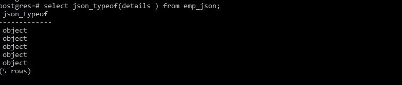

以下查询返回“sal”字段的数据类型。

```
select json_typeof(details->'pay_details'->'sal' ) from emp_json;
```

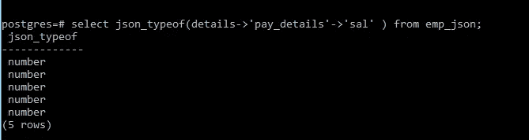

**6.2 json_object_keys()**

json_object_keys()函数从最外层的 json 对象中返回一组键。以下查询检索 details 对象的所有键。

```
select id, json_object_keys(details) from emp_json where id = 6;
```

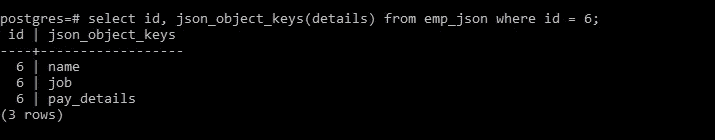

**6.3 json_each()**

我们可以使用 json_each()函数将最外层的 JSON 对象扩展成一组键值对。考虑以下语句:

```
select id, json_each(details) from emp_json where id = 6;
```

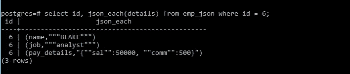

如果想深入挖掘，还有更多 [PostgreSQL JSON 函数](https://www.postgresql.org/docs/current/static/functions-json.html)。

在本教程中，我们学习了如何使用 PostgreSQL 的 JSON 数据类型，以及如何使用一些最重要的 JSON 操作符来更有效地处理 JSON 数据。

我希望你喜欢阅读这篇文章并从中有所收获。谢谢你花时间阅读它。如果你喜欢这篇文章，请给它一个大拇指，并订阅我的中等饲料。

请留意其他文章。