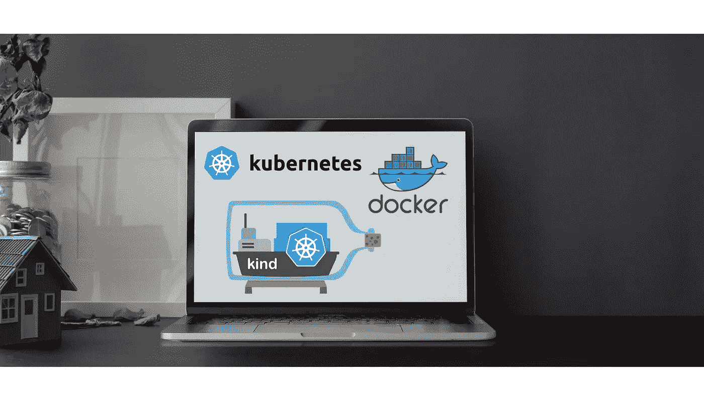
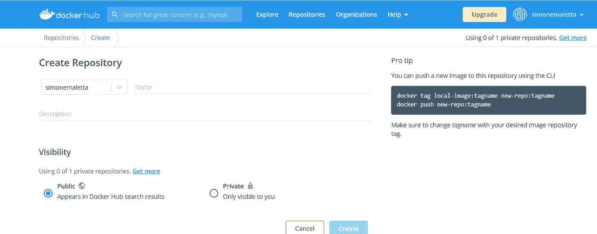
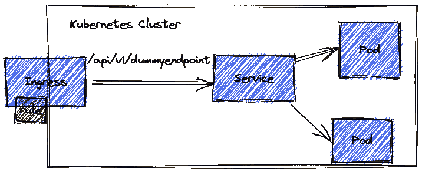

# Docker 和 Kubernetes 必需品

> 原文：<https://medium.com/geekculture/docker-and-kubernetes-essentials-70e5d23d3eda?source=collection_archive---------4----------------------->

## 如何设置本地环境



# 介绍

去年年中，我和我的团队参与了一个云迁移项目。从软件架构的角度来看，我们选择通过微服务架构来实现转型。我们做了一个保守的选择，使用 docker 作为容器，Kubernetes 作为容器编排器。

我们进行了一次概念验证，向我们的客户系统和架构部门展示了预期的每个组件以及它们的交互方式。

我为我的机器配置了:

*   [Docker 桌面](https://www.docker.com/)
*   [善良的库伯星团](https://kind.sigs.k8s.io/)
*   Docker.io 作为远程映像容器注册表。

# 码头工人

Docker 是虚拟化技术。它允许您将应用程序及其所需的引用分发到一个独立的虚拟机中。我们称这种机器为**集装箱**。您从其映像开始创建容器，就像其他虚拟化技术一样。docker 的不同之处在于，您可以将基础设施作为应用程序来管理和分发。映像包含源代码，也就是它需要的 JVM。

您创建了一个编译文本文件的图像。Docker 把这个文件叫做 *Dockerfile* 。最简单的方法是扩展现有映像，该映像已经包含了您需要的基础架构软件。

例如:

```
FROM openjdk:latest
COPY . /usr/src/myapp
```

将 docker 文件和 jar 放在一个临时目录中，然后输入:

```
docker build . -t myimage:tag
```

在哪里

*   。是软件所在的文件夹。这是当前文件夹；
*   mymachine 是构建的名称；
*   *标签*是用于识别单个构建的标签

该命令创建一个 docker 映像，并将其安装到本地 docker 注册表中。

我使用一个公共存储库来模拟云环境中的行为。

## Docker Io

让我们转到 docker.io 网站并创建一个存储库。



我将我的存储库称为 ***test-repo*** 。

回到您的机器，标记您创建的图像，如下所示:

```
docker tag myimage:tag myusername/test-repo:myfirstcontainer
```

存储在本地 docker 存储库中的图像被重命名为 test-repo，并标记为 *myfirstcontainer* 。

下一步是将图像推送到*测试报告*。登录到远程存储库

```
docker login -n username
```

其中用户名是你在 docker.io 网站上注册的用户名。

将您的映像移动到远程容器注册表:

```
docker push myusername/test-repo:myfirstcontainer
```

现在一切都准备好了，可以在 Kubernetes 上工作了。

## 库伯内特斯

Kubernetes 是市场上最知名的集装箱管理公司。



Kubernetes 中运行的应用程序必须与一个**集群**相关联。集群是一组物理或虚拟的机器。每台机器都被命名为**节点**。我们有两种类型的节点:

*   *工作*:应用程序运行的地方；
*   *管理器*:用于管理工作节点，验证应用状态等。

一个 **pod** 是容器映像的运行时表示。Pod 是 Kubernetes 中最小的部署单位。您可以将多个容器分配到一个 pod 中，但不建议这样做。

您可以将 Kubernetes 资源分组到名称空间中。对于 Kubernetes 来说，**名称空间**和它在 XML 模式中的含义是一样的:您可以将它用作分区键。如果您需要引用驻留在不同名称空间的资源，您必须使用*全限定名*。

要创建 pod，您需要定义一个**部署**。部署是一个 YAML 文件和一个 Kubernetes 对象。它指示集群创建 pod。下面是一个部署文件示例:

```
apiVersion: apps/v1
kind: Deployment
metadata:
  name: *myfirstcontainer-deployment*
  namespace: *mynamespace*
  labels:
    app: *myfirstcontainer*
spec:
  replicas: 1
  selector:
    matchLabels:
      app: *myfirstcontainer*
  template:
    metadata:
      labels:
        app: *myfirstcontainer*
    spec:
      containers:
      - name: *myfirstcontainer*
        image: *myusername/test-myfirstcontainer*
        imagePullPolicy: Always
        ports:
        - containerPort: *8080*
        envFrom:
        - configMapRef:
            name: *myconfiguration*
```

部署有一个名称和一个关联的名称空间。*副本*标签定义了要创建多少个 pod。

您在*容器*部分中指定要使用的容器图像。看，它指向我们的 docker.io 远程容器库。

我将应用程序配置为使用一个**配置图**。配置图只不过是一个运行时概要文件。您使用配置图来分离配置和应用程序。

从属性文件开始创建配置图很容易:

```
kubectl create configmap myconfiguration --from-env-file=myconf.properties -n *mynamespace*
```

配置文件必须具有以下格式:

```
myapp.host= localhost 
myapp.port= 8080
myapp.loglevel= DEBUG 
```

***envFrom*** 标签是一个数组，你可以包含不止一个配置图。注意:配置映射必须与部署驻留在同一个名称空间中。您必须在部署之前创建地图。否则，pod 将不会启动，但它将处于*容器配置错误*状态。

使用控制台数字:

```
kubectl apply -f deployment.yaml
```

创建部署和单元。

您必须创建一个**服务**来允许集群中的其他应用程序访问您的服务。服务被用作路由网络呼叫的助记名称。在 Kubernetes 集群中，服务掩盖了应用程序的物理分布。它还可以充当负载平衡器。

下面是一个服务示例

```
apiVersion: v1
kind: Service
metadata:
 name: *myfirstcontainer-service*
 namespace: *mynamespace*
spec:
 type: ClusterIP
 selector:
   app: *myfirstcontainer*
 ports:
 — protocol: TCP
   port: 9080
   targetPort: 8080
```

看:它指的不是使用部署名称的应用程序，而是它的标签。它屏蔽了容器端口(*目标端口*)。网络调用使用*端口*标签端口，而不是容器端口。

Types 标记必须在以下列表中:

*   *ClusterIp* :使您的应用程序只在集群内部可见；
*   *节点端口*:让你的应用程序在集群之外也是可见的；
*   *负载均衡器*:用于云环境，允许你为你的应用配置一个外部负载均衡器；
*   *外部名称*:这允许您定义一个虚拟主机名。

出于设计目的，我选择使用第一种方法。

服务和 pod 必须依赖于相同的名称空间才能工作。

要创建服务数字:

```
kubectl apply -f service.yaml
```

一个**入口**是 Kubernetes 对象，它向外界公开集群中的应用程序。它可以作为你公司的互联网代理。

入口作为 pod 分布在专用的名称空间中。我用的是基于 Nginx 的。

在您的集群中，您不是为每个应用程序创建入口，而是创建一组入口规则:

```
apiVersion: networking.k8s.io/v1
kind: Ingress
metadata:
  name: *myfirstcontainer-ingressrule*
  namespace: *mynamespace*
spec:
  ingressClassName: nginx
  rules:
  - http:
     paths:
     - path: */api/v1/dummyendpoint*
       pathType: Prefix
       backend:
         service:
           name: *myfirstcontainer-service*
           port:
             number: 9080
```

入口规则指向使用公开端口号的服务。入口可以像反向代理一样调用您的应用程序，使用基于路径的路由。

# 结论

这个故事代表了我通过学习集装箱化所学到的东西。你在这里找到的一切对学习环境都是有用的。对于云环境，必须做一些改变，但是命令是相同的。

# 参考

*   https://docs.docker.com/get-started/overview/[码头文件](https://docs.docker.com/get-started/overview/)
*   Kubernetes 服务:[https://kubernetes . io/docs/concepts/services-networking/service/](https://kubernetes.io/docs/concepts/services-networking/service/)
*   kubernetes ingress:[https://kubernetes . io/docs/concepts/services-networking/ingress/](https://kubernetes.io/docs/concepts/services-networking/ingress/)
*   善良的入口:[https://kind.sigs.k8s.io/docs/user/ingress/#ingress-nginx](https://kind.sigs.k8s.io/docs/user/ingress/#ingress-nginx)