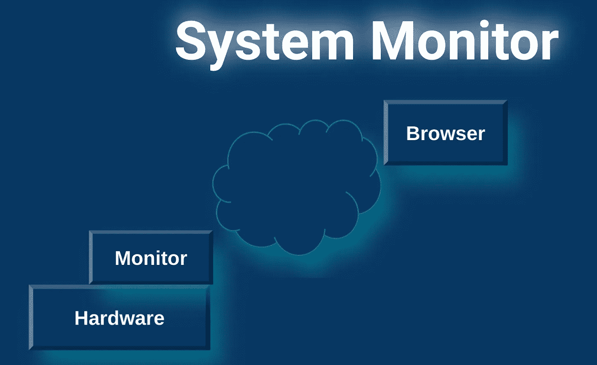
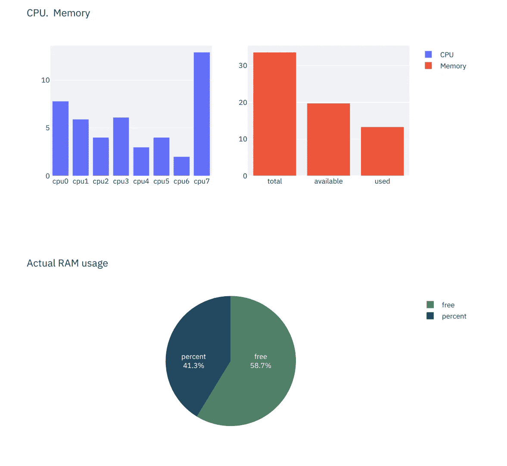

# Docker app。可从 WEB 访问的系统监视器。

> 原文：<https://medium.com/geekculture/docker-app-system-monitor-accessible-from-web-1796d2d86914?source=collection_archive---------25----------------------->



by author

在本文中，我将向您展示如何在 [**Streamlit**](https://streamlit.io/) 和 Python 库**[**psutil**](https://github.com/giampaolo/psutil)**中构建应用程序。**该应用程序既可以在 docker(包含 Dockerfile)中运行，也可以作为单独的应用程序运行。请记住，如果你不从 Docker 运行应用程序(monitor.py ),你将安装所有的库，这些库在 Dockerfile 中运行。
在线更新(运行)提交的应用程序。**

**Streamlit 可能是构建可在浏览器中运行的应用程序的最强大的 Python 库之一。如果你还不熟悉这个库，请访问网站，感受一下构建和运行你梦想中的应用程序是多么容易。**

**我在本文中描述的应用程序使用了 Python 库 psutil，它允许您检索关于正在运行的进程和系统利用率的所有信息，例如:Python 中的 CPU、内存、磁盘、网络、传感器等。
在这个简单的应用程序中，我演示了 CPU 内核(在我的例子中是 8 个内核)和 RAM 统计的使用百分比。受到启发，并添加更多的统计数据，如你所愿。**

**为了在 Docker 中运行应用程序(最简单的方法)是将 monitor.py 复制到 src 文件夹—文件中(见下文)。**

```
.
├── Dockerfile
└── src
    └── monitor.py
```

**我们将要使用的 docker 文件如下所示:**

```
FROM python:3.7.2-slimEXPOSE 8501WORKDIR /appRUN pip install --upgrade pipRUN pip install streamlitRUN pip install psutilRUN pip install plotly-expressCOPY ./src /monitorENTRYPOINT [ "streamlit", "run"]#CMD ["/monitor.py"]CMD ["/monitor/monitor.py"]
```

**使用以下命令构建您的映像:**

```
sudo docker build . -t monitor:1
```

**并运行:**

```
sudo docker run -it monitor:1
```

**在终端上，您将会收到该应用程序的链接。**

**该应用程序如下所示:**

****

**by author**

**感谢阅读。**