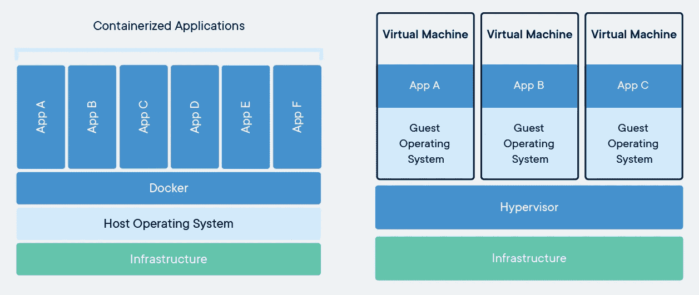
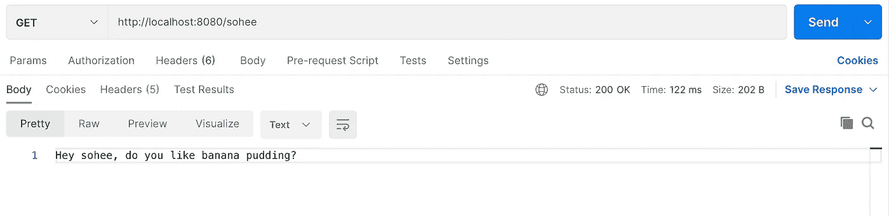
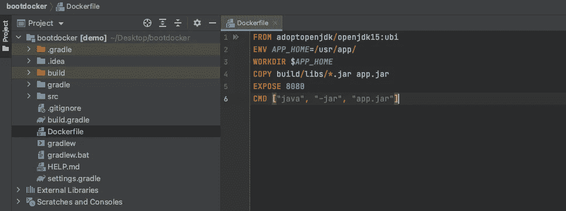
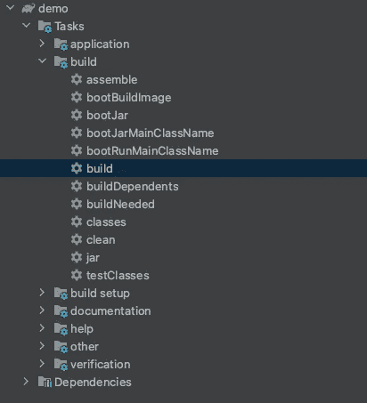
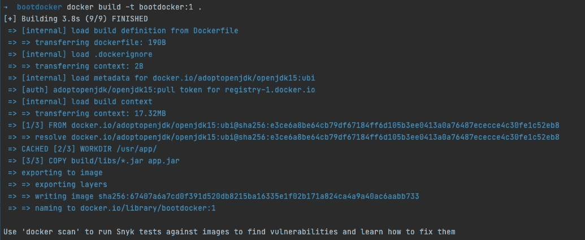
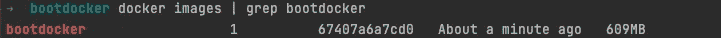
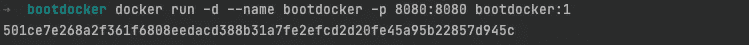
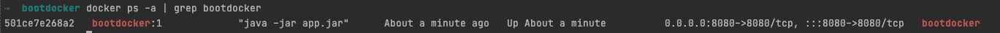
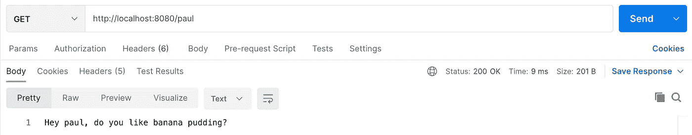
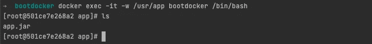

# Docker 基础知识和 Spring Boot 应用程序的简单步骤

> 原文：<https://medium.com/geekculture/docker-basics-and-easy-steps-to-dockerize-spring-boot-application-17608a65f657?source=collection_archive---------0----------------------->

您是否曾经说过“我的应用程序可以在我的笔记本电脑上完美运行，但是当我部署在云中时就不行了。”或者“我和我的同事有相同的代码库。它可以在我同事的笔记本电脑上运行，但不能在我的本地笔记本电脑上运行。”？

> 如果您能够神奇地将您的环境和代码封装在一起，并作为一个完整的包来共享或部署，这不是很好吗？

幸运的是， **Docker** 可以帮你做到这一点。

在这篇文章中，我想分享我到目前为止对 Docker 的了解，并回答诸如“Docker 是什么？”，“Docker 是怎么工作的？”，以及“如何使用 Docker？”。

第一部分:Docker 和容器的基本概念
第二部分:Dockerize 一个 Spring Boot 应用
第三部分:旁注


Photo by [Robin M.](https://unsplash.com/@magstadt?utm_source=medium&utm_medium=referral) on [Unsplash](https://unsplash.com?utm_source=medium&utm_medium=referral)

我想从快速浏览 Docker 和 containers 是什么开始。对于熟悉这些概念的人，请进入下一部分！

# 第一节:码头和集装箱的基本概念

## 问:什么是**码头**？

答:Docker 是一个开源的**容器化**平台。

## 问:什么是**集装箱化**？

答:容器化只是将软件应用打包到容器中的一种方式。

## 问:什么是 C **容器**？

答:容器是软件的可执行单元。它们打包了您的应用程序所需的一切，包括代码、库和依赖项，以便您的应用程序可以在任何地方、任何环境中运行。容器通过采取一种操作系统虚拟化的形式，并在隔离的进程中简单地借用主机操作系统的资源(CPU、内存和磁盘)来实现这一点。

虚拟化的级别是虚拟机(VM)和容器之间的关键区别。虚拟机虚拟化物理硬件，因此每个虚拟机必须包含一个来宾操作系统。然而，由于容器虚拟化了操作系统，它们不需要客户操作系统。没有客户操作系统是容器如此轻量、快速和可移植的原因。



Container vs VM from Docker Official Website

## 问:使用容器有什么好处？

*   **可移植性:**一旦你将你的应用容器化，你就可以在任何环境下运行它，无论是在别人的笔记本电脑上还是在云中，而无需重新配置。使用容器进行部署，可以实现部署的可移植性和一致性。
*   **效率:**容器使工程师能够最大限度地利用物理机器的 CPU 和内存，因为应用程序组件可以在小容器块中部署和扩展。这与在微服务架构中使用容器尤其相关。
*   **使应用程序现代化**:由于容器是轻量级和可移植的，它们适用于云原生和微服务架构。

## 你好，码头工人！

自从 Docker 在 2013 年发布以来，它完全改变了工程师使用容器的方式。现在，Docker 几乎可以和容器互换使用，是利用容器的事实方式。

在运行时，Docker 引擎使用一个名为 **Docker** **images** 的只读模板启动**容器**。Docker 镜像是基于一个**Docker 文件**创建的，Docker 文件只是一个基于文本的脚本文件。

## 问:Docker 有什么特别之处？

Docker 使用定制的集装箱化技术，使工程师能够以更轻、更快、更有效的方式使用集装箱。

*   **映像分层**:Docker 映像不可避免地很庞大，因为它包含所有信息，包括运行容器的代码和配置文件。Docker 通过图像分层来解决这个问题。添加或编辑文件时，Docker 会创建一个新的图像层，而不是从头开始创建一个新的 Docker 图像。你所需要做的就是下载一个新的图像层。
*   **Docker Hub** : Docker 有一个上传或下载容器映像的好地方——Docker Hub。根据该网站，有 100，000+个容器图像。您可以将这些图像用作作为模板的*基础图像*。基本上，这允许您重用现有的容器。
*   **docker file:**docker file 易于读写。使用 Dockerfiles 来维护您的依赖项和配置，您可以像管理应用程序一样轻松地"[管理您的基础架构。](https://docs.docker.com/get-started/overview/)
*   **版本控制:**类似于 Github 的工作方式，Docker 保存容器映像的历史。您可以轻松地跟踪版本和回滚容器映像。

简而言之，Docker 帮助您快速一致地交付应用程序。我推荐阅读 [Docker Docs](https://docs.docker.com/get-started/overview/) 和 [IBM Container](https://www.ibm.com/cloud/learn/containers) 来了解更多。

在下一节中，我将为 Spring Boot 应用程序创建并运行一个 Docker 容器。

# 第二部分:记录 Spring Boot 申请

> Docker 应该已经安装并正在运行。如果没有安装，可以在这里安装[。](https://www.docker.com/get-started)

在本教程中，我们将遵循以下步骤:

1.  创建 Spring Boot 应用程序
2.  创建 Dockerfile 文件
3.  构建可执行 jar 文件
4.  构建 Docker 映像
5.  使用构建的映像运行 Docker 容器
6.  试验

# 开始吧！

## 1.创建一个 Spring Boot 项目

我创建了一个非常简单的 Spring Boot 应用程序。随意创建你自己的或者使用来自 Github 的我的。

有一个端点将一个名字作为路径变量，并问一个简单的问题，“你喜欢香蕉布丁吗？”(btw，我爱香蕉布丁！)

如果我运行我的应用程序并发送一个请求，这就是我得到的！



## 2.创建 Dockerfile 文件

在根文件夹中创建一个 docker 文件。



让我们一行一行地了解每一步都在做什么。

## **来自**

要使用 Docker 文件构建 Docker 图像，我们需要一个基础图像层。因为我的应用程序是用 Java 编写的，所以我们必须基于 Java 映像构建一个映像。因此，`FROM adoptopenjdk/openjdk15:ubi`意味着我们正在创建的图像基于一个 [Java 15 OpenJDK 图像](https://hub.docker.com/r/adoptopenjdk/openjdk15)。

## 包封/包围（动词 envelop 的简写）

这将设置环境变量。`*APP_HOME*=/usr/app/`简单地将目录`/usr/app/`分配给`APP_HOME`。该值用于`CMD`。

## 工作方向

这是`CMD`的输出应该运行的目录。我的话会是`/usr/app/`。

## 复制

这会将文件或目录复制到容器的目录中。因此，`COPY build/libs/*.jar app.jar`意味着将`build/libs/*.jar`复制到容器的`app.jar.`

## 揭露

`Expose`设置连接到主机的端口号。

## 煤矿管理局

当使用`docker run`创建容器或使用`docker start`启动容器时，它运行这个命令。格式为`CMD ["fileToRun", "param1", "param2"]`。因此，`CMD [“java”, “-jar”, “app.jar”]`意味着在容器启动时运行 shell 命令行`java -jar app.jar`。

## 3.构建可执行 jar 文件

只需点击左边的 Gradle build 任务，就可以构建一个可执行的 jar 文件。



这在`/build/libs/demo-0.01-SNAPSHOT.jar`产生了一个可执行的 jar 文件。

## 4.构建 Docker 映像

现在我们有了一个可执行的 jar 文件和一个 Docker 文件，是时候构建 Docker 映像了。

`$ docker build -t bootdocker:1 .`

*   确保在末尾包含`.`
*   在这里，`-t`简单地表示标记，后跟“名称:标记”格式。

运行该命令后，您可以看到构建了一个 Docker 映像。



您可以`$ docker images | grep bootdocker`检查 Docker 映像是否构建成功。



## 5.使用构建的映像运行 Docker 容器

`$ docker run -d --name bootdocker -p 8080:8080 bootdocker:1`

`-d`意味着我们将以分离模式启动容器。当用于运行容器的根进程退出时，它也退出。

`-name`指定容器的名称。

`-p`暴露容器的内部端口。格式为`-p hostPort:containerPort`。公开容器的端口可以通过指定主机的端口定向。因此，`-p 8080:8080`将主机的 8080 端口绑定到容器的内部 8080 端口。

`bootdocker:1`是图像名称和标签。



您可以使用`$ docker ps -a | grep {name}`检查容器是否构建成功。



您还可以查看日志文件，看看我的应用程序是否使用`$ docker logs -f bootdocker`成功运行。


看起来棒极了！

## 6.试验

如果我发送一个请求，我会得到我想要的！



# 万岁，我们刚刚运行了一个 Dockerized Spring Boot 应用程序！

# 第三部分:旁注

*   如果您想查看 jar 文件是否被正确地复制到容器的给定目录中，您可以使用`docker exec -it -w /usr/app bootdocker /bin/bash`。记住`/usr/app`是我在 Dockerfile 文件中分配的`APP_HOME`。



*   这是一些我觉得有用的命令行。

```
$ docker run
$ docker start 
$ docker ps -a 
$ docker stop {containerID} 
$ docker rm {containerID}
$ docker images
```

> 这篇文章是对 Docker 的友好介绍，并简要展示 Docker 是如何工作的。想要更优化的解决方案，我推荐阅读这篇[教程](https://spring.io/blog/2020/01/27/creating-docker-images-with-spring-boot-2-3-0-m1)。如果有什么不同意或者想补充的，请告诉我。我很想了解更多！