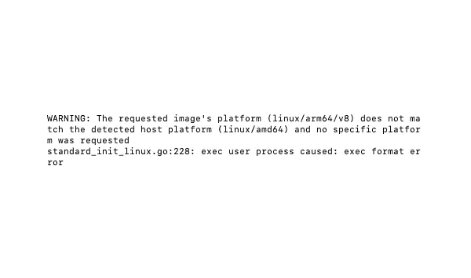
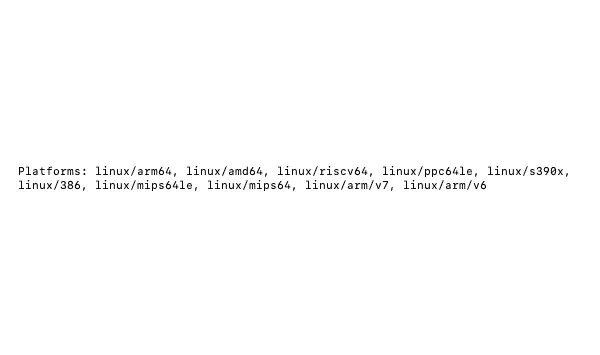

# 与麦克·M1 一起建造码头

> 原文：<https://medium.com/geekculture/docker-build-with-mac-m1-d668c802ab96?source=collection_archive---------0----------------------->

为多种架构构建映像的简明指南

Error about the architecture mismatch (image by author)

在使用了十多年的苹果电脑后，我最近买了一台苹果(迷你)M1 来取代我那快要报废的笔记本电脑。由于潜在的软件不兼容，我一直在犹豫要不要买一台，但谢天谢地，一切都很好。*大多是*。我在 Docker 上没有任何问题，直到这个版本被放到一个活动的 ubuntu 服务器上(见上图中的错误)。哎呀。我以为 Docker 的意思是“it-works-everywhere”，但是我忘记了架构。

*这里声明我最近从 Ampps 转而使用 Docker 进行本地开发——我几乎不懂 Docker 文件。由于我是双重初学者(M1 和码头工人)，这不是专家指南。因为我发现了很多冗长的文章(老实说，我没有读过)，所以在这里我将只尝试一个最简单的答案，并列出我采取的步骤——作为日志供将来参考，以防其他人需要:*

# 求解步骤

Docker 有一个扩展版本，叫做‘buildx ’,它应该已经和 Docker 一起安装了。我们将使用它来构建图像。

## 第一步

我们将需要创造一个“建设者”。我就叫它`mybuilder`。

`docker buildx create --name mybuilder`

## 第二步

然后我们告诉 buildx 使用`mybuilder`。

`docker buildx use mybuilder`

## 第三步

我们可以检查`mybuilder`只是为了确保安全。

`docker buildx inspect --bootstrap`

我们会看到一些打印输出，但我特别检查了以下内容:

As we can see, `linux/arm64` and `linux/amd64` are both listed (image by author).

## 步骤 4a

构建映像(假设您在 docker 文件所在的目录中)。

`docker buildx build --tag [image-tag] -o type=image --platform=linux/arm64,linux/amd64 .`

## 步骤 4b

我们也可以直接构建并推送至 Docker Hub(假设已经登录 Docker)。

`docker buildx build --push --tag [docker-hubid/image-tag] --platform=linux/arm64,linux/amd64 .`

为了快速复查，我们可以登录 Docker Hub。在 Tags & Scans 下，我们可以看到推送尝试，在 OS 列下，我们可以看到 mouseover 上列出的所有体系结构。

## 临时演员

我们可以通过输入以下命令来检查当前的构建器:

`docker buildx ls`

当前的构建器旁边会有一个`*`。

*瞧吧！这是真的。*我希望这足够简单直接，也希望我没有犯任何错误。