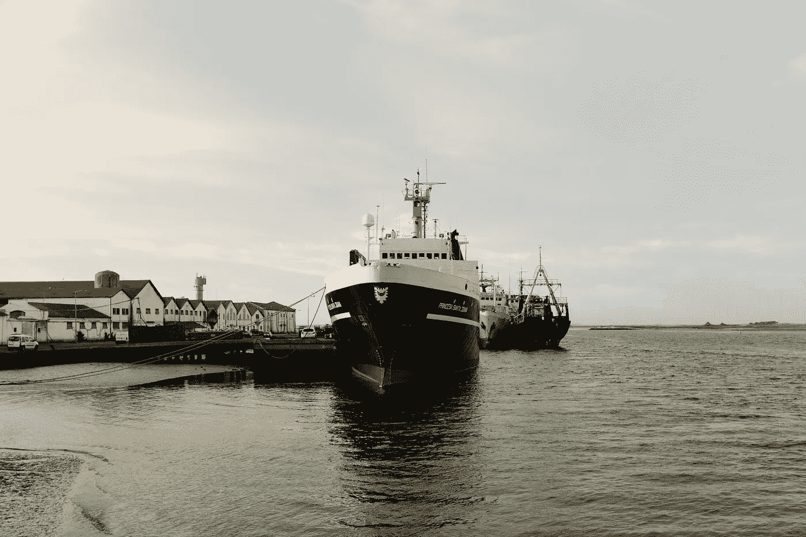

# Docker 备忘单:非常基本的术语和命令

> 原文：<https://medium.com/geekculture/docker-cheat-sheet-very-basic-terms-and-commands-11fc557ffa9a?source=collection_archive---------10----------------------->



Photo by [Ricardo Resende](https://unsplash.com/@rresenden?utm_source=unsplash&utm_medium=referral&utm_content=creditCopyText) on [Unsplash](https://unsplash.com/s/photos/ship-on-dock?utm_source=unsplash&utm_medium=referral&utm_content=creditCopyText)

Docker 已经存在一段时间了。开发社区中的大多数人肯定已经听说过它了。他们中的许多人已经在各种用例中使用了它。我使用它也有一段时间了，主要是为了快速设置项目的依赖项，如数据库、缓存、一些 AWS 服务的模拟。我也制作了一些图片来表达我的想法。虽然我的学习是分散的，卡住了，谷歌寻找解决方案。

现在想结构化的接触 docker 相关话题，打算做一系列关于我理解的帖子，这里是第一个。

**条款
当你在电脑里安装 docker 的时候，你实际上得到了两个软件。**

1.  Docker 客户端:这是一个 CLI，您可以使用它来指示 docker 执行某个操作。
2.  Docker 守护进程:它从 CLI 获取命令并实际执行它。它还管理其他 docker 组件，如映像、容器、网络和卷。

好的，那么你如何使用 docker 呢？通过创建和配置各种对象。以下是各种 docker 对象的简短描述:

1.  图片:这些是你申请的模板或蓝图。它包含运行应用程序包所需的信息、元数据和指令。它是可运输和可共享的。
2.  容器:这些是应用程序运行的封装环境。一个简化的类比可以是这样的，如果图像是代码，容器就是代码的运行实例。

Docker 包含其他对象，如网络、存储、插件。但那些是后一种。还有一个重要术语叫做**注册表。**注册表就像是图像的 github。这是存储和共享应用程序图像的最简单方式。在通常情况下，完成开发后，您构建一个映像并将其发布到注册表中，然后运营团队从注册表中提取映像，并将其作为容器在生产环境中运行。

最受欢迎的公共注册地是 hub.docker.com。你也可以建立一个你自己的私人注册表，这样你的图片就可以留在你的组织里。

1.  **如何找到主机中安装的 docker 的版本？**

```
docker version
```

2.**如何列出主机中可用的 docker 镜像？**

```
docker image ls
```

3.**如何列出主机中正在运行的 docker 容器？**

```
docker ps
```

4.**如何列出主机中所有(运行和停止的)容器？**

```
docker ps -a
```

5.**如何运行已有图像的容器？**

```
docker run <image>:<tag>ordocker run <image>
```

如果你没有提到标签，默认情况下它会拉或者运行最新的标签。

例如:`docker run redis:latest`

6.**如何在分离模式下运行容器？**

```
docker run -d <image>:<tag>
```

7.**运行时如何为容器提供名称？**

```
docker run --name=<desired name> <image>:<tag>
```

如果你不指定一个名字，docker 会给容器分配一个随机的名字。命名有助于您稍后检查容器或与容器进行交互。

例:`docker run --name=my_redis redis`

8.**如何停止正在运行的容器？**

```
docker stop <container id>
or
docker stop <container name>
```

例:`docker stop my_redis`

9.**如何移除 docker 容器？**

```
docker rm <container id>
or
docker rm <container name>
```

请注意，您不能删除正在运行的容器。如果你需要删除一个容器，你必须先停止它。

10.**如何删除 docker 图像？**

```
docker rmi <image name>
```

例如:`docker rmi nginx`或`docker rmi redis`

如果您有任何正在运行或停止状态的容器正在使用该映像，docker 会阻止您删除它。您必须先移除容器，然后才能移除图像。

11.**如何拉一张图片？**

```
docker pull <image>:<tag>
```

如果你发出一个`docker run`命令，如果它不存在，它将首先尝试从注册表中提取图像。而`pull` 命令只是拉取图像并保存。这样当你运行它的时候，它会更快。

今天到此为止。