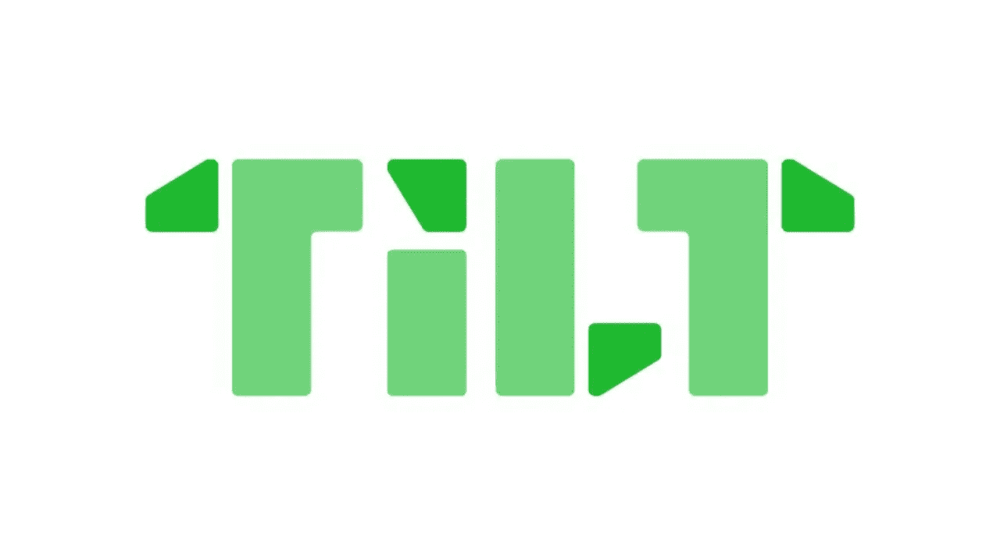
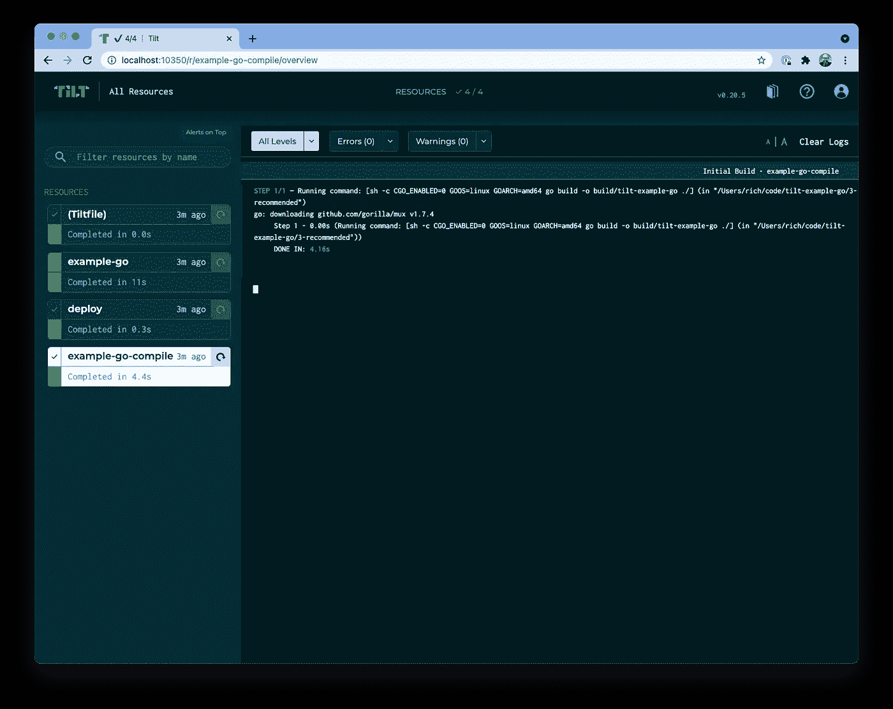

# Docker 为 Kubernetes 撰写替代方案:Tilt

> 原文：<https://medium.com/geekculture/docker-compose-alternatives-for-kubernetes-tilt-d3b89176f4ae?source=collection_archive---------28----------------------->

里奇·巴勒斯



许多开发在 Kubernetes 上运行的应用程序的工程师使用 Docker Compose 用于他们的本地环境，但是有许多很好的替代方案可以使针对 Kubernetes 集群的开发变得快速而简单。 [Tilt](https://tilt.dev/) 是一款开源工具，由 Tilt 团队开发，用于开发 Kubernetes 的工作流程。该领域的其他工具包括由谷歌创建的 [Skaffold](https://skaffold.dev/) ，以及由 Loft Labs 创建的 [DevSpace](https://devspace.sh/) 。我在 Loft Labs 工作，开发人员的工作效率是我的一大兴趣，所以我想看看 Tilt 能提供什么。

# 装置

Tilt 的安装取决于您的平台。你可以在这里找到[的说明](https://docs.tilt.dev/install.html)。我在 Mac 上工作，这个 curl 命令是推荐的安装方式:

```
curl -fsSL https://raw.githubusercontent.com/tilt-dev/tilt/master/scripts/install.sh | bash
```

我用家酿和倾斜安装是相当光滑。安装人员为 tilt 添加了一个家酿木桶，然后从那里安装了 Tilt 命令行界面(CLI)。我查看了安装脚本，它检测是否有自制软件，如果没有，就下载一个 tarball 并以这种方式安装二进制文件。还有 Linux 和 Windows 的安装说明。

# 倾斜文件

使用名为 Tiltfile 的文件配置 Tilt，该文件放在项目的根目录下。Tiltfile 可以像下面这样简单(来自文档):

```
docker_build('example-html-image', '.')
k8s_yaml('kubernetes.yaml')
k8s_resource('example-html', port_forwards=8000)
```

或者可以复杂得多。

Tiltfiles 是用一种叫做 Starlark 的语言编写的，它的语法受到 Python 的启发。如果你曾经接触过 Bazel，Starlark 就是它使用的配置语言。您可以使用内置函数，就像上面 Tiltfile 中的例子一样，您也可以加入一些编程逻辑。这里有一个 [Tiltfile API 的指南](https://docs.tilt.dev/api.html)。

我用 Tilt 的[例子 Go 项目](https://docs.tilt.dev/example_static_html.html)入门。Go 非常适合评估这些工具，因为 Go 项目是可移植和可编译的。

# CLI 和 Web 用户界面

一旦创建了 Tiltfile 并准备好进行开发，第一步就是运行 CLI 命令:

运行“向上倾斜”后，按空格键打开倾斜网页界面。


UI 中列出的资源代表了 Tilt 正在管理的东西，包括 Tiltfile。您可以钻取资源并查看更多详细信息。



实时重载特性，有时被其他工具称为热重载，是这个领域中项目的真正魅力所在。Tilt 监视 Tiltfile 和其他托管资源，当它看到它们发生变化时，它会自动重建和部署那些需要更新的资源。Tilt 可以通过构建和部署新的容器来做到这一点，但实时重载允许应用程序在已经运行的容器中更新。实时重载比每次都必须构建/部署新的容器要快得多，而且它确保了代码的最新版本总是在运行。

如果你想了解更多细节，艾伦·科贝斯(Ellen Korbes)有一个很棒的视频，解释了[倾斜的控制回路](https://docs.tilt.dev/controlloop.html)。

# 展开性

你可以通过编写[自定义扩展](https://docs.tilt.dev/extensions.html)来扩展 Tilt，这些扩展可以包含在你的 Tilt 文件中，或者使用 Tilt 社区中人们共享的扩展。扩展也是用 Starlark 写的，你也可以为它们写测试。你可以像内置函数一样在 Tiltfile 中使用扩展，并且有一个人们贡献的扩展的 [GitHub repo](https://github.com/tilt-dev/tilt-extensions) 。

扩展是与您在 CI 流程中使用的工具集成的一个很好的方式，社区报告包括 Circle CI 和 Snyk 等工具的扩展。

# 结论

Tilt 是一个非常有用的工作流工具，可以帮助人们获得关于他们在 Kubernetes 集群中运行的应用程序的即时反馈。Tilt 团队在 UX 上花了很多心思，我对此表示感谢。

如果您正在构建在 Kubernetes 集群中运行的应用程序，您应该看看这个领域的工具，看看哪个最适合您的用例。几年前我在 Puppet 工作，有一次我在一次会议上和《厨师》的 Nathen Harvey 交谈。有人走上前问 Nathen，他们是否应该使用 Chef、Puppet 或 Ansible 来管理他们的基础架构。娜坦说:“是的。”

我觉得这类工具也是一样的。现场重装，或热重装，无论你怎么称呼它，都是一个彻底的游戏改变者。当你点击保存时，看到你的应用程序实时更新是很棒的，这应该会让你更有效率。

我将为使用 Kubernetes 的团队写更多关于其他开发人员生产力工具的文章，敬请关注。

*原发布于*[*https://loft . sh*](https://loft.sh/blog/docker-compose-alternatives-for-kubernetes-tilt/)*。*