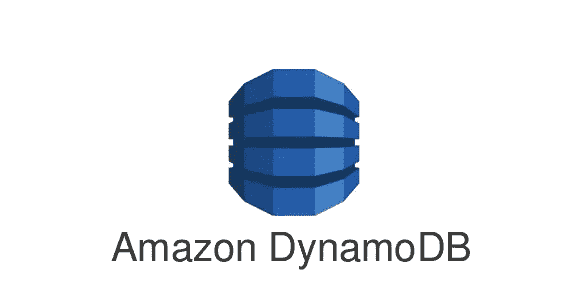
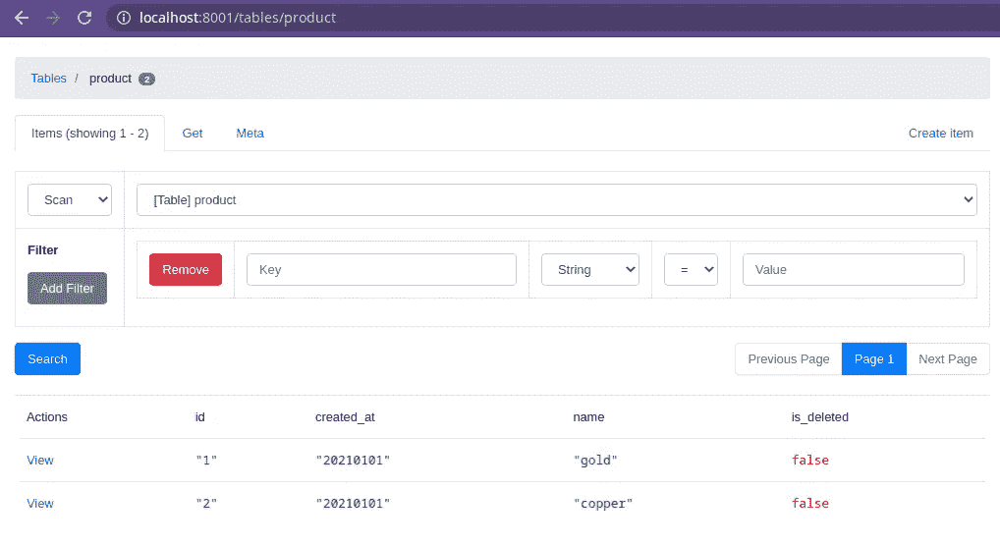

# Docker Compose for Amazon DynamoDB 带有迁移、播种和管理 UI

> 原文：<https://medium.com/geekculture/docker-compose-for-amazon-dynamodb-with-migration-seeding-and-admin-ui-db11a348cc6a?source=collection_archive---------9----------------------->

初学者指南，介绍如何在不创建自定义程序的情况下，使用迁移和播种机为 Amazon DynamoDB 设置本地开发。



*Amazon DynamoDB*

# 为什么*亚马逊 DynamoDB* ？

*Amazon DynamoDB* 是一个键值和文档数据库，在任何规模下都能提供一位数的毫秒级性能。这是一个全面管理、多区域、多活动、耐用的数据库，具有内置的安全性、备份和恢复功能，以及适用于互联网规模应用程序的内存缓存。

# 问题是

由于 *Amazon DynamoDB* 是一个完全托管的服务，在过去，即使在本地开发过程中，我们也必须连接到一个真实的实例。如今，有了 *Docker* ，我们可以在本地机器中为本地开发生成一个容器。

当我们需要创建某个程序来创建表或在本地容器中植入数据库时，问题就出现了。我们不想创建一个自定义程序来创建表或播种表。更重要的是，当我们可以只用 Docker 做任何事情的时候，为什么要浪费时间呢？不管我们精通哪种编程语言，我们实际上都可以做到这一点。

# 先决条件

*   *Docker* ≥ 20.10.8
*   *码头工人组成* ≥ 1.27.4

# 步伐

创建具有以下结构的项目:

```
{21-09-15 22:28}arwego:~/go/src/github.com/rizalgowandy/docker-sample/dynamodb@main% tree                           
**.** 
├── docker-compose.yaml 
└── **schema** 
    ├── product.json 
    └── product_seeder.json
```

在 */schema* 中创建一个名为 *product.json* 的迁移文件，以创建 *product* 表:

```
{
  "TableName": "product",
  "KeySchema": [
    { "AttributeName": "id", "KeyType": "HASH" },
    { "AttributeName": "created_at", "KeyType": "RANGE" }
  ],
  "AttributeDefinitions": [
    { "AttributeName": "id", "AttributeType": "S" },
    { "AttributeName": "created_at", "AttributeType": "S" }
  ],
  "ProvisionedThroughput": {
    "ReadCapacityUnits": 10,
    "WriteCapacityUnits": 5
  }
}
```

在 */schema* 中创建一个名为 *product_seeder.json* 的播种文件，用两个数据播种该表:

```
{
  "product": [
    {
      "PutRequest": {
        "Item": {
          "id": {
            "S": "1"
          },
          "created_at": {
            "S": "20210101"
          },
          "name": {
            "S": "gold"
          },
          "is_deleted": {
            "BOOL": **false** }
        }
      }
    },
    {
      "PutRequest": {
        "Item": {
          "id": {
            "S": "2"
          },
          "created_at": {
            "S": "20210101"
          },
          "name": {
            "S": "copper"
          },
          "is_deleted": {
            "BOOL": **false** }
        }
      }
    }
  ]
}
```

创建一个 *docker-compose* 文件:

```
**version**: "3"
**services**:
  **dynamodb**:
    **image**: amazon/dynamodb-local:1.16.0
    **container_name**: app-dynamodb
    **hostname**: app-dynamodb
    **volumes**:
      - app_dynamodb:/home/dynamodblocal
    **working_dir**: /home/dynamodblocal
    **ports**:
      - "8000:8000"
    **command**: "-jar DynamoDBLocal.jar -sharedDb -dbPath ."
    **restart**: unless-stopped

  **dynamodb_admin**:
    **image**: aaronshaf/dynamodb-admin:dependabot_npm_and_yarn_aws-sdk-2.952.0
    **container_name**: app-dynamodb_admin
    **ports**:
      - "8001:8001"
    **environment**:
      - DYNAMO_ENDPOINT=http://dynamodb:8000
    **depends_on**:
      - dynamodb
    **restart**: unless-stopped

  **dynamodb_migrator**:
    **image**: banst/awscli:1.18.76
    **container_name**: app-dynamodb_migrator
    **working_dir**: /home/dynamodblocal
    **command**: dynamodb create-table --cli-input-json file://product.json --endpoint-url http://dynamodb:8000
    **volumes**:
      - ./schema:/home/dynamodblocal
    **environment**:
      - AWS_ACCESS_KEY_ID=unicorn_user
      - AWS_SECRET_ACCESS_KEY=magical_password
      - AWS_DEFAULT_REGION=ap-southeast-1
    **depends_on**:
      - dynamodb

  **dynamodb_seeder**:
    **image**: banst/awscli:1.18.76
    **container_name**: app-dynamodb_seeder
    **working_dir**: /home/dynamodblocal
    **command**: dynamodb batch-write-item --request-items file://product_seeder.json --endpoint-url http://dynamodb:8000
    **volumes**:
      - ./schema:/home/dynamodblocal
    **environment**:
      - AWS_ACCESS_KEY_ID=unicorn_user
      - AWS_SECRET_ACCESS_KEY=magical_password
      - AWS_DEFAULT_REGION=ap-southeast-1
    **depends_on**:
      - dynamodb_migrator
      - dynamodb
    **restart**: on-failure

**volumes**:
  **app_dynamodb**:
    **driver**: local
```

来自 *docker-compose* 文件的重要信息:

*   Amazon DynamoDB 运行在端口 8000。
*   管理 UI 正在端口 8001 上运行。
*   用于迁移和播种的 AWS CLI 指向端口 8000，也就是我们的 Amazon DynamoDB 端口。
*   迁移将创建一个产品表，并使用 */schema/product.json* 和*/schema/product _ seeder . JSON .*为其植入两个数据

然后执行:

```
$ docker-compose up
```

转到 [http://localhost:8001/](http://localhost:8001/) 查看管理 UI。


Admin UI

该表已经创建，您可以看到其中已经填充了我们的播种数据。



Product Table Data

瞧，我们完成了。现在，您使用 *Amazon DynamoDB* 的本地开发变得简单多了。您可以创建一个表，播种该表，甚至可以使用管理 UI 控制一切。

# 参考资料:

*   **来源**:[https://github.com/rizalgowandy/docker-sample](https://github.com/rizalgowandy/docker-sample)
*   **亚马逊 DynamoDB 本地**:【https://registry.hub.docker.com/r/amazon/dynamodb-local 
*   **UI**:【https://registry.hub.docker.com/r/aaronshaf/dynamodb-admin 
*   用于迁移和播种的**AWS CLI**:[https://registry.hub.docker.com/r/banst/awscli](https://registry.hub.docker.com/r/banst/awscli)