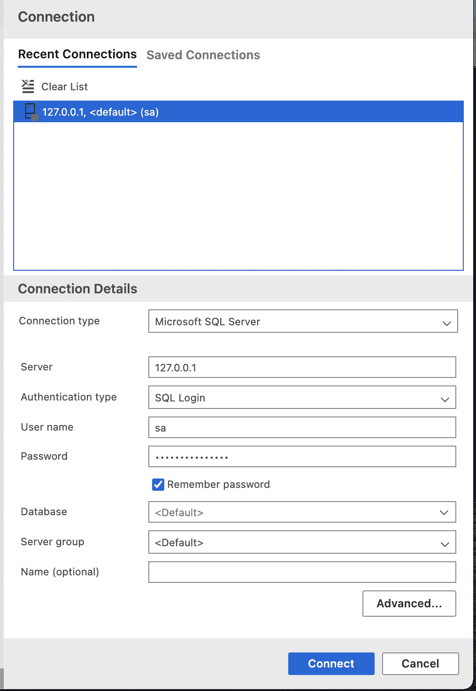
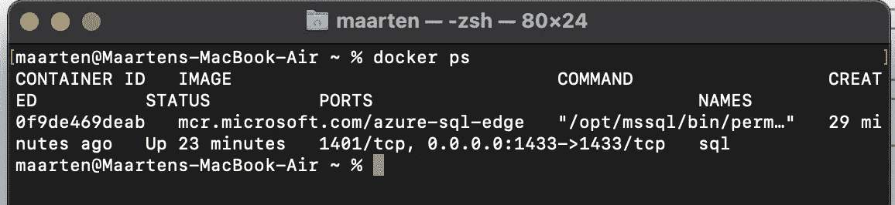
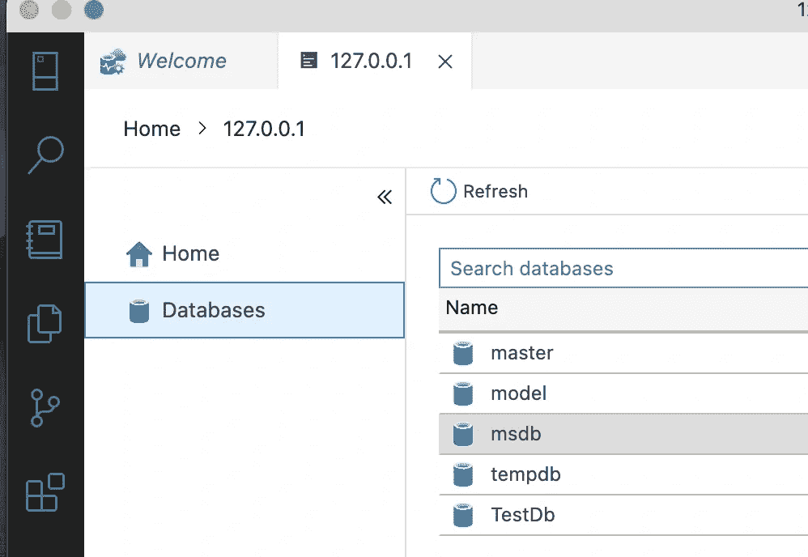
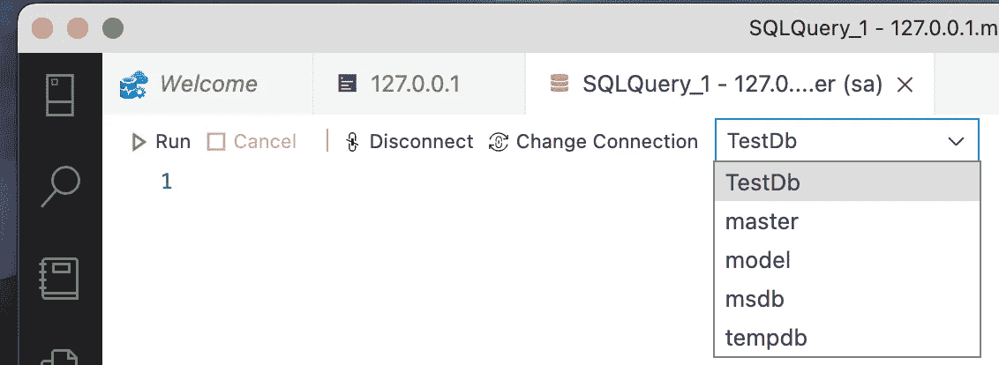
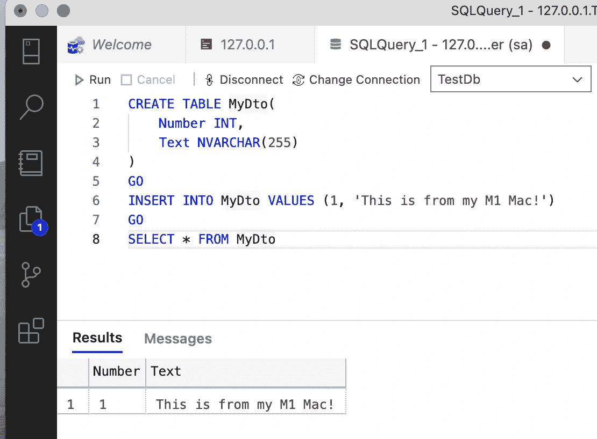

# Docker Express:在您的 M1 Mac 上运行本地 SQL Server

> 原文：<https://medium.com/geekculture/docker-express-running-a-local-sql-server-on-your-m1-mac-8bbc22c49dc9?source=collection_archive---------0----------------------->


大约两年前，我写过如何使用 Microsoft SQL Server for Linux Docker image 在 Docker 容器中运行 [SQL Express。](/agilix/docker-express-running-a-local-sql-server-express-204890cff699)

现在，我发现我的 M1 Mac 电脑也需要同样的功能。原始的 SQL Server for Linux 映像尚未移植到 ARM64 架构。然而，我发现有一种新的数据库技术，针对人工智能命名为 [Azure SQL Edge](https://hub.docker.com/_/microsoft-azure-sql-edge) 。这个数据库已经被 dockered 并移植到 ARM64 上，因此**可以**在 Mac 上的 Docker for M1 上运行。

**TL；RD；**这是如何在 M1 上运行 Docker SQL 实例:

```
docker run -e "ACCEPT_EULA=1" -e "MSSQL_SA_PASSWORD=MyPass@word" -e "MSSQL_PID=Developer" -e "MSSQL_USER=SA" -p 1433:1433 -d --name=sql mcr.microsoft.com/azure-sql-edge
```

## M1 码头工人

自 2020 年末以来，M1 的 Docker 已经走过了漫长的道路，Docker 团队的努力在 ARM64 的最新 RC 版本中大放异彩，[可以在这里找到](https://docs.docker.com/docker-for-mac/apple-m1/)。您需要安装此最新版本(或更高版本)才能成功运行 SQL 容器。安装后，运行上面提到的脚本。

## 通过 Azure Data Studio 连接

要通过 [Azure Data Studio](https://docs.microsoft.com/en-us/sql/azure-data-studio/download-azure-data-studio?view=sql-server-ver15) 连接，您需要将 **127.0.0.1** 作为**服务器**，我们已经在端口 **1433** 上托管 Docker 容器，这是 SQL 的默认端口。使用 **SQL 登录**并将用户设置为 **sa。**最后，设置你选择的密码，就是上面例子中的 **MyPass@word** 。



点击**连接**，看看是否有效！如果您在连接时遇到任何问题，请检查容器是否正在运行:

```
docker ps
```



如果没有，请尝试手动启动它:

```
docker run sql
```

## **创建数据库**

我建议不要使用**主**数据库，只需创建自己的数据库，在 **Azure Data Studio** 的**新查询**窗口中运行以下内容:

```
USE masterGOIF NOT EXISTS (SELECT [name]FROM sys.databasesWHERE [name] = N'TestDb')CREATE DATABASE TestDbGO
```

这个脚本将创建一个名为 **TestDb** 的数据库，如果它还不存在的话。

运行这个脚本后，您应该在数据库列表中看到新的 **TestDb** :



从现在开始运行任何查询时，请确保在下拉列表中选择正确的数据库！



## 插入数据

现在让我们来测试一下，并插入一些数据。下面的脚本将**创建一个表** , **插入一条记录**,**从新创建的表中选择该记录**:

```
CREATE TABLE MyDto(Number INT,Text NVARCHAR(255))GOINSERT INTO MyDto VALUES (1, 'This is from my M1 Mac!')GOSELECT * FROM MyDto
```



就是这样！我们现在在 Apple Silicon 上有了一个实用的 SQL Docker 容器！