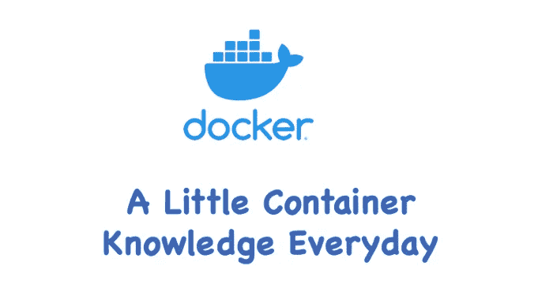

# docker——集装箱如何访问外部世界？

> 原文：<https://medium.com/geekculture/docker-how-does-container-access-outside-world-c05118ecbc44?source=collection_archive---------3----------------------->

## 每天一点集装箱知识！



在本文中，我们来谈谈容器是如何与外界通信的。

让我们看一下`busybox`的例子，在我们运行`busybox`容器之前，让我们从主机本身 ping bing.com:

```
$ ping bing.com -c 2
PING bing.com (204.79.197.200) 56(84)…
```