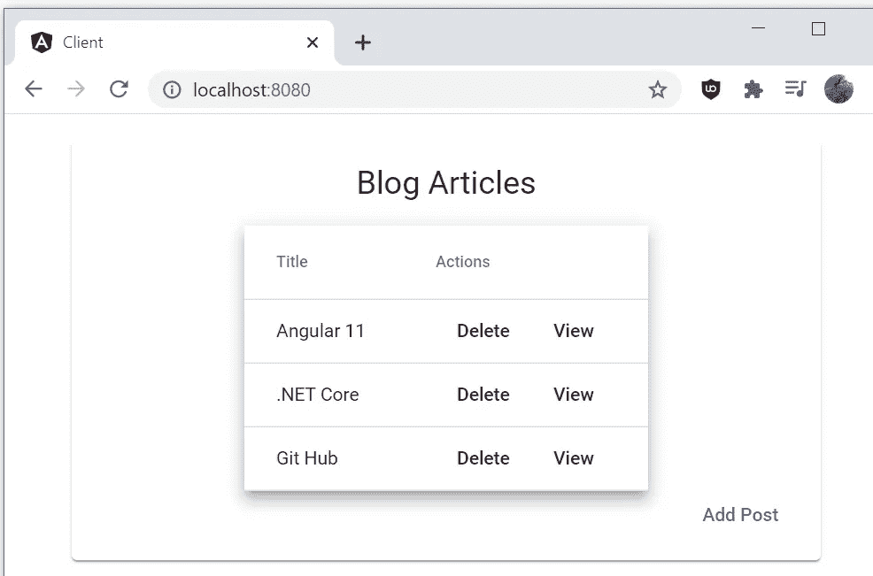
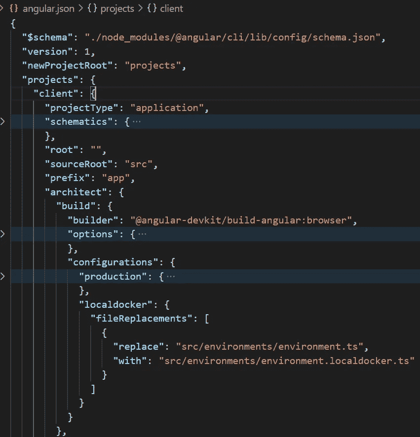
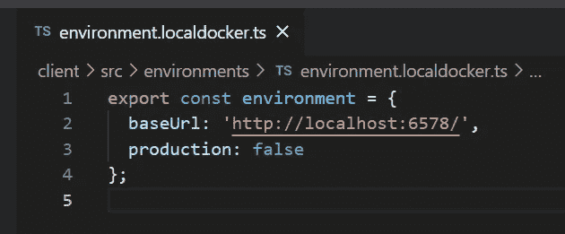

# 码头工人。谷歌云平台上的 NET Core 5.0、Angular 11、Nginx 和 Postgres—Pt 1

> 原文：<https://medium.com/geekculture/docker-net-core-5-0-angular-11-nginx-and-postgres-on-the-google-cloud-platform-pt-1-363160e34439?source=collection_archive---------6----------------------->

编写、配置和部署 dockerized CRUD 应用程序到 Google 云平台的完整指南。

如果你只是想在 GCP 直播的过程中得到帮助，请跳到第二部分。

[这个例子的源代码可以在这里找到。](https://github.com/Pastafarian/GcpBlog)

当使用 Docker 将您的第一个成熟的应用程序部署到云中时，有很多东西需要学习。事实上，它可以是压倒性的。你怎么知道从哪里开始？

我最近开通了我的[博客](https://stephenadam.dev/)，并以此为借口学习 docker 和 GCP 一起玩。

一路上遇到了一些阻碍，虽然每种技术都有大量的好教程，但还是花了一些时间将它们放在一起并启动网站。

在这里，我将把所有这些信息集中在一个地方，并引导您完成整个过程。最终，我们将拥有一个使用 https、容器化数据库和 api 保护的站点，以及一个从 Google 存储桶提供服务的静态站点。有了谷歌慷慨的 3 个月试用期，我们可以免费做所有这些事情！

我会迅速行动，提供启动和运行所需的所有信息。如果您想更深入地了解所使用的任何技术，我在最后提供了一个参考资料列表。

有很多内容要讲，所以让我们开始吧！

# 架构概述

解决方案架构尽可能保持简单。VM 实例托管 docker，docker 为我们的应用程序运行容器。

Nginx 处理传入的请求，然后将它们代理给。NET 核心 Web Api 或 GCP 托管的桶。web api 连接到 Docker 主机中的 Postgres 数据库。


# 示例应用程序

我们将使用一个简单的博客应用程序，允许我们添加，查看和删除文章。这些文章将有一个搜索引擎友好的鼻涕虫来识别它们。

本文假设读者已经掌握了。NET，Angular 和编写 CRUD 应用程序。

我们将首先让项目在本地运行，并检查实现这一点所需的 Docker 配置。然后，我们将更新项目，让它在云中运行，接着设置 GCP 虚拟机，最后将它部署到 Google Cloud。

# 在本地运行

为了在本地运行应用程序，您需要确保您的系统上安装了以下先决条件。

Docker 桌面。[https://www.docker.com/products/docker-desktop](https://www.docker.com/products/docker-desktop)。

https://nodejs.org/en/download/。

饭桶。https://git-scm.com/download[。](https://git-scm.com/download)

角度 CLI。安装节点后，运行以下命令进行安装。

```
npm install -g [@angular/cli](http://twitter.com/angular/cli)
```

接下来，克隆示例应用程序存储库。

```
$ git clone [https://github.com/Pastafarian/GcpBlog](https://github.com/Pastafarian/GcpBlog)
```

现在在我们的机器上有了源代码，我们准备构建 Angular 应用程序。

导航到 powershell 中的应用程序(docker-compose.yml 驻留的位置)并运行以下命令。

```
docker-compose build
```

这将运行 docker-compose.yml 脚本。它的工作是为我们的 Postgres 数据库、Web Api 和 Angular 应用程序构建我们的图像并运行基于它们的容器。Postgres 数据库是基于图像的，可以快速启动，但是 Web Api 和 Angular 应用程序都需要从源代码构建，然后才能从它们生成容器。

现在我们已经准备好了图像，是时候用下面的命令启动它们了。

```
docker-compose up
```

现在，当我们导航到下面的 url 时，我们应该看到我们的应用程序正在运行。

```
[http://localhost:8080/](http://localhost:8080/)
```



# 应用概述

接下来，我想更详细地介绍一下这个项目，在我们考虑将我们的解决方案迁移到云之前，先回顾一下在本地运行所需的配置。

首先让我们处理 docker-compose.yml 来看看解决方案的结构，并解释它是如何配置的。组合文件允许我们配置应用程序所需的所有服务，并定义组成它的容器。

docker-compose 文件上的几个小问题。我们对每个项目都使用默认的命名约定‘docker file ’,所以我们不需要在构建选项中指定这些。当我们运行“Docker-compose up”命令时，docker 还会为我们创建一个默认网络，因此我在本例中没有给出任何网络选项。

**Postgres 数据库**

docker 合成文件中的第一个服务是 Postgres 数据库。与所有其他服务一样，我们将重启策略指定为“除非-停止”。这将确保容器自动重启，除非用户手动停止。该图像未指定标签，因此默认使用 Postgres 的“最新”版本。这在生产环境中可能有风险，但对于我们的简单演示来说是没问题的。

接下来，我们指定 database.env 文件。这将配置数据库使用的凭据，并将由 Web Api 中的连接字符串使用。该文件与 docker 合成文件一起位于解决方案的根目录下。

端口配置中给出的两个端口映射到容器要使用的外部和内部端口。要从 Docker 主机外部访问 Prostgres 数据库，例如，通过在本地机器上使用 [pgAdmin](https://www.pgadmin.org/) ，您将使用 localhost:5439，因为我们正在向外界“发布”它。注意，出于安全原因，我们可能不希望在生产系统中发布外部端口。

为了从 docker 组合中的另一个服务访问 Postgres 容器，我们将使用服务名别名和内部端口。

例如，下面是 Web Api 使用的连接字符串。

```
“Host=database;Port=5432;Username=BlogUser;Password=BlogPassword;Database=GcpBlog”
```

**。NET Core Web Api**

接下来是 Web Api 服务。与由 [dockerhub](https://hub.docker.com/) 上的现有映像指定的数据库服务不同，该映像需要使用 docker 文件来构建。

为此，我们使用构建配置选项。在这里，我们指定“context ”,它是构建上下文的路径，它将在那里查找包含如何创建映像的指令的 Dockerfile。

我们将一个环境变量以‘ASPNETCORE _ ENVIRONMENT = local docker’的形式传递给图像上下文。这确保了。NET Web Api 使用正确的“appsettings”。我们还传入了 ASPNETCORE_URLS 环境变量，该变量设置 Api 在端口 8800 上运行。

为了使 Api 成功启动，首先需要运行数据库。我们通过使用‘depends _ on’配置选项来实现这一点，该选项确保我们的 Postgres 容器在 api 容器启动之前启动并运行。

现在让我们看看服务器目录中的 Dockerfile 以及 Web Api 代码。

这使用 Dockers [多阶段构建](https://docs.docker.com/develop/develop-images/multistage-build/)来保持最终图像的大小尽可能小。最后一个 FROM 语句是创建最终基础映像的语句，这允许我们使用更大的 sdk 映像及其所有工具来构建。NET 核心应用程序，然后将这些构建工件复制到我们在文件开头指定的更精简的 aspnet 运行时映像。

让我们依次完成每一步。

首先，我们指定。NET Core 5.0 SDK 作为构建映像。这是一个大图，包含了构建我们的应用程序所需的所有工具。

我们将工作目录设置为 app，这是我们所有工作发生的文件夹。

下一步是复制解决方案文件和每个 csproj 文件，并运行 restore 命令。我们可以在构建之前简单地复制整个应用程序，但是通过这种方式复制分离出文件，Docker 可以复制到这个缓存层。本质上，在您更新 NuGet 包之前，所有后续构建的恢复步骤都将依赖于缓存的映像。如果您只更新了一个. cs 文件，则可以跳过整个恢复步骤。关于这一点的更多信息和一个更优雅的方法，请查看关于这个主题的 Andrew Locks 的伟大文章。

现在，我们已经运行了恢复步骤，是时候复制应用程序的其余部分，并以发布模式发布应用程序了。

我们不想使用 sdk 映像作为我们最终应用程序映像的基础，因为它很大，并且包含许多我们不需要运行应用程序的工具。

最后一条 FROM 语句选择了更精简的 ASP.NET 核心运行时映像，它要小得多，并且会使我们的应用程序启动得更快。

我们将构建映像中的内容复制到我们的运行时映像中，并将入口点设置为 GcpBlog.Api.dll，以开始运行我们的应用程序。

**角度应用**

当我们迁移到云时，我们将使用 CDN 来服务 Angular 应用程序。在这里，我想使用本地示例来展示如何在容器中运行它。

docker-compose 文件已经设置了我们将要运行的端口。外部应用程序将使用 8080，内部我们将使用 80。

让我们先浏览一下 Angular docker 文件，然后看看对应用程序所做的更改，以使配置正常工作。

我们再次使用多阶段构建来保持应用程序的规模较小。首先，我们使用最新版本的节点映像来构建我们的应用程序。package.json 和 package-lock.json 文件被复制到/user/src/app 文件夹，我们运行一个 npm install 命令来下拉我们需要的包，然后我们将应用程序代码复制到同一个目录。

接下来，我们使用“npm run localdocker”命令来运行 package.json 文件中的自定义脚本。这将运行“ng build”命令并向其传递配置参数“localdocker”。

通过在构建 Angular 时传递配置参数，它将在下面显示的“配置”块中查找并应用我们指定的文件替换。



我们将使用“environment.dockerlocal.ts”文件，而不是使用默认的“environment.ts”文件。这包含我们将在本地连接的 Web Api 的地址，在本例中为“http://localhost:6578/”。



一旦用正确的配置值构建了应用程序，我们就指定最终的图像‘nginx:alpine’。NGINX 是一个速度极快的网络服务器，我们将用它来服务我们的 Angular 应用程序。

我们从客户端文件夹的 config 文件夹中复制 nginx.config 文件来覆盖现有的文件。

配置文件如下所示。关于 NGINX 配置选项的细节超出了本文的范围，但是值得看一下第 14 行。鉴于这是一个 SPA，并且是 Angular 应用程序将处理我们所有的路由，我们希望给定路径的所有请求都解析到我们的 index.html 文件。“try_files”命令的最后一部分确保了如果 NGINX 找不到文件，我们将会收到 404，然后路由到 index.html 文件。这意味着当我们点击 F5 刷新页面时，Angular 将仍然能够显示页面，无论我们当前在什么路线上。

现在我们已经有了在本地运行的应用程序，并且已经介绍了 docker 的配置，在第 2 部分中是时候将它迁移到云中了！

[码头工人。谷歌云平台上的 NET Core 5.0、Angular 11、Nginx 和 Postgres—Pt 2](/p/a8b32167e183)

# **参考资料和延伸阅读**

[https://wkrzywiec . medium . com/build-and-run-angular-application-in-a-docker-container-b 65 dbbc 50 be 8](https://wkrzywiec.medium.com/build-and-run-angular-application-in-a-docker-container-b65dbbc50be8)

[](https://blog.codewithdan.com/video-building-and-running-custom-asp-net-core-containers/) [## 视频:构建和运行定制的 ASP.NET 核心容器

### 我最近有机会为 Pluralsight 做了一个网上研讨会，会上我谈到了如何使用 Docker 来构建和…

blog.codewithdan.com](https://blog.codewithdan.com/video-building-and-running-custom-asp-net-core-containers/) [](https://redstapler.co/cost-of-hosting-wordpress-website-on-google-cloud/) [## Google Cloud f1-micro Instance 能处理多少流量|红色订书机

### 因为谷歌已经提供了他们的“永远免费”层的改进版本，在他们的云上托管网站…

redstapler.co](https://redstapler.co/cost-of-hosting-wordpress-website-on-google-cloud/) [](https://andrewlock.net/optimising-asp-net-core-apps-in-docker-avoiding-manually-copying-csproj-files-part-2/) [## 优化 Docker 中的 ASP.NET 核心应用——避免手动复制 csproj 文件(第二部分)

### 这是我最近在 Docker 上发表的关于构建 ASP.NET 核心应用的帖子的后续:在这篇帖子里，我扩展了一个评论…

andrewlock.net](https://andrewlock.net/optimising-asp-net-core-apps-in-docker-avoiding-manually-copying-csproj-files-part-2/)