# 码头工人。谷歌云平台上的 NET Core 5.0、Angular 11、Nginx 和 Postgres——Pt 2

> 原文：<https://medium.com/geekculture/docker-net-core-5-0-angular-11-nginx-and-postgres-on-the-google-cloud-platform-pt-2-a8b32167e183?source=collection_archive---------10----------------------->

[在第 1 部分](https://stephen-adam.medium.com/docker-net-core-5-0-angular-11-nginx-and-postgres-on-the-google-cloud-platform-pt-1-363160e34439)中，我们在本地构建并运行了我们的映像，涵盖了 docker-compose 文件和 docker 构建文件。现在是时候考虑将所有东西都迁移到云上，并让它免费运行了！

[这个例子的源代码可以在这里找到。](https://github.com/Pastafarian/GcpBlog)

# 推送 Api Docker 映像

当我们迁移到云时，我们将依赖虚拟机上的 docker compose 实例来下载我们在第一步中创建的预构建 Api 映像。为了使我们的图像可以被访问，我们将把它放在 Docker Hub 上，一个 Docker 图像库；其他可用的存储库有 [Azure Container Registry](https://azure.microsoft.com/en-gb/services/container-registry/) 和 [Google 的容器注册表](https://cloud.google.com/container-registry)。

首先你需要[注册](https://hub.docker.com/signup)并创建一个 Docker Hub 账户，给自己一个 Docker ID。

一旦您完成了这一步，就该使用下面的命令将我们的容器推到 hub 了。

输入您的 Docker ID 作为您的用户名，然后输入您的密码。

```
docker login
```

现在，在 docker-compose.yml 文件所在的解决方案的根目录中打开 powershell。

这将为我们的应用程序(包括 Api)创建一个新的映像。

*注意，直接进入服务器目录并在那里运行 docker 构建会更快，但是我想尽可能简单地用最少的命令来解释*。

```
docker-compose build
```

Docker images 将向我们显示系统上的所有图像，包括 Api 图像。

```
docker images
```

我们应该得到类似这样的输出。

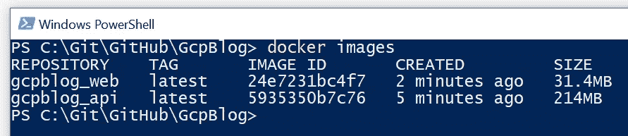

为了将 api 映像推送到 Docker Hub，我们需要给它一个标签，包括您之前给它的 Docker ID。在我的情况下，它是我的名字'斯蒂芬达姆'

```
docker tag gcpblog_api stephenadam/gcpblog_api
```

现在把我们的形象推给 Docker Hub。

```
docker push stephenadam/gcpblog_api
```

请注意，默认情况下，该图像将对外部世界公开。Docker Hub 允许您免费拥有一个私人图像，当您在自己的网站上工作时，请转到 Docker Hub 上的图像设置，并将其设置为私人。

# 设置云环境

对于这一步，我们需要一个谷歌帐户来访问谷歌云平台，并访问他们提供的 3 个月/300 美元的试用版。

登录 Google 后，请访问以下 URL 创建一个免费的 Google 云平台帐户。

[https://cloud.google.com/free/](https://cloud.google.com/free/)

接下来，让我们进入云控制台并开始工作！

[https://console.cloud.google.com/](https://console.cloud.google.com/)

首先，我们需要创建一个虚拟机来运行我们的网站。在左侧菜单中找到“计算引擎”,然后转到虚拟机实例。虽然运行我们的代码有其他选择，但计算引擎虚拟机是最便宜的选择，并允许我们配置自己的环境。

谷歌提供了一个免费的虚拟机选项，我们将在这里使用。我们需要在以下位置之一调配 f1-micro 实例—美国西部 1、美国中部 1 或美国东部 1。

我们以后需要支付的唯一选择是每月 2.88 美元的固定 IP。对于一个在 GCP 的网站来说还不错！

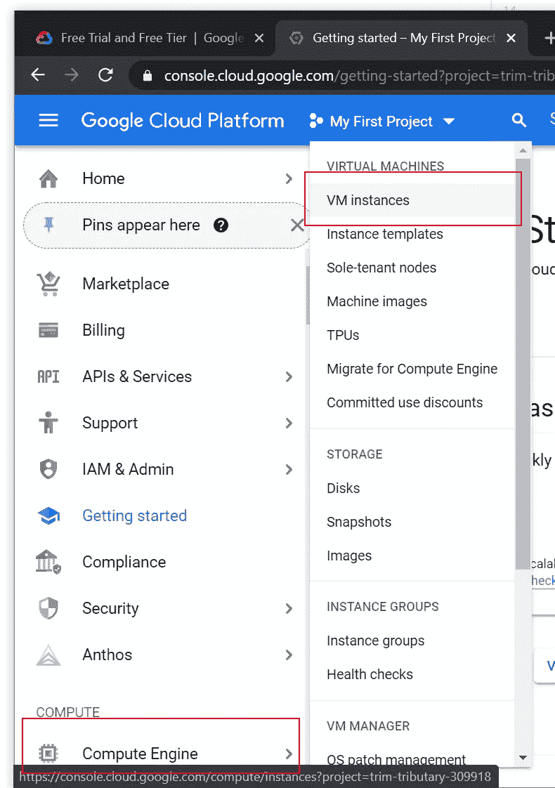

创建一个实例。

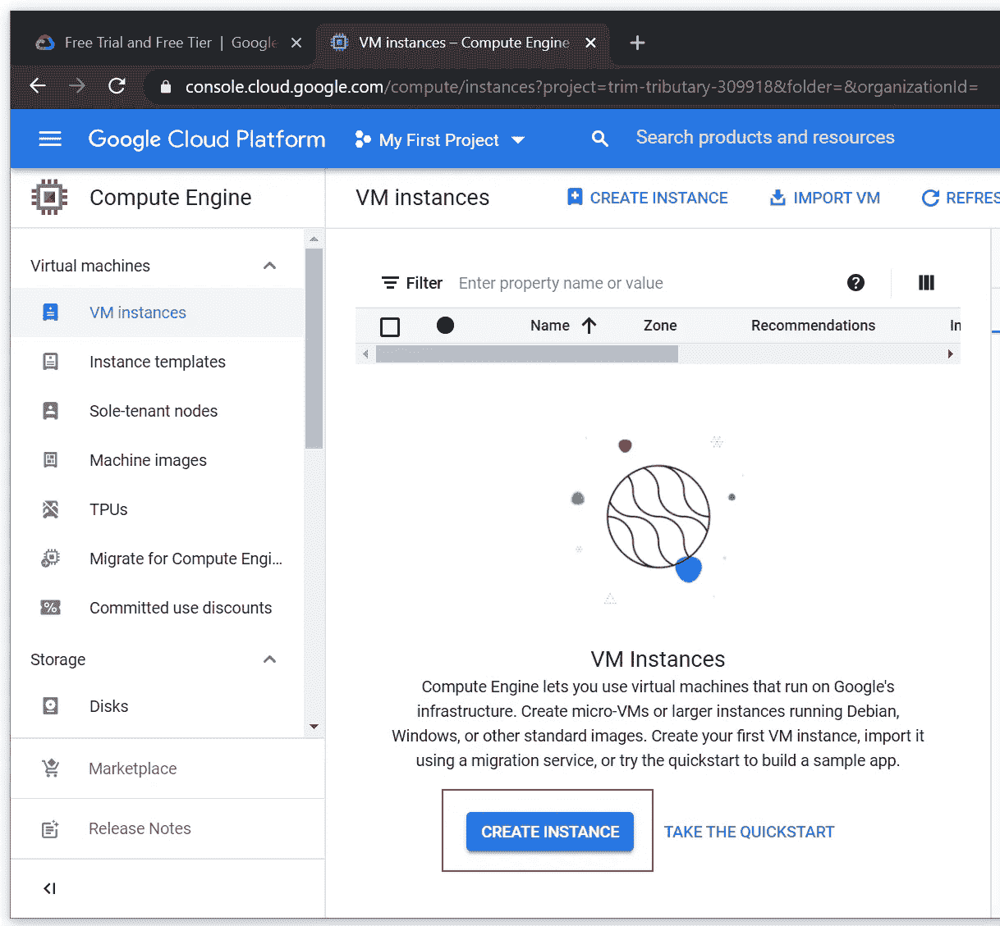

现在我们需要配置我们的虚拟机。在本例中，除了以下选项之外，我们将保留所有内容的默认设置:

**名字:**挑合适的。我去了 gcp 博客。
**机器类型:**E2-小型。这是一台低功率的机器，但它很便宜，很适合我们的目的。
**防火墙:**这里确保我们允许 HTTP 和 HTTPS 访问。


我们有高达 30g 的免费存储空间，因此请转到引导磁盘部分，然后单击“更改”。

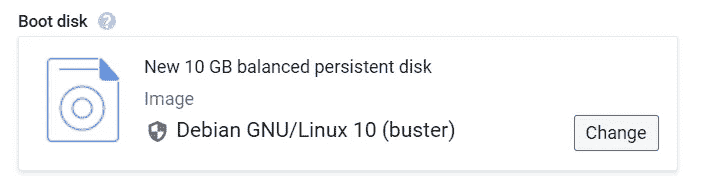

现在把磁盘空间增加到 30g。

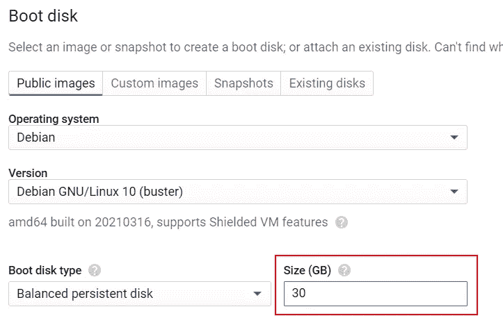

如果您已经成功设置了机器，在设置虚拟机时，您应该会在屏幕右上角看到以下消息。


现在只需点击“创建”按钮来创建您的虚拟机。

**设置交换文件**

我们使用的 f1-micro 只有 614 兆内存可用。我们可能会在这一点点工作内存上遇到麻烦，所以让我们通过建立一个交换文件来解决这个问题，以防用完。

```
sudo fallocate -l 1G /swapfile
sudo chmod 600 /swapfile
sudo mkswap /swapfile
sudo swapon /swapfile
echo '/swapfile none swap sw 0 0' | sudo tee -a /etc/fstab
```

**在虚拟机上安装 Docker**

现在我们已经创建了全新的虚拟机，我们需要在其上安装 docker 和 docker-compose，以便运行我们的应用程序。在计算引擎的“VM instrances”部分，单击 SSH 选项以打开机器上的命令提示符。

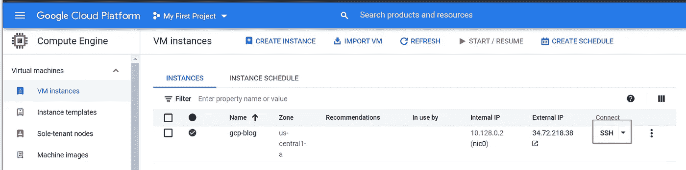

运行以下命令。

```
sudo apt-get updatesudo apt-get install apt-transport-https ca-certificates curl gnupg-agent software-properties-commonsudo add-apt-repository “deb [arch=amd64] [https://download.docker.com/linux/debian](https://download.docker.com/linux/debian) $(lsb_release -cs) stable”sudo apt-get updatesudo apt-get install docker-ce docker-ce-cli containerd.io
```

运行 sudo 'apt-get update '时，您可能会得到以下错误。

```
[https://download.docker.com/linux/debian](https://download.docker.com/linux/debian) buster InRelease
 The following signatures couldn’t be verified because the public key is not available: NO_PUBKEY 7EA0A9C3F273FCD8
```

> apt 打包系统有一组可信密钥，它们决定了一个包是否可以被认证，从而可以被信任地安装在系统上。有时系统没有它需要的所有键，并遇到这个问题。幸运的是，有一个快速解决方案。每一个被列为丢失的密钥都需要被添加到 apt 密钥管理器中，以便它能够认证包。

[https://Chris jean . com/fix-apt-get-update-the-following-signatures-cannot-be-verified-as-the-public-key-is-not-available/](https://chrisjean.com/fix-apt-get-update-the-following-signatures-couldnt-be-verified-because-the-public-key-is-not-available/)

为了解决这个问题，我们只需要用它抱怨的丢失的键运行下面的命令。

```
apt-key adv --keyserver keyserver.ubuntu.com --recv-keys 7EA0A9C3F273FCD8
```

**在虚拟机上安装 Docker Compose**

```
sudo curl -L “https://github.com/docker/compose/releases/download/1.28.6/docker-compose-$(uname -s)-$(uname -m)” -o /usr/local/bin/docker-composesudo chmod +x /usr/local/bin/docker-compose
```

# 将网站上传到谷歌的 CDN

现在我们已经设置好了我们闪亮的新虚拟机，是时候把我们的网站转移到 Google 的 CDN 上了。从 CDN 存储和访问我们的数据要便宜得多。

为了让事情尽可能简单，我们将通过反向代理功能在我们的虚拟机上从 NGINX 服务器提供我们的 CDN 文件。

*请注意，这在生产设置中远远不理想，因为我们将进行两次跳跃，并失去 CDN 的许多好处，如降低服务器负载和内容的地理位置。*

首先，让我们在生产模式下构建站点。我们需要更新“GcpBlog \ client \ src \ environments environment . prod . ts”以指向正确的域。在这里，我将它设置为 gcpblog.dev。

```
export const environment = {
 production: true,
 baseUrl: ‘[https://gcpblog.dev/api/'](https://gcpblog.dev/api/')
};
```

现在，在 powershell 中打开客户端目录，并在生产模式下构建站点。

```
ng build --prod
```

现在，我们在以下文件夹中有了生产就绪文件。

```
‘GcpBlog\client\dist\client’
```

现在进入谷歌云平台，进入左边菜单中的“云存储”。

单击“创建存储桶”并输入新存储桶的名称。稍后您将需要使用它来配置我们的 NGINX 服务器。

选择您的区域设置，然后为存储类别选择“标准”。访问控制应设置为统一，高级设置应保持默认状态。

当出现新的 bucket 时，单击 upload files，选择“GcpBlog\client\dist\client”目录中的所有文件，并将它们上传到我们的新 bucket！

## 设置文件的公共权限

默认情况下，这些文件是私有的。最后一步是让外界看到它们。为此，请执行以下步骤。

选择页面顶部附近的权限选项卡。

*   单击添加成员按钮。
*   将出现“添加成员”对话框。
*   在“新成员”字段中，输入 allUsers。
*   在选择角色下拉列表中，选择云存储子菜单，然后单击存储对象查看器选项。
*   单击保存。

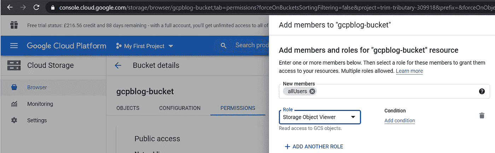

# 保留静态 IP 地址

默认情况下，分配给我们虚拟机的 IP 地址是短暂的，也就是说，它可以随时改变。当我们稍后将我们的域 A 记录指向 VM 时，我们将需要一个不会改变的 IP 地址。

要获取我们的固定 IP 地址，请转到左侧菜单，从“网络”部分选择“VPC 网络”。我们应该会看到我们虚拟机的当前外部端口以及一个“类型”下拉菜单。点击并选择“静态”并给 IP 地址起个名字。

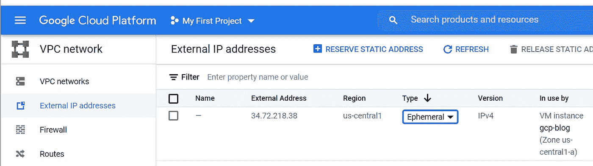

我们现在应该看到相同的 IP 地址在列表页面上显示为静态的。

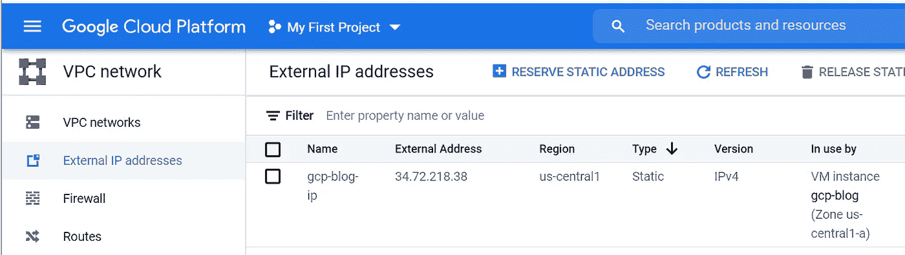

# 生产码头工人组成

生产 dock-compose 文件非常类似于我们在第 1 部分中用来在本地运行应用程序的 compose 文件。在我们的解决方案中，可以在“vm-files”文件夹中找到这些文件以及服务器上的其他文件。

这里，在将我们的应用程序迁移到虚拟机之前，我将掩盖这些差异。

**Postgres 数据库**

运行在数据库服务上的 Postgres 数据库除了 volumes 语句之外是相同的。当在本地运行我们的示例时，我们没有破坏我们的数据——一旦容器被关闭，对数据库的任何更改都会丢失。

Volumes 选项允许我们在容器和我们正在运行的机器的文件系统之间创建一个链接，并持久化数据。在这里，我们在“database-data”卷和容器上的“var/lib/postgresql/data/”文件夹之间创建了一个链接。机器上数据的物理路径是“/var/lib/docker/volumes/username _ database-data”。

现在，我们可以重启数据库容器并部署更新，而不会丢失存储在其中的任何数据。

我们在合成文件的底部定义了卷。

**。NET Core Web Api**

ASPNETCORE_ENVIRONMENT 变量设置为“Production”而不是“LocalDocker”。这将加载 appsettings。Production.json 文件与生产数据库连接字符串，而不是本地。

此外，我们不再发布端口，在本地示例中，Angular 应用程序直接从我们的主机调用 Api。在我们的产品示例中，我们使用 NGINX 反向代理来处理所有传入的请求，这意味着对 api 的调用将与我们的应用程序代码到达相同的 URL 和端口。这意味着我们不需要向外界公开 Api 的端口。稍后在 NGINX 部分会有更多的介绍！

再往下看，我们看到两个新的服务，certbot 和 nginx。这两者都值得一个适当的解释，并涵盖如下。

这里有一个提示，它是如何组合在一起的。

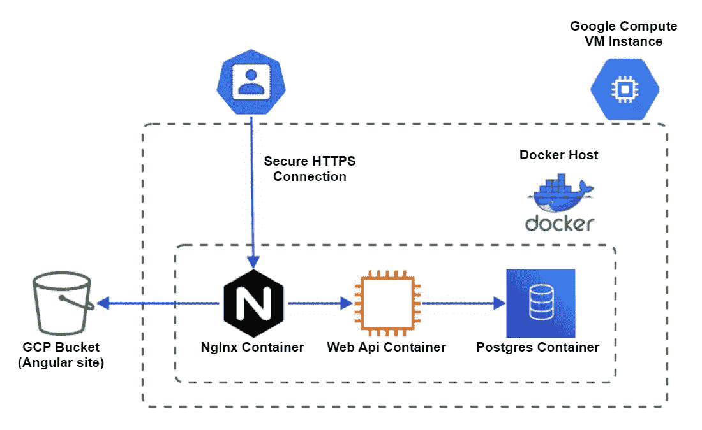

# 通过 WinSCP 访问虚拟机上的文件

这个过程的下一步需要我们在服务器上编辑文件，我们很快也需要上传文件，所以现在是设置 WinSCP 的好时机。

> **WinSCP**(***Win****dows****S****ecure****C****o****p****y*是一个[免费开源的](https://en.wikipedia.org/wiki/Free_and_open-source_software) [SSH 文件传输协议](https://en.wikipedia.org/wiki/SSH_File_Transfer_Protocol) (SFTP)、

WinScp 让我们在虚拟机上上传、下载和编辑文件。从这里下载并安装它。

[](https://winscp.net/eng/download.php) [## WinSCP::官方网站::下载

### WinSCP 5.17 是一个重要的应用程序更新。新的特性和增强包括:对会话和…

winscp.net](https://winscp.net/eng/download.php) 

我们还需要生成一个公钥和一个私钥。PuTTYgen 是一个很好的工具，所以让我们下载并安装它吧。

[](https://www.ssh.com/academy/ssh/putty/windows/puttygen) [## 如何安装和使用 puttygen 来创建新的密钥对和更改密码。正在安装钥匙…

### 这个页面是关于在 Windows 上安装 PuTTYgen 的。对于 Linux 版本，请参见。PuTTYgen 是一个关键的生成器工具，用于创建…

www.ssh.com](https://www.ssh.com/academy/ssh/putty/windows/puttygen) 

首先让我们创建 ssh 密钥对。打开 PuTTYgen 并点击 generate。然后在关键评论字段中输入您的 Google 帐户名称。这与我们在终端上使用的 SSH 终端中显示的用户名相同。

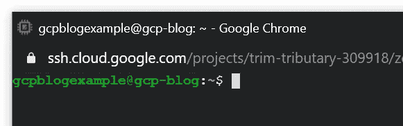

GCP Username

我们需要保存两把钥匙。首先，将框顶部的公钥复制并粘贴到一个文本文件中，标题为“用于粘贴到 OpenSSH authorised _ keys 文件中的公钥”，并确保其安全。接下来单击保存私钥，将它保存在与上一步中的公钥相同的位置，并选择不使用密码保护它的选项。

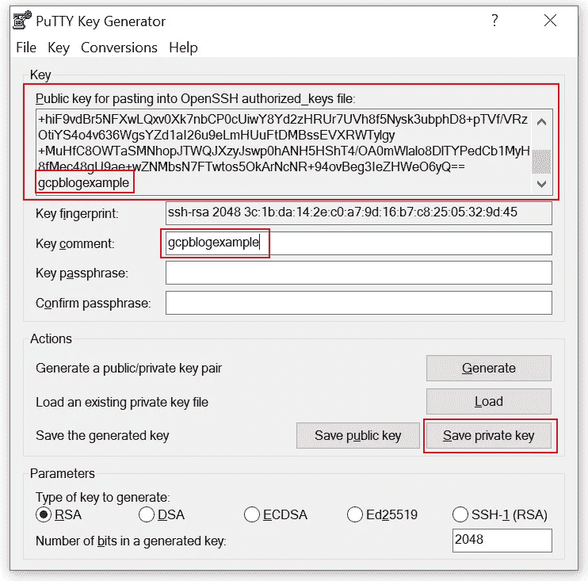

PuTTY Key Generator

现在我们有了我们的密钥对，是时候把它放到谷歌云平台上公开了。从 GCP 左侧菜单的计算引擎部分选择元数据。

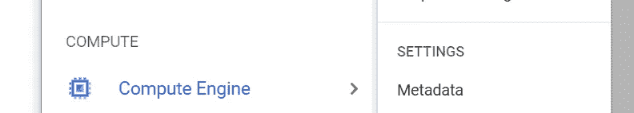

现在在顶部导航中选择 SSH，并添加我们在上一步中刚刚保存的公钥。

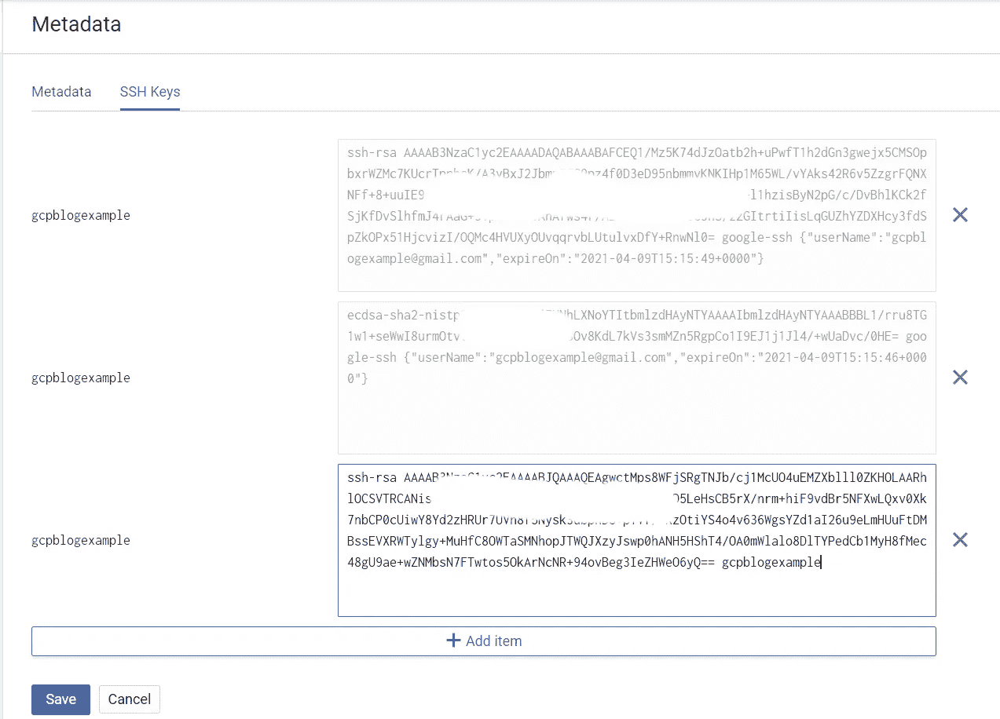

通过在我们的计算实例上设置公共 ssh 密钥，我们现在可以使用 WinSCP 和私有密钥访问虚拟机上的文件。

打开 WinSCP 并选择“新会话”。单击新站点，输入名称，将虚拟机的 IP 地址添加到“主机名”部分，并在用户名字段中输入您的 GCP 用户名。

我们使用私钥来访问我们的虚拟机，选择“高级”，然后从出现的窗口中选择“身份验证”。接下来，选择私钥文件并点击“确定”。

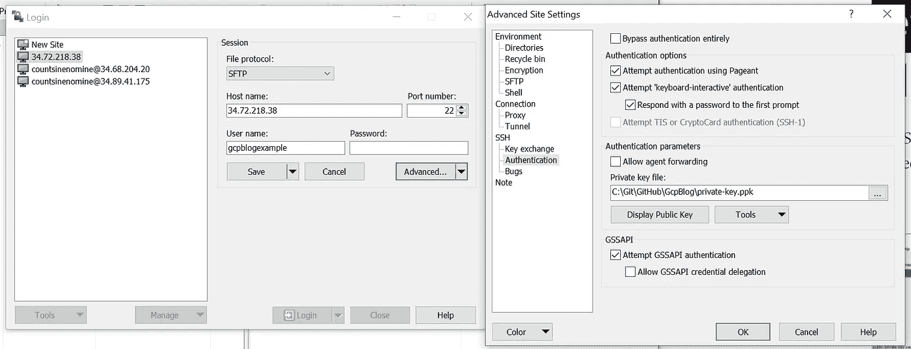

设置完成。点击保存，然后在选择网站后点击登录，我们将能够访问和上传文件到服务器上！

# NGINX

NGINX 是一个免费的速度极快的 web 服务器，我们将使用它来托管我们的应用程序并充当反向代理。上面 docker-compose 文件中的“命令”确保每 6 个小时重新加载一次可能已经被 certbot 更新的 SSL 证书。

除了指向证书和挑战请求数据的卷之外，我们还指向运行应用程序的配置文件。现在让我们深入探讨一下。

配置的第一部分是上游语句。这用于定义 proxy_pass 可以引用的服务器组。这里我们引用运行 api 的容器。在 docker compose 中运行的服务集内，我们可以使用它们的服务名来寻址它们，在本例中是在端口 880 上运行的“api”。我们在第二台服务器的底部使用它来代理进入我们的域的请求，将以下模式‘gcpblog . dev/api’匹配到我们的 API 应用程序。

接下来我们有我们的第一个服务器块，这些类似于 Apache 的虚拟主机。这里我们列出了端口 80 上对 gcpblog.dev 的传入 http 请求。第一个位置块句柄返回加密所需的质询数据，以证明域的所有权。我们需要通过 http 提供这个，因为此时我们还没有设置 SSL 证书。

以下语句确保使用 301 代码将对站点 http 版本的任何其他请求重定向到站点的 https 版本。

下面的服务器块处理从端口 443 传入的 https 请求。我们包括到 ssl 证书的路径，我们将在下一步中设置该证书以及其他相关的 ssl 配置。

现在，我们为在前面的步骤中上传到 gcp bucket 的网站文件设置代理配置。我们的位置陈述越具体，优先级越高。

第一个语句使用了一个特殊的语法，这意味着任何直接进入 gcpblog.dev 域的请求都会被转发到我们的 bucket 上的 index.html 文件，并加载我们的 angular 应用程序。

```
location = / {     
proxy_pass [https://storage.googleapis.com/gcpblog-bucket/index.html;](https://storage.googleapis.com/gcpblog-bucket/index.html;)    
}
```

这条语句提供了我们需要的文件，映射了我们在 bucket 上托管的任何 css、javascript 和图像文件。

```
location / { 
proxy_pass [https://storage.googleapis.com/gcpblog-bucket/;](https://storage.googleapis.com/gcpblog-bucket/;) 
}
```

我们现在确实有一个路径问题，如果我们使用 Angular 在应用程序中导航到[https://www.gcpblog.dev/add-article](https://www.gcpblog.dev/add-article)页面，然后按 F5 刷新页面，那么 GCP 桶将不知道如何处理该路径，因为它在服务器上不存在。我们需要做的是将它和应用程序上的所有其他路由重定向到 index.html 文件，并让 Angular 处理路由。

```
location /add-post { 
proxy_pass [https://storage.googleapis.com/gcpblog-bucket/index.html;](https://storage.googleapis.com/gcpblog-bucket/index.html;) }
```

如果你还记得第一篇文章，我们的文章有一个 seo 友好的 url，标题变成了一个 slug，用来标识它们，比如'【https://www.gcpblog.dev/】T2article/angular-11/'？

下面一行匹配任何符合“/article/”后跟任何字符的模式的传入请求。然后，我们使用一个重写规则来获取该路径，并将其重写为/index.html，然后将其传递给 proxy_pass 指令。它用来停止处理并传递结果的最后一条语句。

如果我们不采取这些步骤，那么域之后的路径的所有部分将通过代理传递指令传递到存储桶，我们将得到一个错误。

```
location /article { 
rewrite ^/blog/(.*)$ /index.html last; 
proxy_pass [https://storage.googleapis.com/gcpblog-bucket/index.html;](https://storage.googleapis.com/gcpblog-bucket/index.html;) }
```

最后，最后一个 location 语句用于将任何请求传递给 api，并将它们与路径的任何部分一起传递给我们的 api，我们在前面的 upstream 指令中定义了该 API。

```
location /api/ { 
   proxy_pass [http://web-api/;](http://web-api/;) 
}
```

# 让我们加密、认证和启用 HTTPS

理想情况下，所有的网站都应该运行 https，为了安全，seo 和让你的用户安心。在这里，我们深入探讨如何为您的站点获得免费的 SSL 证书，并在当前证书过期时自动检索新证书。

我想借此机会感谢 [Philipp](https://medium.com/u/524783b33278?source=post_page-----a8b32167e183--------------------------------) 就这个问题写了一篇精彩的文章，我用这篇文章弄清楚了这一切。当我浏览这个的时候，我强烈建议你通读一下他的文章，这篇文章很有深度，可以帮助你解决你可能遇到的任何问题。

[](https://pentacent.medium.com/nginx-and-lets-encrypt-with-docker-in-less-than-5-minutes-b4b8a60d3a71) [## Nginx 和让我们用 Docker 加密不到 5 分钟

### 让 Nginx 在 docker-compose 环境中运行 Let's Encrypt 比你想象的要复杂得多…

pentacent.medium.com](https://pentacent.medium.com/nginx-and-lets-encrypt-with-docker-in-less-than-5-minutes-b4b8a60d3a71) 

Let's Encrypt 是一个免费的、自动化的、开放的认证机构。为了使用这项服务并自动化大部分流程，我们将使用 certbot 映像。

> Certbot 是一个免费的开源软件工具，可以自动使用[手动管理的网站上的](https://letsencrypt.org/)证书来启用 HTTPS。

[https://certbot.eff.org/about/](https://certbot.eff.org/about/)

首先，让我们再次查看 docker compose 文件，看看我们需要添加什么来使它工作。

```
certbot:
  image: certbot/certbot
  restart: unless-stopped
  volumes:
    — ./data/certbot/conf:/etc/letsencrypt
    — ./data/certbot/www:/var/www/certbot 
  entrypoint: “/bin/sh -c ‘trap exit TERM; while :; do certbot renew; sleep 12h & wait $${!}; done;’”
 nginx:
   image: nginx:1.15-alpine
   restart: unless-stopped
   volumes:
     — ./data/nginx:/etc/nginx/conf.d
     — ./data/certbot/conf:/etc/letsencrypt
     — ./data/certbot/www:/var/www/certbot
   ports:
     — “80:80”
     — “443:443”
    command: ‘/bin/sh -c ‘’while :; do sleep 6h & wait $${!}; nginx -s reload; done & nginx -g “daemon off;”’’’
```

首先，我们指定 certbot 服务映像，并确保在出错时重新启动它。接下来，我们创建两个由 certbot 和 nginx 使用的共享卷。

为了让“让我们加密”验证您对域的控制，它会发出一个挑战请求。这个挑战数据需要由 certbot 创建并由我们的 NGINX 服务器提供服务。我们还需要通过 NGINX 提供我们的 SSL 证书。这就是为什么我们让 NGINX 和 certbot 服务共享这两个卷。

下一行是 certbot 服务中的“入口点”。默认情况下，certbot 服务不会自动续订我们的证书，该行通过每 12 小时检查我们的证书是否即将过期并在过期时进行续订来解决这个问题。

我们确实有一个问题，但是我们需要创建一个伪证书。来自[菲利普](https://medium.com/u/524783b33278?source=post_page-----a8b32167e183--------------------------------)的文章。

> 现在是棘手的部分。我们需要 nginx 来执行 Let's Encrypt 验证，但是如果证书丢失，nginx 将不会启动。
> 
> 那我们该怎么办？创建一个伪证书，启动 nginx，删除伪证书并请求真正的证书。
> 幸运的是，你不必手动完成所有这些，我为此创建了一个方便的脚本。

SSH 到我们的虚拟机上，执行下面的语句来下载他的脚本。

```
curl -L [https://raw.githubusercontent.com/wmnnd/nginx-certbot/master/init-letsencrypt.sh](https://raw.githubusercontent.com/wmnnd/nginx-certbot/master/init-letsencrypt.sh) > init-letsencrypt.sh
```

# 直播！

现在我们需要使用 WinSCP 来编辑服务器上的 init-letsencrypt.sh shell 脚本文件。

在 WinSCP 中打开站点，右键单击“init-letsencrypt.sh”文件上的“编辑”。现在找到域名行，添加你的域名而不是 example.com。比如说。

```
domains=(gcpblog.dev [www.gcpblog.dev)](http://www.example.org))
```

现在，使用 WinSCP 将“vm-files”文件夹中的所有文件和数据文件夹上传到 vm 上的默认文件夹。

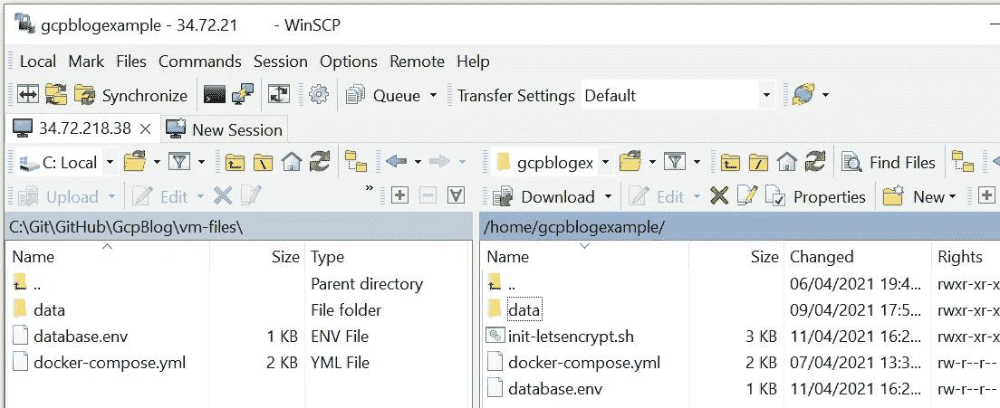

接下来编辑以下文件夹中的 app.conf 文件，并将 server_name 的两个实例更改为您正在使用的域。

```
GcpBlog\vm-files\data\nginx\app.conf
```

然后更新 SSL 证书路径以匹配域名。比如说。

```
ssl_certificate /etc/letsencrypt/live/gcpblog.dev/fullchain.pem;
ssl_certificate_key /etc/letsencrypt/live/gcpblog.dev/privkey.pem;
```

现在将您的域指向服务器上的一条记录。

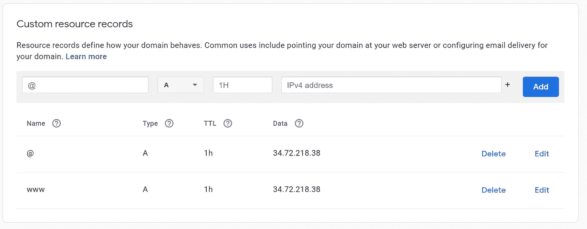

一旦我们等待了记录更新的传播，就到了获取 SSL 证书的时候了。

首先登录虚拟机上的 docker，这样我们就可以下载我们的 api 映像。

```
docker login
```

现在设置脚本文件的执行权限。

```
chmod +x init-letsencrypt.sh.
```

然后通过运行以下命令获得我们的证书。

```
sudo ./init-letsencrypt.sh
```

您现在应该会收到一条成功消息，说明已经为您的域正确生成了证书。

现在我们只需要通过 Docker Compose 打开我们的容器来启动站点。

```
docker-compose up
```

现在，当你导航到你的领域，你应该看到网站！

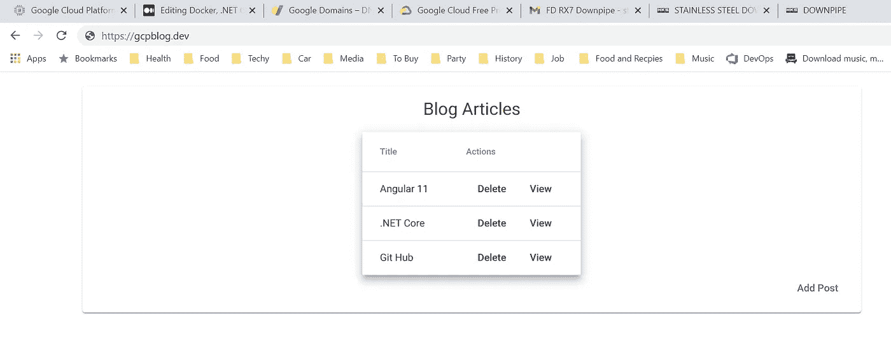

# 参考资料和进一步阅读

 [## 修复 apt-get 更新“无法验证以下签名，因为公钥不是…

### apt 打包系统有一组可信任的密钥，用于确定包是否可以被认证，因此…

chrisjean.com](https://chrisjean.com/fix-apt-get-update-the-following-signatures-couldnt-be-verified-because-the-public-key-is-not-available/) [](https://pentacent.medium.com/nginx-and-lets-encrypt-with-docker-in-less-than-5-minutes-b4b8a60d3a71) [## Nginx 和让我们用 Docker 加密不到 5 分钟

### 让 Nginx 在 docker-compose 环境中运行 Let's Encrypt 比你想象的要复杂得多…

pentacent.medium.com](https://pentacent.medium.com/nginx-and-lets-encrypt-with-docker-in-less-than-5-minutes-b4b8a60d3a71) [](/@hbmy289/how-to-set-up-a-free-micro-vps-on-google-cloud-platform-bddee893ac09) [## 如何在谷歌云平台上设置免费的 micro VPS

### 在谷歌云平台上配置“永远免费”的虚拟专用服务器(VPS)

medium.com](/@hbmy289/how-to-set-up-a-free-micro-vps-on-google-cloud-platform-bddee893ac09) [](https://redstapler.co/cost-of-hosting-wordpress-website-on-google-cloud/) [## Google Cloud f1-micro Instance 能处理多少流量|红色订书机

### 因为谷歌已经提供了他们的“永远免费”层的改进版本，在他们的云上托管网站…

redstapler.co](https://redstapler.co/cost-of-hosting-wordpress-website-on-google-cloud/)