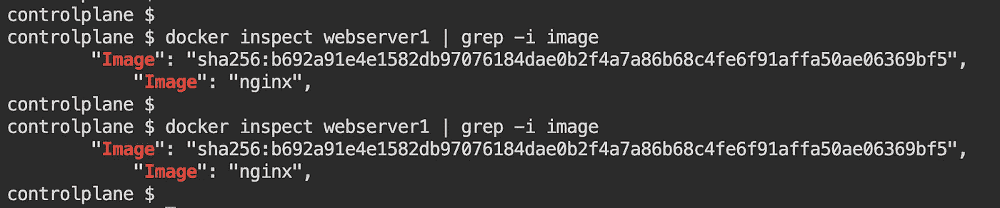
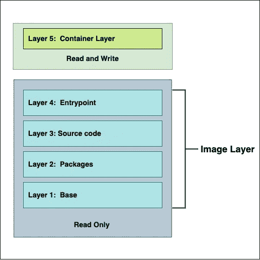

# 码头仓库

> 原文：<https://medium.com/geekculture/docker-storage-1dd3db3ded4c?source=collection_archive---------2----------------------->

## 深入了解 Docker 储物件


Photo by [Viktor SOLOMONIK](https://unsplash.com/@solomonikvik?utm_source=medium&utm_medium=referral) on [Unsplash](https://unsplash.com?utm_source=medium&utm_medium=referral)

## **Docker 文件系统**

当 docker 安装在系统中时，它会在`/var/lib/docker`位置创建一个文件夹。在`docker`文件夹下，docker 存储了它的所有数据。

```
**Docker file system
--------------------------------------------------------------------** **/var/lib/docker
                   | containers  
                    | image        
                    | volumes      
                    | plugins
                    | network
                    | . . . .**
```

每个文件夹存储与该文件夹相关的数据；例如，`image` 文件夹存储了与`image`文件夹中的图像相关的所有数据。

在 docker 中，一个图像可以被几个容器使用。假设，如果需要两个 nginx 容器，docker 将从同一个 unlaying 映像创建两个 nginx webservers。

让我们使用 nginx 映像创建两个 web 服务器—

```
**>** docker run -d --name webserver1 nginx 
**>** docker run -d --name webserver2 nginx
```

现在，检查`webserver1`和`webserver2`



经过检查，很明显，两个不同的 web 服务器使用相同的图像。这是可能的，因为 docker 以分层结构存储图像。使用带有`docker build`命令的 dockerfile 创建图像时。它创建了一个只读的分层架构。

当从图像创建容器时。Docker 在`**Image layers**`之上创建了一个额外的`**Container layer**`。`**Container layer**`是一个读/写层，存储运行时容器生成的任何数据。如果容器需要修改`**Image layers**`下的任何东西，那么它被复制到`**Container layer**`中，以便根据需要修改图像。该程序也被称为**写入时复制**机制。由于写入时复制的机制，`Image layers`总是保持不变。因此，一个图像可以被多个容器使用。为了更好地理解，请参见下图:



Docker Layered Architecture

Docker 使用**存储驱动**存储`**Image layers**`并将数据存储在容器的可写层。`**Container layer**`在容器被删除后并不持久，但它适合存储运行时生成的短暂数据。

对于 docker 容器数据的持久存储，有两个选项:**卷**和**绑定挂载**。

> **Volumes-** 在`**/var/lib/docker/volumes**`目录下创建一个新卷。并在容器被删除或停止后保持容器数据。
> 
> **绑定挂载-** 使用绑定挂载，可以将来自*主机*的文件或目录挂载到一个容器中。

## ***卷***

**卷**是由 Docker 容器生成和使用的**持久化数据**的首选机制。虽然**绑定挂载**依赖于主机的目录结构和操作系统，但是**卷**完全由 Docker 管理。

**音量**使用**音量驱动器。**使用卷驱动程序，可以在远程主机或云提供商上创建卷，以保存容器数据，并在需要时加密数据。

默认情况下，如果没有指定卷驱动器，docker 使用`**local**` **卷驱动器** r。
现在，创建一个卷—

```
**>** docker volume create **<volume-name>**
**>** docker volume create newVolume01
```

列出可用的**卷** —

```
**host~$**  docker volume ls
-------------------------------------------------------------------**DRIVER    VOLUME NAME**
local     newVolume01
```

我们可以看到一个名为`**newVolume01**`的卷是使用`**local**` **卷驱动**创建的。

现在，将该卷装入容器。可以使用`**-v**`或`**--mount**`选项将卷安装到容器中。

```
**#**Using **-v** optiondocker run -d  --name <container-name> \
**-v <source-volume-name>:<target-volume-name>** \
<image-name>:<tag>
--------------------------------------------------------------------docker run -d  --name webserver1 \
**-v newVolume01:/usr/share/nginx/html** nginx:latest**#**Using **--mount** optiondocker run -d \
 --name <container-name> \
 **--mount source=<volume-name>,target=****<target-volume-name>** \
 <image-name>:<tag>
--------------------------------------------------------------------docker run -d \
 --name webserver1 \
 **--mount source=newVolume01,target=****/usr/share/nginx/html** \
 nginx:latest
```

> **注意:**如果在创建容器的过程中,`**/var/lib/docker/volumes**`位置不存在挂载的卷。它将被自动创建。

使用以下命令检查**卷**:

```
**host~$** **docker volume inspect <volume-name>
--------------------------------------------------------------------****host~$ ** docker volume inspect newVolume01{
        "CreatedAt": "2022-08-13T12:41:02Z",
        **"Driver": "local",**
        "Labels": null,
  **      "Mountpoint": "/var/lib/docker/volumes/newVolume01/_data",**
        "Name": "newvol1",
        "Options": null,
        "Scope": "local"
    }
]
```

如果需要，我们可以使用`**docker volume rm <volume-name>**`删除一个卷

> **注意:**一个已挂载的**卷**不能被删除。只能删除已卸载/未使用的卷。

如前所述，为了在远程主机或云提供商中创建卷，需要使用不同种类的卷驱动器。一个例子是用于在 aws-ebs 上创建卷的 ***rexray*** 卷驱动程序。 [**更多关于这个。**](https://docs.docker.com/engine/extend/EBS_volume/)

## ***绑定挂载***

使用 ***绑定挂载*** 一个文件或目录从 ***主机*** 挂载到一个容器中。文件或目录被其在 ***主机*** 上的绝对路径引用。相比之下，当使用**卷**时，会在`**/var/lib/docker/volumes**`位置创建一个新目录。这是 Docker 在***主机*** 上的存储目录，Docker 管理该目录的内容。

创建一个新的目录`**mkdir var/local/data**`，然后**将新创建的`**data**` 目录挂载**到一个容器中。

```
***#*** *Using* ***-v*** *option*docker run -d  --name <container-name> \
**-v <directory or file path>:<target-volume-name>** \
<image-name>:<tag>
--------------------------------------------------------------------docker run -d  --name webserver1 \
**-v /var/local/data:/usr/share/nginx/html** nginx:latest***#*** *Using* ***--mount*** *option*docker run -d \
 --name <container-name> \
 **--mount type=**bind**,source=**<directory-path>**,target=****<**target-volume-name> \
 <image-name>:<tag>
--------------------------------------------------------------------docker run -d \
 --name webserver1 \
 **--mount type=**bind**,source=**/var/local/data,**target=/usr/share**\
 nginx:latest
```

> **注意:**一个**卷**，**目录**可以挂载到多个容器中。

到目前为止，docker 容器上装载的卷或目录驻留在运行容器的同一台主机上。Docker 还允许用户安装通过 NFS 远程文件共享系统共享的目录。为此创建的卷使用 Docker 自己的 NFS 驱动程序，无需在主机上安装 NFS 目录。

更多关于 [**docker 存储**](https://docs.docker.com/storage/) **。**

> 我希望这篇文章能帮助你更清楚地了解 docker 存储。如果你觉得这篇文章有帮助，请**不要忘记点击**拍拍**和**跟随**按钮来帮助我写更多这样的文章。
> **谢谢 *🖤*****

## 参考

[](https://docs.docker.com/storage/) [## 管理 Docker 中的数据

### 预计读取时间:9 分钟默认情况下，在一个容器中创建的所有文件都存储在一个可写容器中…

docs.docker.com](https://docs.docker.com/storage/)