# Docker 初学者教程

> 原文：<https://medium.com/geekculture/docker-tutorial-for-beginners-8af6a4967378?source=collection_archive---------2----------------------->

## 我欢迎你，希望你过得好。


# **Docker 是什么？**

以一致的方式构建、运行和交付应用程序的平台。

> 但是为什么是 Docker？我们可以使用我们的开发机器来运行应用程序。

好，让我们假设您构建了应用程序并将源代码导出到客户端，但是现在他无法在自己的机器上运行它。可能是由于软件版本不匹配或配置不同。这就是多克来帮忙的地方。

我们可以很容易地将我们的应用程序与各自的需求打包，并在任何地方、任何机器上用 Docker 运行它。

配置一次并在任何机器上运行它，配置部分将由 Docker 处理，您不需要为不同的机器一次又一次地配置它。

# **集装箱**

当依赖项被安装后，它在一个被称为容器的隔离环境下运行。这种隔离的环境允许多个应用程序并行使用任何软件的不同版本。

例如，如果有两个应用程序都使用 Node，但版本不同。它们可以在一个隔离的环境中并肩奔跑，不会互相捣乱。

# **虚拟机**

虚拟机是对机器/物理硬件的模拟。我们可以使用虚拟机管理程序在一台真实的物理机上运行多个虚拟机。


Virtual Machine

虚拟机管理程序是我们用来创建和管理虚拟机的工具。有许多跨平台的虚拟机管理程序，如 VirtualBox 和 VMware。

它有助于我们在虚拟机中独立运行应用程序，在同一台物理机上，我们可以有另一台虚拟机运行完全不同的应用程序。

> 那么，我们为什么不用 VM 来代替容器呢？

# **虚拟机 vs 容器**

因为虚拟机会带来一些问题。让我们来讨论它们

1.  每个虚拟机都需要操作系统的完整副本。
2.  它很慢，因为它模仿我们的计算机。
3.  每个虚拟机都利用实际的物理硬件资源。

让我们来谈谈容器

1.  容器也为我们提供了同样的隔离。
2.  它们是轻量级的，不需要完整的操作系统。
3.  它利用主机的操作系统。
4.  因为操作系统已经在主机上启动，所以容器启动很快。
5.  此外，它不利用任何硬件资源，如 CPU、内存等。因此，我们可以根据需要并排运行许多容器。

# **Docker 架构**

Docker 使用客户机-服务器架构。其中客户端组件通过 UNIX 套接字或网络接口使用 rest-full API 与服务器组件进行对话。

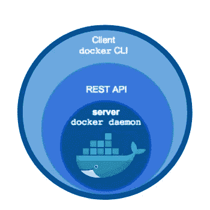

Docker Engine

主机上的所有容器共享与操作系统相关的主机内核。例如，Linux 容器运行在 Linux 操作系统上，Windows 容器运行在 Windows 操作系统上，等等。

# **安装对接器**

访问 https://docs.docker.com/get-docker/的，按照各自的指南在各自的平台上安装 Docker，即 Windows、Linux 或 MAC。但是在安装之前，请检查系统要求。

一旦安装了对接器。我们必须验证它，为此运行以下命令。该命令将列出您可以使用的 docker 的所有可用选项。

```
$ docker
```

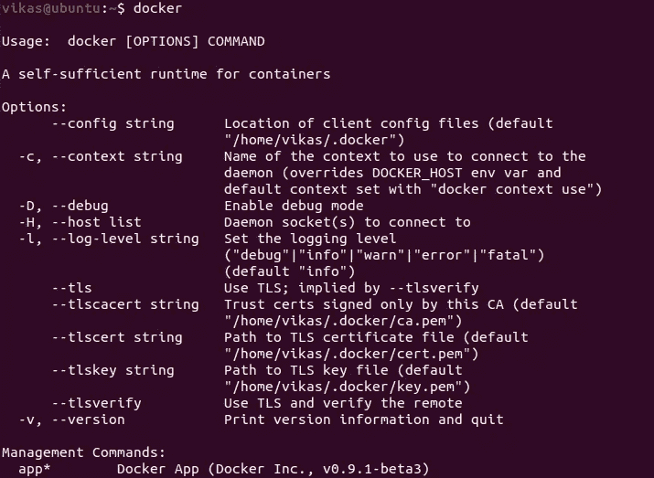

如果您看到以下错误或类似的内容。

```
'docker' is not recognized as an internal or external command,
operable program or batch file.
```

请确保您已正确遵循安装步骤，然后继续。

之后，运行以下命令来检查您的系统中安装了哪个版本。这个命令会给你所有关于 Docker 安装版本的详细信息。

```
$ docker version
```

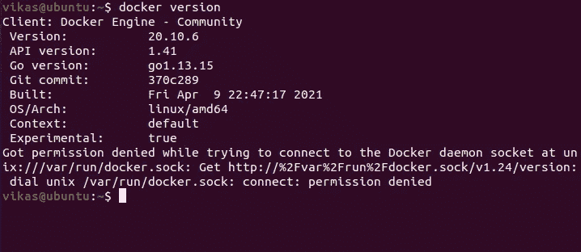

# **开发工作流程**

我们采用一个应用程序，不管它使用什么技术，并对它进行分类。

> 怎么会？

只需添加 Dockerfile，其中包含 Docker 进一步使用的指令，以便将应用程序打包到映像中。这个映像满足了它需要运行的应用程序的所有需求。

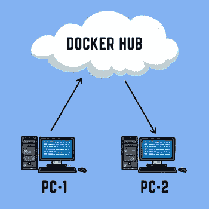

我们可以像在 Github 中一样将映像推送到 Docker hub，然后我们可以从 Docker Hub 将它放入任何机器中，并虚拟地运行它，因为它包含应用程序运行所需的所有特定依赖项。

存储库:推和拉容器图像。

# **与 Docker 一起工作**

1.  打开终端并键入以下命令

*首先，确保你已经安装了*[*vs code*](https://code.visualstudio.com/download)*和* [*节点*](https://nodejs.org/en/download/)

```
$ mkdir docker-app
$ cd docker-app
$ code .
```

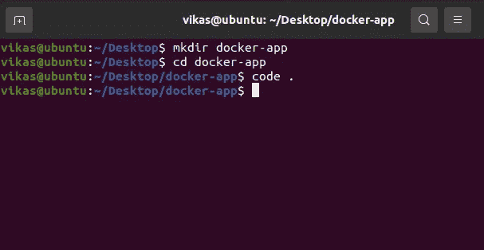

2.创建一个 index.js 文件并粘贴以下代码

```
console.log("My First Docker App")
```

在终端中运行下面的命令来运行 index.js 文件

```
$ node index
```

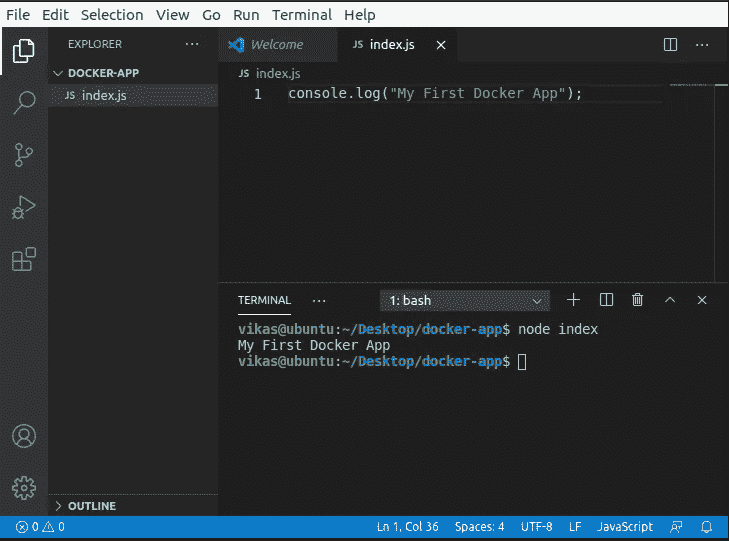

3.在创建 index.js 文件的同一层创建 Dockerfile，并在 vscode 中添加 Docker 扩展，如下图所示

文件名: **Dockerfile** 【不带任何扩展名】

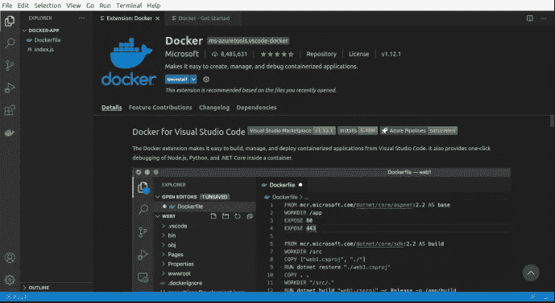

4.将以下代码复制到 Dockerfile 中并保存

```
FROM node:alpine
COPY . /index
WORKDIR /index
CMD node index.js
```

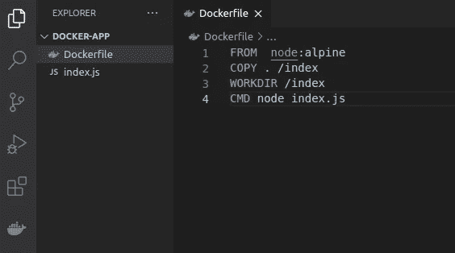

5.让我们构建我们的 docker 应用程序

```
sudo docker build -t docker-app .
```

> -t 代表标语

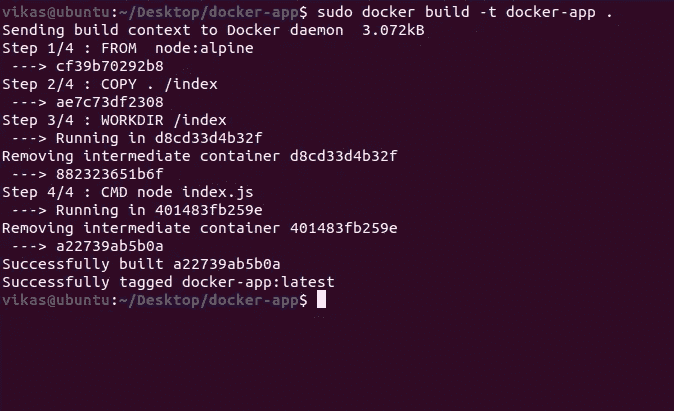

6.因为我们创建了图像，但它在我们的工作目录中不可见。因此，要检查它，运行以下命令

```
$ sudo docker image ls
```

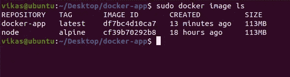

7.让我们在开发机器上运行 docker-app 映像。

```
$ sudo docker run docker-app
```

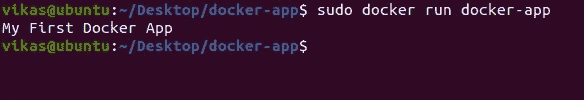

参考本博客，了解如何利用 Docker Hub 来推送和提取图像—[https://tiwarivikas . medium . com/working-with-Docker-Hub-3a 0 ba 1d 7 cc 05](https://tiwarivikas.medium.com/working-with-docker-hub-3a0ba1d7cc05)

# **结论**

您已经成功构建了 docker 映像，并了解了关于 Docker 的基本详细概述。如果你遇到任何问题，请随时通过 LinkedIn 联系我。

如果你喜欢这个博客，一定要看看我的 [**YouTube**](https://www.youtube.com/channel/UCI_xIqMJa1Oirfjx5-ykylA) 频道，了解更多令人惊叹的东西。

# **参考文献**

*   [https://docs.docker.com/](https://docs.docker.com/)
*   [https://stack overflow . com/questions/16047306/how-is-docker-different-a-virtual-machine](https://stackoverflow.com/questions/16047306/how-is-docker-different-from-a-virtual-machine)
*   [https://www.youtube.com/watch?v=pTFZFxd4hOI&t](https://www.youtube.com/watch?v=pTFZFxd4hOI)