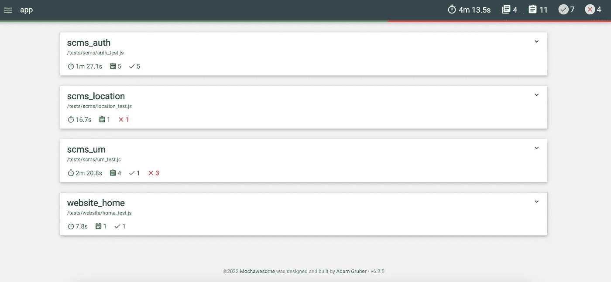
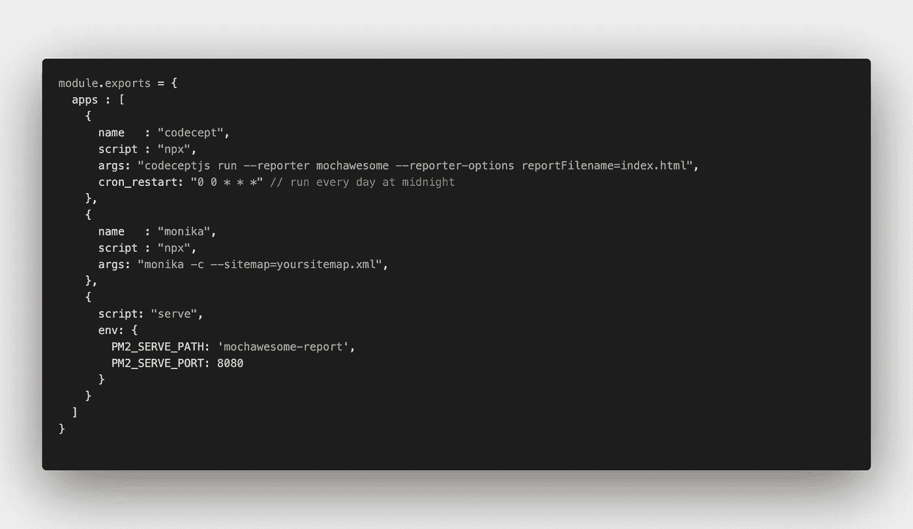
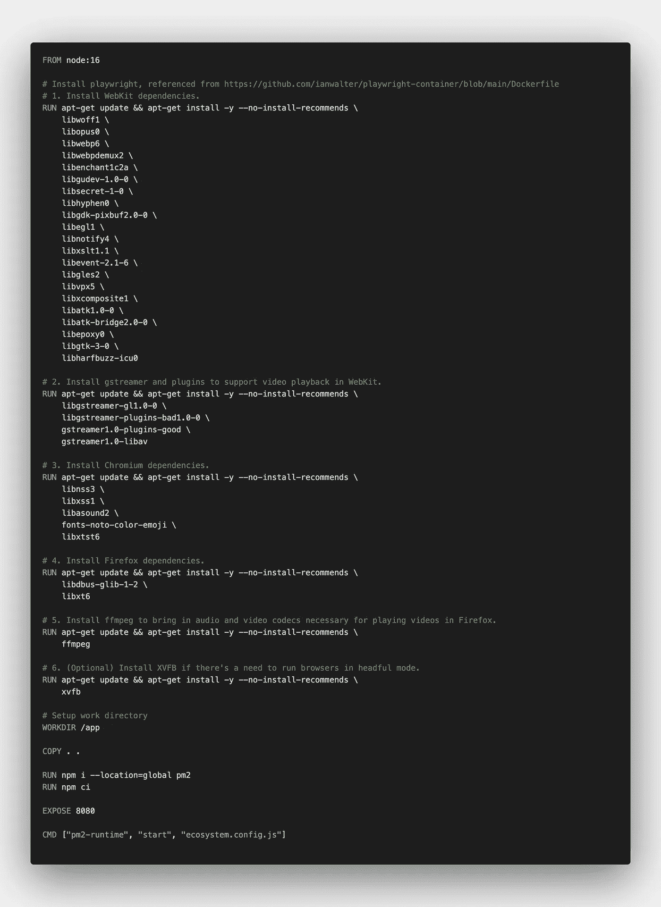

# 记录您的自动化测试和监控

> 原文：<https://medium.com/geekculture/dockerize-your-automated-test-monitoring-c9ecdbbcf187?source=collection_archive---------5----------------------->

使用 docker 轻松监控并定期运行您的 API/UI 测试。随处部署。

> 要实现稳定且可扩展的平台，监控和自动化测试是必须具备的。通过实施持续监控，您可以尽快对停机或错误做出反应。通过实现自动化测试，您可以更加自信地将新特性发布到产品中。


Photo by [Stephen Dawson](https://unsplash.com/@dawson2406?utm_source=unsplash&utm_medium=referral&utm_content=creditCopyText) on [Unsplash](https://unsplash.com/s/photos/test-report?utm_source=unsplash&utm_medium=referral&utm_content=creditCopyText)

## **你已经建立了你的自动化测试**

下一个问题是，我应该如何以及何时运行测试？对于单元测试，显然你可以把它们放在 CI/CD 管道中来检查方法的正确性和合理性。对于集成测试，当测试开始消耗大量时间时，可能会产生疑问。对于 UI 测试或 API 测试，将它放在 CI/CD 管道中并不是一个好的选择，因为它会消耗大量的时间，并可能阻塞另一个等待运行的管道。

## **那么我应该在哪里运行我的长跑测试呢？**

对于长时间运行的测试，您有几个选择:

*   **手动运行测试&检查平台可用性**
    优点:不增加额外成本
    缺点:一切都是手工操作，难以扩展
*   **使用测试管理平台**
    优点:易于使用和设置
    缺点:受限于平台支持的内容
*   **推出您自己的测试&监控工具**
    优点:很好地融入您当前的环境/技术
    缺点:部署和工具维护

第一个和第二个选项非常简单。如果适合你的团队条件，请随意选择。但是，如果您想推出自己的测试和监控工具，请继续阅读。

## I .选择您的测试报告员

这是必要的，因为我们想要容易地与其他涉众共享测试结果。使用 html 格式，最简单的方法是确保记者为我们稍后提供 index.html。

一个例子是使用 mochawesome-reporter 来支持 CodeceptJS 测试。

*   安装 mochawesome

```
npm i mochawesome
```

*   将报表程序配置添加到 CodeceptJS 运行中

```
codeceptjs run --reporter mochawesome --reporter-options reportFilename=index.html
```

运行测试将会产生这样的报告



mochawesome reporter result

## 二。设置您的网站监控

因为我们正在开发自己的测试和监控工具，所以让我们使用 [Monika](https://monika.hyperjump.tech/overview) 来设置一个简单的网站监控

1.  生成你站点地图
    有几个站点地图生成器。请随意选择一个并生成您的 sitemap.xml
2.  使用命令`npm i @hyperjumptech/monika`安装 Monika
3.  对你的站点地图进行监控

```
monika -c --sitemap=yoursitemap.xml
```

瞧啊。你的网站被莫妮卡监控了。不要忘记通过启用[莫尼卡通知](https://monika.hyperjump.tech/guides/notifications)来设置提醒通知(支持 Slack、Google Chat、Telegram、Discord 等)

如果你想要一个更加定制的监控，阅读更多关于[莫尼卡配置](https://monika.hyperjump.tech/guides/configuration-file)。

## 三。使用流程管理器

为了运行同步和预定的测试，需要一个过程管理器。让我们用 [PM2](https://pm2.keymetrics.io/) 来做这个。

首先，我们需要安装 pm2

```
npm install pm2 -g
```

之后，我们必须为并行流程生成一个配置

```
pm2 init simple
```

上面的命令将生成生态系统. config.js。让我们修改该文件，直到它看起来像这样



通过创建上面的配置，并运行`pm2 start ecosystem.config.js`,我们设法:

*   使用来自 pm2 的 cron 特性在每个午夜运行 codeceptjs
*   运行 Monika 根据站点地图中的 URL 监控您的站点
*   运行静态服务器以查看来自最新 codeceptjs 执行的 mochawesome 报告

最后一步是在云中准备和部署您的测试。

## 四。准备好你的文档

Docker 是一个开发、发布和运行应用程序的开放平台。如果你不熟悉 Docker，在这里阅读更多。



将上面的代码放到 Dockerfile 中，它将

*   使用节点 16 作为基础映像设置容器
*   为 codeceptjs 测试安装剧作家(您的设置可能会有所不同)
*   运行 pm2

通过执行以下命令在本地测试您的应用

```
docker build . -t testimg && docker run -p 8080:8080 -t testimg
```

codeceptjs 完成测试后打开`localhost:8080`,您将在浏览器中看到您的 mochawesome 报告。

## 动词 （verb 的缩写）部署

完成上述步骤后，最后一部分是部署 docker 容器。有很多方法可以部署 docker 容器，比如

*   [将 Docker 部署到 Heroku](/geekculture/deploy-docker-containers-to-heroku-dc1bca7e4025)
*   [将 Docker 部署到 AWS](/geekculture/deploy-to-aws-docker-in-10-minutes-68a60724dcb9)

玩得开心！