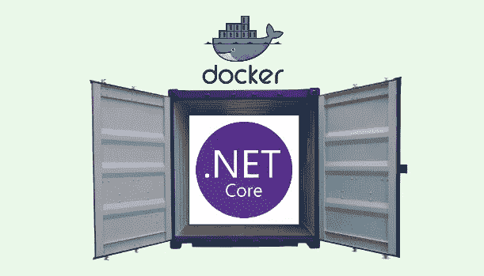

# 对接. NET 核心微服务

> 原文：<https://medium.com/geekculture/dockerizing-a-net-core-project-f7965e4fbe95?source=collection_archive---------4----------------------->

## 为什么每个开发人员都应该了解 dockerizing

.NET Core + Docker = Developer Experience++ 🚀

当新开发人员加入一个团队时，让他们尽快适应是很重要的。我们把融合新员工的过程称为“入职”。**开发人员的入职流程有一些特点**。

开发人员入职通常包括:

*   认识新同事…