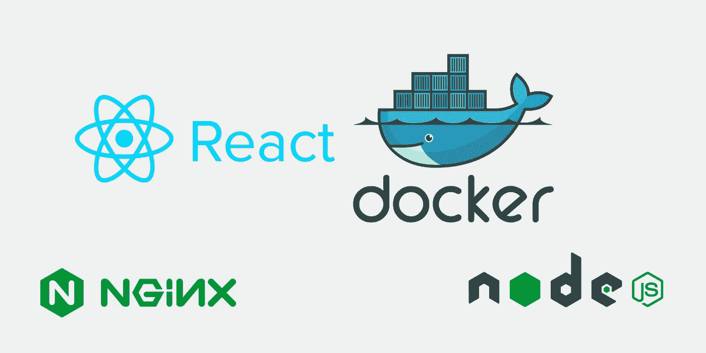

# 用多阶段 Docker 构建对 React 应用程序进行 Docker 化

> 原文：<https://medium.com/geekculture/dockerizing-a-react-application-with-multi-stage-docker-build-4a5c6ca68166?source=collection_archive---------4----------------------->

## [使用 GitOps 技术的 CI/CD 管道](/google-cloud/ci-cd-pipeline-using-cloud-build-with-gitops-technique-68b0e9d3b53)

## 了解如何使用 Node 和 NGINX 通过多阶段 Docker 构建对 React 应用程序进行 Docker 化。

过去，如果我们希望与他人共享我们的应用程序，或者在不同的环境中访问它，我们需要做些什么…