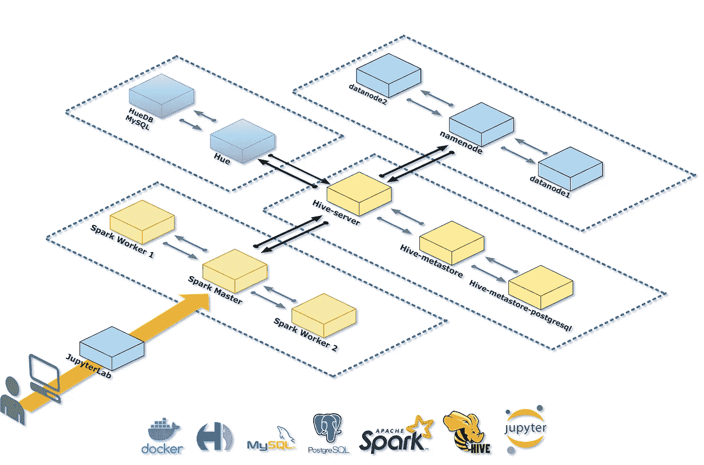

# 停靠 Apache Spark 独立集群

> 原文：<https://medium.com/geekculture/dockerizing-an-apache-spark-standalone-cluster-eeb7d3f8efeb?source=collection_archive---------21----------------------->

## 具有内存处理能力的小型大数据生态系统

Small Big Data ecosystem with In-Memory Processing

本文的目的是向您展示如何使用 docker 作为一个强大的工具来部署应用程序，这些应用程序以一种快速而稳定的方式相互通信。在这种情况下，我提出了一个用于内存处理的大数据小型生态系统，该生态系统基于不同的 docker 容器，它是…