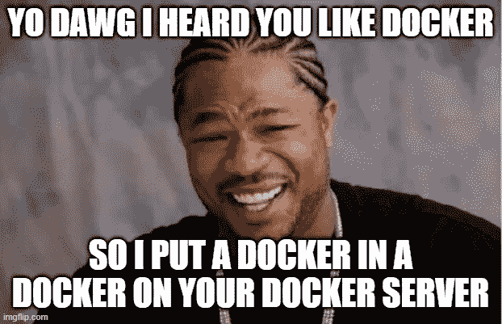
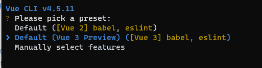
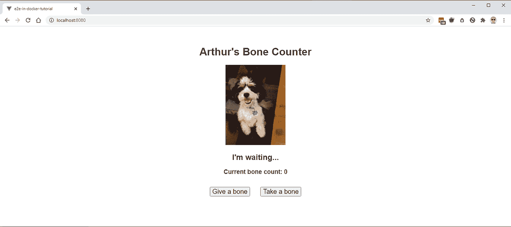
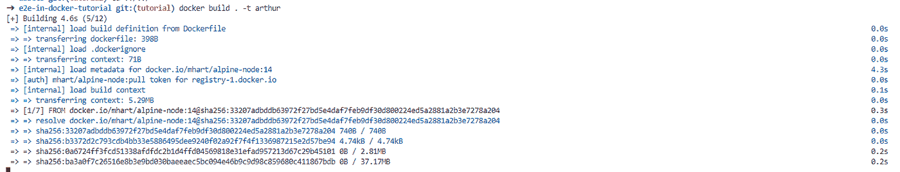
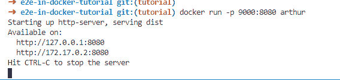
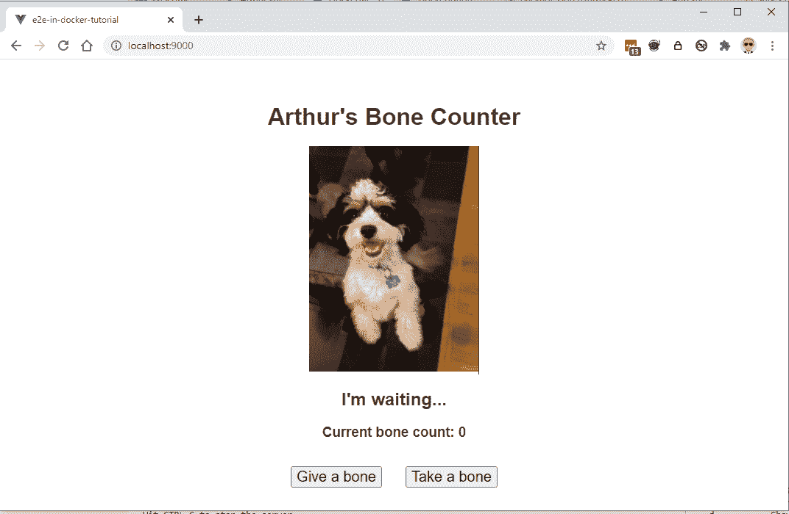

# 剧作家/E2E 测试

> 原文：<https://medium.com/geekculture/dockerizing-playwright-e2e-tests-c041fede3186?source=collection_archive---------19----------------------->

厌倦了管理你的自动化测试机器吗？您是否每隔一周更新一次 Chrome 版本，或者维护多个似乎总是需要系统更新的虚拟机？您在扩展每小时、每天可以运行的测试数量方面有问题吗？

如果是这样(也许即使不是)，这个指南是给*你*的！

我们将消除这些问题，并在您的测试设置中考虑可伸缩性、灵活性和隔离性。

你可能会问，我们如何去做？我们将在 Docker 容器中运行您的测试套件！



如果你没怎么想过，你可能会想为什么要做这样的事情。

嗯……归根结底就是两件事，**隔离性&可扩展性。**

不，我们不是在谈论 2020 年版的隔离。

我们正在谈论*隔离你的测试运行*，这样它们可以在同一时间在多个设置上运行多次。

也许你今天只运行了少数几个测试，但是将来你可能需要覆盖*几十个*浏览器&操作系统组合**快速和大规模**。

在本教程中，我将尝试介绍在 Docker 容器中运行典型 web 应用程序的基础知识，以及如何使用剧作家在 Docker 容器中运行测试。

> *注意，对于一个真正的产品设置，你会希望把 NGINX 作为容器中的 web 服务器，以及一个编排系统(如 Kubernetes)来探索。对于一个健壮的 CI/CD 管道，您还希望将测试作为脚本运行，并让您的 CI/CD 提供者在一个安装了依赖项的容器中运行所有这些，稍后会详细介绍。*

你可以在这里克隆 repo [来获得完整的教程，或者你可以在我们进行的过程中复制脚本块。](https://github.com/tipalti/e2e-in-docker-tutorial)

[](https://github.com/tipalti/e2e-in-docker-tutorial) [## 蒂帕蒂/e2e 码头教程

### 运行自动化/E2E 测试的教程存储库。通过创建……为蒂帕尔蒂/e2e 码头教程开发做出贡献

github.com](https://github.com/tipalti/e2e-in-docker-tutorial) 

# 基础知识

## 创建您的应用

对于这个例子，我们将使用 [Vue CLI](https://cli.vuejs.org/) 来创建我们的应用程序。

通过在 shell 中运行以下命令来安装 Vue CLI:

```
npm i -g @vue/cli @vue/cli-service-global
```

现在让我们创建应用程序，这里我们称之为`e2e-in-docker-tutorial`(但是使用你喜欢的任何东西):

```
vue create e2e-in-docker-tutorial
```

如果您想要自定义设置，请遵循屏幕上的说明，但为此我们将使用`Default (Vue 3 Preview)`选项。



一切安装完成后，让我们确保它的工作。

我们将通过运行以下程序在本地提供应用程序:

```
npm run serve
```

在它选择的端口上打开 localhost 浏览器( [http://localhost:8080](http://localhost:8080) )，您应该会看到类似这样的内容。


## 阿爸，给我造点什么吧！

我们现在将编写一个小的示例页面，稍后可以使用它进行测试。它将有一些基本的逻辑和一些交互性。

在这个例子中，我们将创建一个狗骨计数器，这样我们就可以跟踪卡瓦雄亚瑟得到了多少次款待。


“Is that a dog?” — Arthur

我们将只有两个按钮，“给一根骨头”和“拿一根骨头”(薛定谔的骨头在 v2 中到来)。

我们还将添加一条消息，以便他可以告诉我们他的感受。当给它一根骨头时，它会高兴地汪汪叫，但当你拿走一根骨头时，它会悲伤地呜呜叫。

最后，我们将保持一个计数器运行，以便我们可以跟踪他的骨摄入量(必须注意钙的摄入量，你知道…)。

我们将在 SCSS 的 [BEM](http://getbem.com/) 中编写样式，因此我们需要将`sass`和`scss-loader`添加到`devDependencies`中。**注意，由于与 Vue CLI 中的`postcss-loader`存在一些兼容性问题，我们在这里使用版本 10** 。

```
npm i -D sass sass-loader@^10
```

`App.vue`应该是这样的:

```
<template>
  <Arthur />
</template>

<script>
import Arthur from './components/Arthur.vue'

export default {
  name: 'App',
  components: {
    Arthur
  }
}
</script>

<style>
#app {
  font-family: Avenir, Helvetica, Arial, sans-serif;
  -webkit-font-smoothing: antialiased;
  -moz-osx-font-smoothing: grayscale;
  text-align: center;
  color: #2c3e50;
  margin-top: 60px;
}
</style>
```

我们还有看起来像这样的`Arthur.vue`组件:

```
<template>
  <div class="arthur">
    <h1>Arthur's Bone Counter</h1>
    
    <h2 id="dog-message">
      {{ dogMessage }}
    </h2>
    <h3 id="bone-count">
      Current bone count: {{ boneCount }}
    </h3>
    <div>
      <button class="arthur__method-button" @click="giveBone" id="give-bone">Give a bone</button>
      <button class="arthur__method-button" @click="takeBone" id="take-bone">Take a bone</button>
    </div>
  </div>
</template>

<script>
export default {
  name: 'Arthur',
  data() {
    return {
      boneCount: 0,
      dogMessage: `I'm waiting...`
    }
  },
  methods: {
    giveBone() {
      this.boneCount++;
      this.dogMessage = 'Woof!';
    },
    takeBone() {
      if (this.boneCount > 0) {
        this.boneCount--;
        this.dogMessage = 'Whine!';
      } else {
        this.dogMessage = `I'm confused!`;
      }
    }
  }
}
</script>

<style lang="scss">
.arthur {
  &__img {
    height: 50vh; // width scales automatically to height when unset
  }
  &__method-button {
    margin: 1rem;
    font-size: 125%;
  }
}
</style>
```

完成所有设置后，我们可以运行应用程序，我们应该会看到:



点击“给一根骨头”按钮给亚瑟一根骨头，他会感谢你的！

如果它不听你的话，你也可以把骨头拿走，但是如果你想拿一块不存在的骨头，它会很困惑的！

## 托管您构建的应用

为了托管构建，我们需要将 http-server 添加到我们的 devDependencies 并创建一个启动脚本，从添加 http-server 开始:

```
npm i -D http-server
```

并向 package.json 添加一个启动脚本，该脚本将托管 dist 文件夹，该文件夹是通过在端口 8080 上运行一个构建而创建的:

```
“start”: “http-server dist -- port 8080”
```

要对此进行测试，请运行以下命令，然后打开浏览器到 [http://localhost:8080](http://localhost:8080) :

```
npm run build
npm start
```

您应该看到应用程序现在正在运行。干得好！让我们把这些都打包到一个 Docker 容器中！

# 我来了，看了，做了记录

## 创建 Dockerfile 文件

现在让我们创建一个`Dockerfile`来构建骨骼计数器并为我们服务。

在 repo 的根中创建 Dockerfile(字面意思是 Dockerfile，没有扩展),我们将基于当前的 Alpine 节点 LTS(撰写本文时有 14 个)。

我们将添加一些代码来复制文件，构建应用程序并在 Docker 容器中使用 http-server 从我们的 start 命令运行它。

```
FROM mhart/alpine-node:14

WORKDIR /app

COPY package.json package-lock.json ./

# If you have native dependencies, you'll need extra tools
# RUN apk add --no-cache make gcc g++ python3

RUN npm ci

COPY . .

RUN npm run build

# Run the npm start command to host the server
CMD ["npm", "start"]
```

我们还将添加一个`.dockerignore`来确保我们*不会意外地复制我们不想要的东西，比如 node_modules* ，因为我们将把它安装在代理上。

```
node_modules
npm-debug.log
dist
```

回到 over 文件，重要的是要注意我们为什么首先复制`package*`文件，这是因为层缓存。

如果我们在`package.json`或`package-lock.json`改变了什么，码头工人会知道，并从那条线向下重建。

然而，如果你只改变了应用程序文件，它将使用缓存版本的`package.json`和它的安装，并将只运行我们构建的层和之后的层。

当您进行大型安装，或者需要多次重建映像以获得更大的存储库时，这可以大大节省时间。

现在让我们构建图像并将其标记为`arthur`。确保您在 docker 文件所在的根目录中。

```
docker build . -t arthur
```

输出应该如下所示:



构建完成后，我们将运行刚刚构建的映像，并将正在运行的容器上的端口 8080 转发到主机端口 9000，而不是直接到达主机上的 8080。

```
docker run -p 9000:8080 arthur
```



注意，我们在日志中看到它在端口 8080 上运行，但这是来自容器内部的**。**要查看站点，我们需要使用`-p 9000:8080`标志设置主机端口 9000。

导航到 [http://localhost:9000](http://localhost:9000) ，您应该会看到应用程序:



恭喜你！**您现在正在 Docker 容器中运行一个 web 应用程序！在继续之前，喝杯你想要的庆祝咖啡或啤酒，我就在这里看 Youtube 上的猫视频。**

# 你应该测试你的应用程序

## 编写剧作家测试

在下一部分中，我们将介绍如何向项目中添加剧作家和笑话，并且我们将针对正在运行的应用程序运行一些测试。我们将使用`jest-playwright`来配置 Jest 并在测试时运行服务器，它应该带有许多样板类型的代码。

剧作家是微软的一个库，它的 API 几乎是 1 比 1，可以通过标准的 javascript API 运行浏览器。

最大的区别是，Puppeteer 仅限于基于 chromium 的浏览器，但剧作家包括一个特殊的 WebKit 浏览器运行时，可以帮助覆盖浏览器与 Safari 的兼容性。

出于你自己的需要，你可能想使用 Selenium，Cypress.io，Puppeteer，或者其他什么东西。JavaScript 生态系统中有许多优秀的自动化和端到端测试工具，所以不要害怕尝试其他东西！

所以回到我们的教程，让我们从添加我们需要的`devDependencies`开始，它们是 Jest，剧作家的预置，剧作家本身，以及一个很好的 expect 库来帮助我们断言条件。

```
npm install -D jest jest-playwright-preset playwright expect-playwright
```

我们将在项目的根目录下创建一个`jest.e2e.config.js`文件，并指定`preset`以及一个仅运行 e2e 测试的`testMatch`属性。我们还将在这里设置 expect-剧作家断言。

```
module.exports = {
  preset: 'jest-playwright-preset',
  setupFilesAfterEnv: ['expect-playwright'],
  testMatch: ['**/*.e2e.js']
};
```

> 请注意，这种通过命名的分离对于这个演示项目来说并不重要。然而，在一个真实的项目中，你也会有单元测试(**你*确实*有 100%覆盖率的单元测试，不是吗…** )，并且你会因为性能和其他原因想要单独运行这些套件。

我们还将为`jest-playwright`添加一个配置文件，这样我们就可以在运行测试之前运行服务器。用以下内容创建一个`jest-playwright.config.js`。

```
// jest-playwright.config.js

module.exports = {
    browsers: ['chromium', 'webkit', 'firefox'],
    serverOptions: {
        command: 'npm run start',
        port: 8080,
        usedPortAction: 'kill', // kill any process using port 8080
        waitOnScheme: {
            delay: 1000, // wait 1 second for tcp connect 
        }
    }
}
```

当我们运行 e2e 测试套件时，这个配置文件也会自动为我们启动服务器，太棒了！

## 编写测试

现在让我们继续写一个快速测试场景，我们将打开站点，测试一些动作，并断言它们做了我们期望的事情(安排、动作、断言！).

继续在`__tests__/e2e/`目录中创建`arthur.e2e.js`(如果不存在，则创建该目录)。

测试将如下所示:

```
describe('arthur', () => {
    beforeEach(async () => {
        await page.goto('http://localhost:8080/')
    })

    test('should show the page with buttons and initial state', async () => {
        await expect(page).toHaveText("#dog-message", "I'm waiting...");
        await expect(page).toHaveText("#bone-count", "Current bone count: 0");
    });

    test('should count up and woof when a bone is given', async () => {
        await page.click("#give-bone");
        await expect(page).toHaveText("#dog-message", "Woof!");
        await expect(page).toHaveText("#bone-count", "Current bone count: 1");

    });

    test('should count down and whine when a bone is taken', async () => {
        await page.click("#give-bone");
        await page.click("#give-bone");
        // first give 2 bones so we have bones to take!
        await expect(page).toHaveText("#dog-message", "Woof!");
        await expect(page).toHaveText("#bone-count", "Current bone count: 2");

        await page.click("#take-bone");

        await expect(page).toHaveText("#dog-message", "Whine!");
        await expect(page).toHaveText("#bone-count", "Current bone count: 1");

    });

    test('should be confused when a bone is taken and the count is zero', async () => {
        // check it's 0 first
        await expect(page).toHaveText("#dog-message", "I'm waiting...");
        await expect(page).toHaveText("#bone-count", "Current bone count: 0");

        await page.click("#take-bone");

        await expect(page).toHaveText("#dog-message", "I'm confused!");
        await expect(page).toHaveText("#bone-count", "Current bone count: 0");
    });
})
```

在本文中，我们不会详细讨论剧作家的语法，但是你应该对上面的测试有一个基本的概念。

如果不太清楚，你可以查看一下剧作家的文档，或者试着用调试器一步一步地测试。

如果您继续操作并启用了 VS 代码上的`eslint`，您也可能在上面的文件中得到一些`eslint`错误。

您可以添加`eslint-plugin-jest-playwright`并使用推荐设置上的扩展来正确地在 e2e 目录中 lint。

首先安装`devDependencies` `eslint-plugin-jest-playwright`:

```
npm i -D eslint-plugin-jest-playwright
```

然后在`__tests__/e2e`中创建一个`.eslintrc.js`文件，如下所示:

```
module.exports = {
    extends: [
        'plugin:jest-playwright/recommended'
    ]
};
```

再见，红色的波浪线！

## 运行测试运行！

既然已经正确设置了测试，我们将继续添加一个脚本来从`package.json`运行它们。

添加如下`test:e2e`脚本:

```
“test:e2e”: “jest — config jest.e2e.config.js”
```

这将告诉 jest 使用 e2e 配置，而不是默认的单元测试配置(`jest.config.js`)。

现在继续进行测试，继续努力！

> 请注意，如果您没有正确的系统依赖项，您可能需要设置一些库。为此，请直接查阅剧作家文档，或者直接跳到 Docker 部分，那里有你需要的所有东西。

## 在 Docker 容器中运行它

现在，我们将把它们放在一起，在一个 Docker 容器中运行 e2e 测试，这个容器有我们需要的所有依赖项，这将使我们能够轻松地**伸缩**以及 [**运行一个矩阵**](https://docs.github.com/en/actions/learn-github-actions/managing-complex-workflows#using-a-build-matrix) ( *我们在本文中没有涉及，但可能在第 2 部分*中)。

像这样创建一个`Dockerfile.e2e`:

```
# Prebuilt MS image
FROM mcr.microsoft.com/playwright:bionic

WORKDIR /app

COPY package.json package-lock.json ./

RUN npm ci

COPY . .

RUN npm run build

# Run the npm run test:e2e command to host the server and run the e2e tests
CMD ["npm", "run", "test:e2e"]
```

> 请注意，这里的 CMD 设置为运行 e2e 测试。这是因为我们希望将测试作为容器的启动命令运行，而不是作为容器构建过程的一部分。这并不是您与 CI 提供者一起运行的方式，因此 YMMV。

继续运行容器的`docker build`，并指定不同的`tag`和`Dockerfile:`

```
docker build . -f Dockerfile.e2e -t arthur-e2e
```

在这个演示**中，我们用**中的测试构建了容器 **，但是理论上你可以从`COPY`命令中排除测试，并且可以**挂载一个测试卷**，这样你就不需要在测试变化之间重新构建。**

我们可以使用下面的命令运行容器并查看测试结果(在测试结束时，`--rm`标志将移除容器，这样我们就不会让容器挂起):

```
docker run --rm arthur-e2e
```

您应该会看到如下所示的输出:


干得好！你刚刚在 Docker 容器中运行了 WebKit、Chromium 和 FireFox 的 e2e 测试！

如果你喜欢这个教程，并且你想加入一个正在寻找优秀人才的令人惊叹的创业公司，请前往 [Tipalti Careers](https://www.tipalti.com/careers) ！

如果您想评论或添加一些反馈，也请随意，我们一直在寻求改进！