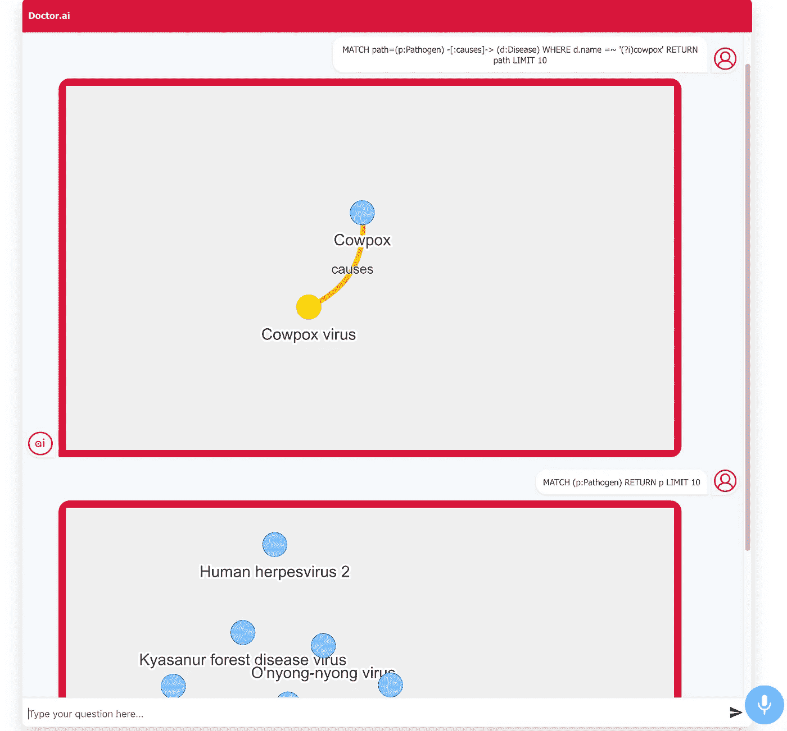

# dr . ai 与 Alan 和 Neovis.js

> 原文：<https://medium.com/geekculture/doctor-ai-with-alan-and-neovis-js-aa4ac0d94ba?source=collection_archive---------8----------------------->

## 一种替代实施方式

*由黄思兴* [*梁丽*](https://www.linkedin.com/in/%E4%BA%AE-%E6%9D%8E-422311175/) *。灵感来自*[*maru thi Prithivirajan Lokananthan*](https://www.linkedin.com/in/maruthi-prithivirajan-lokananthan/)*。*

Figure 1\. Doctor.ai with Alan and Neovis. Image by author.

知识图是语义图数据库。我们把我们的知识编码成一系列的主谓宾三元组，并把它们输入到图表中。知识图可以整合来自多个来源的信息。因此，它们可以丰富用户…