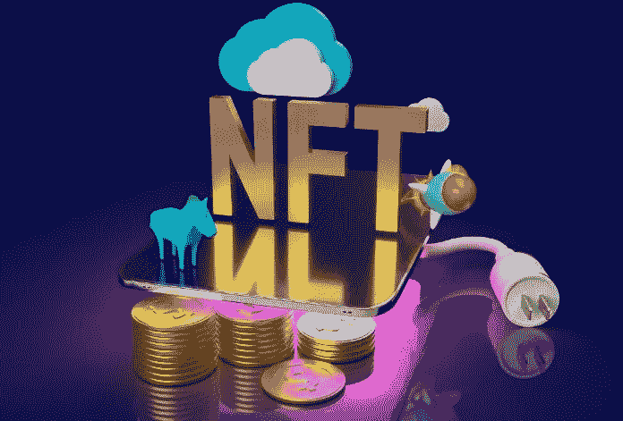
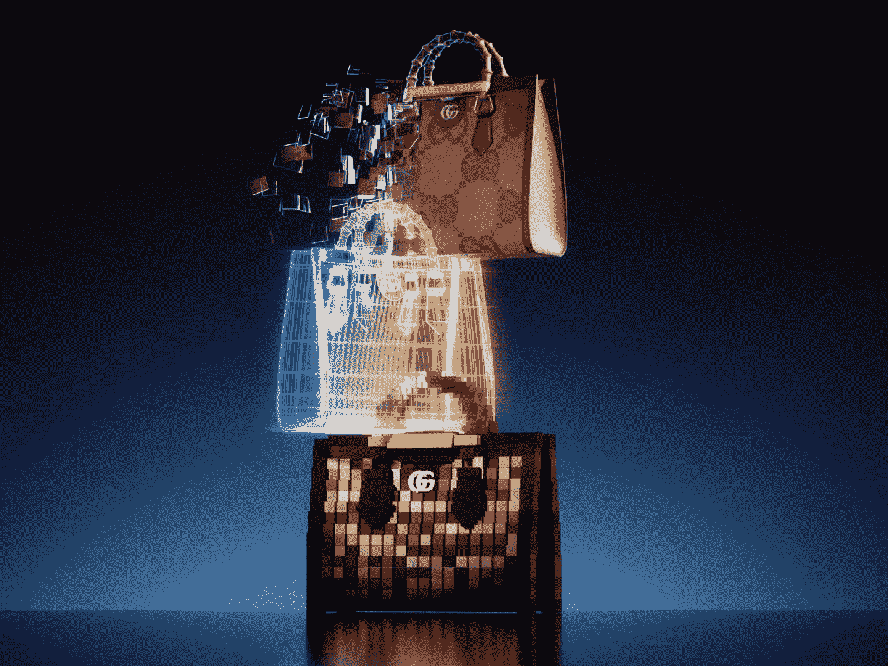

# 实物资产的 NFT 平台连接了虚拟世界和现实世界吗？

> 原文：<https://medium.com/geekculture/does-an-nft-platform-for-physical-assets-link-the-virtual-and-real-worlds-4fea2e04fbc5?source=collection_archive---------17----------------------->

NFT Platform For Physical Assets

当我们听到不可替代令牌(NFT)时，我们大多数人都记得它们是支持数字艺术(或通俗的 JPEGs 和 gif)的东西。但实际上，NFT 可以支持几乎任何东西，因为它们旨在作为所有权和真实性的证明。已经有一些品牌已经尝试了物理上可兑换的 NFT，更多的品牌正在尝试中。但是出售这种 **NFT 资产**的平台呢？如果你想知道他们的存在，是的，他们确实存在，本博客将详细讨论他们。

# 什么是实物资产 NFT 平台？

一个 [**实物资产 NFT 平台**](https://bit.ly/3s9NfXw) 可以粗略地定义为一个 NFT 市场，专门销售支持现实世界中实物项目的 NFT。通常情况下，NFT 可以兑换成它们所支持的实物资产。在此之前，NFT 持有者可以享受一些作为直接使用案例的专属好处。这种 NFT 还可以让任何在二次销售中购买的人相信，他们购买的产品是原始交易，值得花一些密码。

实物 NFT 资产的范围可以从实物绘画、纪念品、古董收藏品、**配饰**、可穿戴设备和异国情调的产品(如葡萄酒)，甚至是房地产，这是一个独立的领域。简而言之，大多数物理 NFT 用作古董和外来产品的认证，恶意行为者可以很容易地伪造这些产品。

就目前的实物资产非金融交易市场而言，没有多少企业提到为这类产品创造代币的模糊性。此外，由于监管定义松散，风险投资者甚至怀疑市场是否会起飞。尽管有这样的担忧，运动服装品牌阿迪达斯，以及一些酒精饮料品牌，如格兰菲迪威士忌。就实体房地产 NFT 资产市场而言，美国的一些建设项目已经开始了使命，只有时间会让我们知道结果。

# 为实物资产搭建 NFT 平台

**✔** 就像所有其他项目一样，为实物资产创建一个 NFT 平台始于规划阶段，在这个阶段，所有想法都会得到讨论，项目在纸面上已经完全就绪。其中必须包括 NFT 平台的集中度、目标受众、要使用的技术、NFTs 的效用以及赎回流程。

**✔** 然后，进行**前端开发**在这里你应该构建平台的用户界面(UI)和与用户体验(UX)相关的特性。通过沉浸式用户界面提供无缝的用户体验是企业成功的主要因素之一。

**✔** 之后，继续进行**后端开发**，在那里你使用高级编程技术构建平台的安全性和健壮性。应在此阶段完成区块链平台的集成。

✔然后，为你打算带到区块链世界的实物物品创建智能合同的最重要过程开始了。确保您提供了所有必要的细节，包括效用和兑换条件，以便交易能够顺利进行。

**✔** 之后，继续对平台和智能合约进行多次测试，以解决任何缺陷。这里建议重复使用各种测试用例，因为这里涉及的技术仍在不断发展。

**✔** 最后一步，启动您的**实物资产 NFT 平台**开始交易。经常升级你的平台，以跟上不断增长的用户流量和更新的缺陷。

# 结论

因此，如果你想知道将现实和虚拟世界联系起来的可能性，在 metaverses 流行之前，用虚拟工具销售物理 NFT 可能是一个更容易的选择。你可以 [**创建一个销售 NFT 实物资产的 NFT 平台**](https://bit.ly/3s9NfXw) (一个市场)，如果你与一家经验丰富的公司合作开发这样的平台，事情会变得更容易。