# 清理后的数据能保证高数据质量吗？

> 原文：<https://medium.com/geekculture/does-cleaned-data-guarantee-high-data-quality-251582d764f8?source=collection_archive---------11----------------------->

对“清理的数据能保证高数据质量吗？”是一个很大的不和永远不会。本文涵盖了数据质量维度以及如何使用 python 确保数据的高质量。

Photo by Kindel Media: [https://www.pexels.com/photo/person-holding-black-pen-on-white-printer-paper-7054417/](https://www.pexels.com/photo/person-holding-black-pen-on-white-printer-paper-7054417/)

数据清理仅确保数据没有任何缺失或重复的值，修复结构错误，过滤不需要的异常值，格式化数据，并删除不相关的观察值或数据。如果你想知道如何使用 python 清理数据，可以查看我的文章[这里](/geekculture/what-is-data-cleaning-how-data-cleaning-can-be-done-20722af9dc67)。

当我们说数据清洗移除不相关的观察值或数据时，它的主要焦点是移除具有错误值或信息的不相关的列和行。它不会深入挖掘数据来检查它是否相关。此外，数据清理永远不能保证数据适合服务于业务目标。

因此，要进行数据质量检查，以确保数据适合服务于业务目标，并正确地表示它所涉及的真实世界的构造。从客户、业务和标准的角度来看，数据质量的定义是不同的。

因此，数据质量应确保数据适合使用，满足或超过顾客期望，满足规范文件，没有缺陷，并满足其预期用途的要求。此外，它应该准确、正确、一致、相关、有效，并对业务决策及其应用有用。

这些期望、规范和需求通常由一个或多个个人或团体、标准组织、法律和法规、商业政策或软件开发政策来定义。

通过使用数据质量指标对数据进行评估，可以将数据分为高质量或低质量。不同的数据质量指标包括:

## 精确度:

准确性是高质量数据的一个关键属性，也是最难确定的属性。如果我们的数据中有数百万条记录，数据质量的这一方面必须确保每条数据记录都是准确的，手动检查数百万条记录几乎是不可能的。

根据数据及其行为，需要进行各种检查和可疑错误模式，以确保数据的高质量。

为了解释这一点，我使用干净的数据，这是可用的[在这里](https://github.com/SandKrish/Data-Quality/blob/main/Data_Quality.csv)。

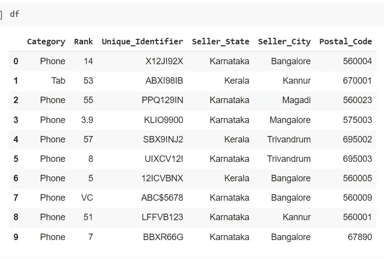

数据集属性和期望值或数据类型如下:

类别:应具有“电话”、“标签”或“笔记本电脑”
等级:卖家等级，它是一个整数，可以在 1 到 50 的范围内
唯一标识符:字母数字 8 个字符。
卖家 _ 州:印度的两个州**任一**卡纳塔克邦和喀拉拉邦，
卖家 _ 城市:这两个州的任何一个城市
邮政编码:城市的 Pin 码。

对于此数据集，为了确保数据的准确性，可以进行数据质量检查。注意，我已经用 google colab 解释过了。

*   **类别的准确性检查:**预期有“手机”、“平板电脑”或“笔记本电脑”，则应检查除了上述值之外没有其他值。

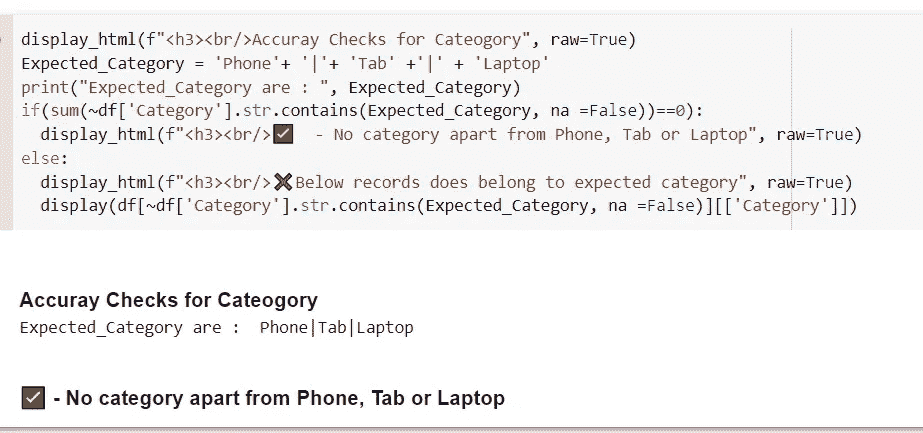

*   **精度检查求秩:**1 到 50 的正整数，不应该是小数。

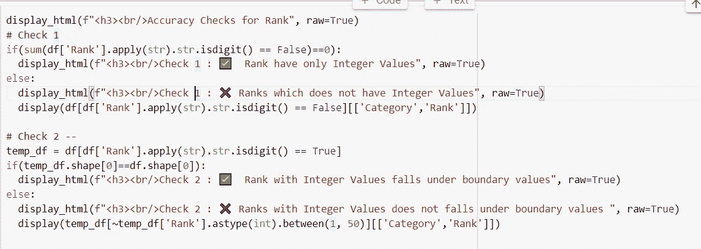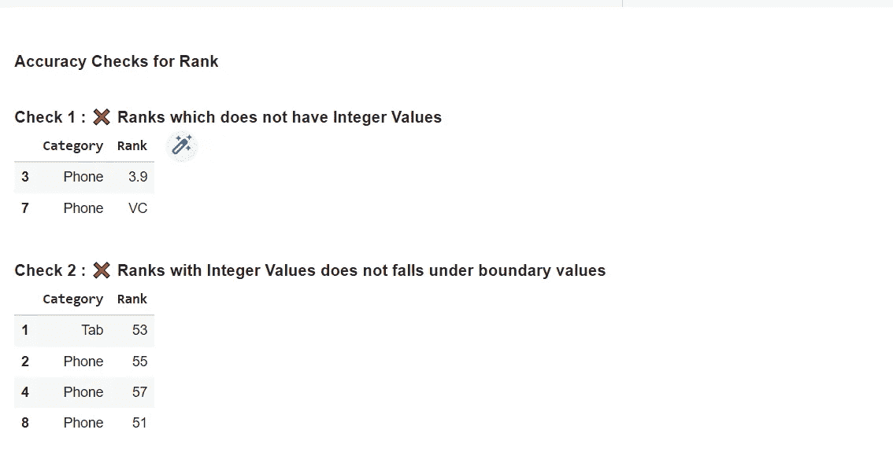

*   **唯一标识符的准确性检查:**长度为 8 的字母数字。

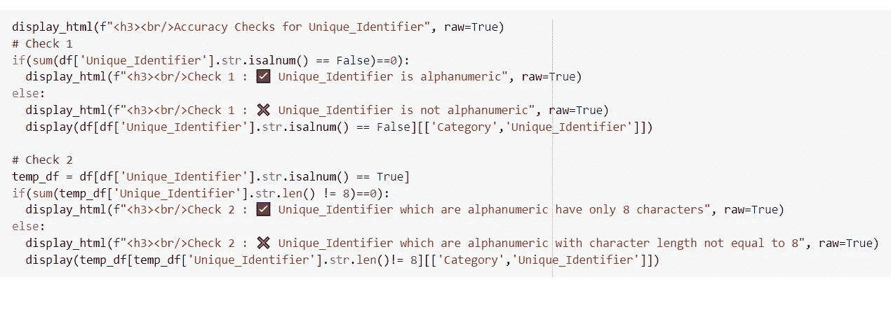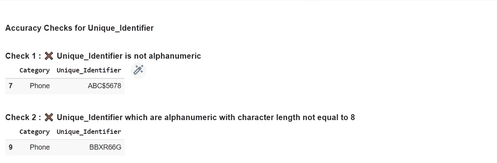

*   **Seller _ State 的准确性检查:**值应该是卡纳塔克邦或喀拉拉邦

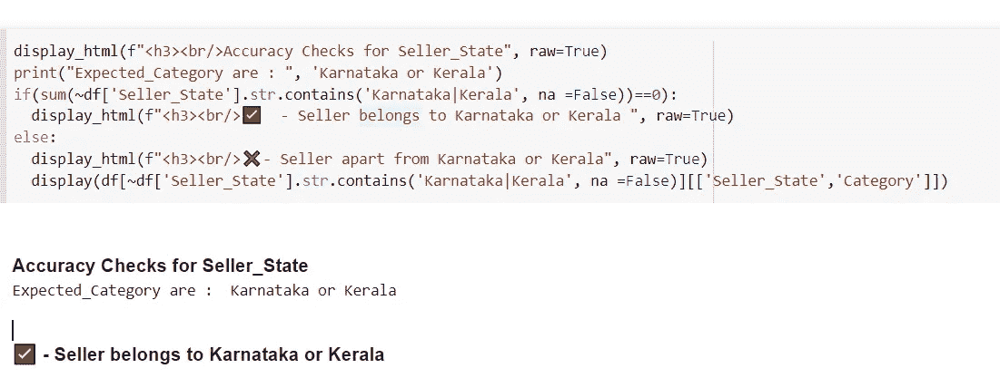

*   **卖方城市的准确性检查:**卖方城市属于卖方州

为了检查城市是否属于某个特定的州，我在 google sheet 中创建了一个州、城市和邮政编码(稍后检查需要邮政编码)的主列表。要访问 Google Sheets，必须向 Google 帐户提供身份验证，这可以使用下面的代码来完成。

一旦谷歌帐户被授权，然后使用下面的代码，我们可以得到谷歌表的内容。

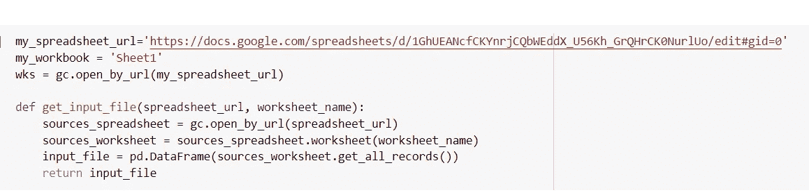

这里 **city_info** 调用函数 **get_input_file()** 存储 google sheet 的所有内容。

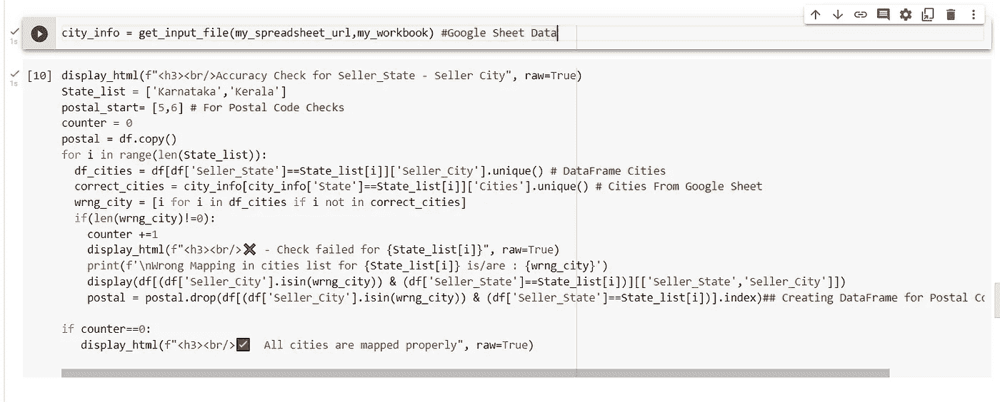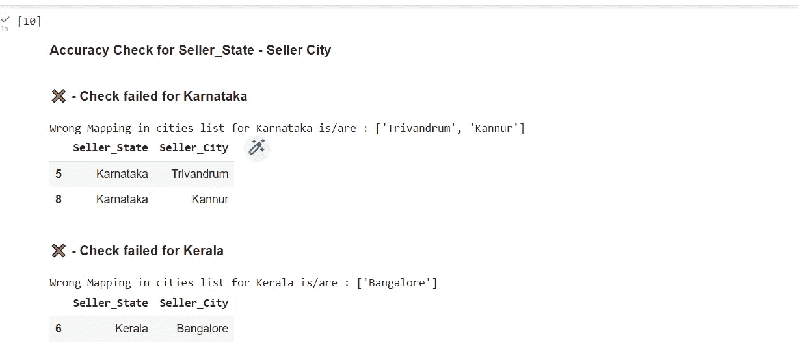

*   **邮政编码的准确性检查:**邮政编码属于卖方城市。印度邮政编码是 6 位数。

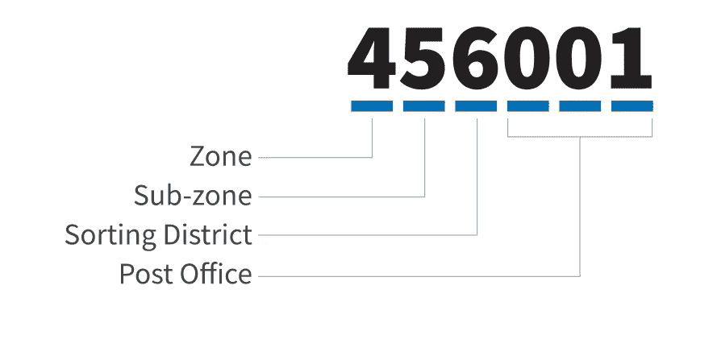

Sample of Indian Postal Code Number [https://upload.wikimedia.org/wikipedia/commons/f/f1/Example_of_Indian_Postal_Index_Number.svg](https://upload.wikimedia.org/wikipedia/commons/f/f1/Example_of_Indian_Postal_Index_Number.svg)

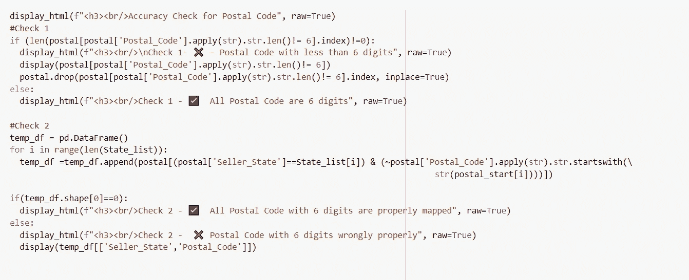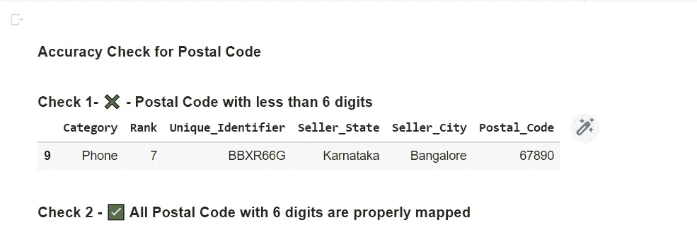

如果数据有年龄细节，那么可以检查年龄不应该有负值或不合理的正值。

## 完整性:

为了确保数据的完整性，主要检查数据规范文档中提到的所有列在数据集中是否可用。准确的数据不一定总是完整的。如前所述，如果一个列预计只有几个值，如“电话”、“标签”和“笔记本电脑”。如果数据除了“手机”、“平板电脑”或“笔记本电脑”之外没有任何类别，则数据是准确的，但在这三个类别都存在之前，数据是不完整的。

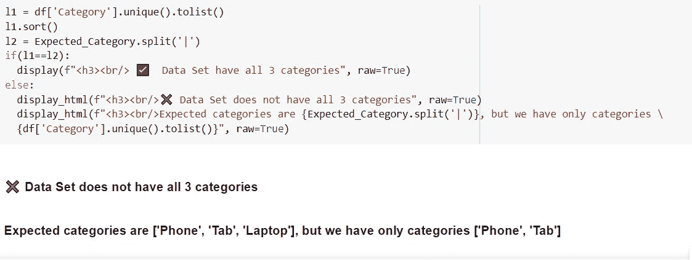

## 一致性:

当数据稳定、兼容、格式相同且一致时，称之为一致。当要定期提交数据文件进行分析或输入 ML 模型时，文件大小应保持一致，即文件大小应始终在平均正负两个标准偏差之间。对于上边界，可以在拒绝数据之前分析异常值，而下边界数据文件可以被直接拒绝。

应该彻底检查数据一致性，如前所述，如果我们有一个手机、平板电脑和笔记本电脑的数据集，前两个数据集有 1000 条记录，而笔记本电脑只有少量记录，那么数据根本就不一致。

可以通过分析 df['类别']之间的差异来检查一致性。value_counts()。nlargest(1)和 df['Category']。value_counts()。nsmallest(1)。

## 有效性:

对于研究性学习，我们可以检查内部和外部有效性的一致性。内部效度将告诉我们对我们的数据有多有信心，这可以在结果发生变化的同时得到保证。当原因发生变化时，结果总是变化的后效，如果有任何相关性，那么就没有合理的原因。

研究人员还应该注意不要有实验偏见，不要对研究结果妥协。

外部有效性包括**种群有效性、生态有效性和时间有效性。**人口有效性确保研究人口和感兴趣人口相同。生态有效性确保结果可以应用于现实世界，而时间有效性检查结果随着时间的推移保持准确的程度。

对于干净的数据，如果城市属于映射的州，邮政编码的准确性检查可以被认为是有效性检查。

## 及时性:

历史数据应该有清晰的年代信息。处理后可供客户使用的数据应在客户需要的正确时间内，当数据是某个时间范围的预期数据时，它不应在该时间段之前或之后有数据，并且停止时间不应在开始时间之前。当企业在正确的时间以正确的格式获得正确的数据时，就可以做出正确而准确的业务决策。

## 独特性:

在数据清理过程中会检查数据的唯一性，即文件中不应有重复值。但是在数据质量检查中交叉验证也是一个很好的做法，所以如果在数据清理中有任何遗漏，可以在这里捕获到。

## 相关性和合规性:

数据应该与解决业务问题相关，并且应该符合数据法规。

完整的代码可以在 [GitHub](https://github.com/SandKrish/Data-Quality/blob/main/Data_Quality_Check_Accuracy_Completeness.ipynb) 和 [Kaggle](https://www.kaggle.com/code/sandhyakrishnan02/data-quality-check-for-accuracy-and-completeness) 上获得。

 [## 邮政索引号-维基百科

### 邮政索引号()或 PIN 码是指印度邮政使用的印度邮政编码系统中的六位数字代码…

en.wikipedia.org](https://en.wikipedia.org/wiki/Postal_Index_Number)