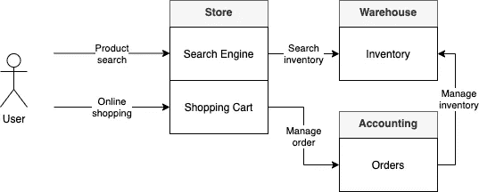
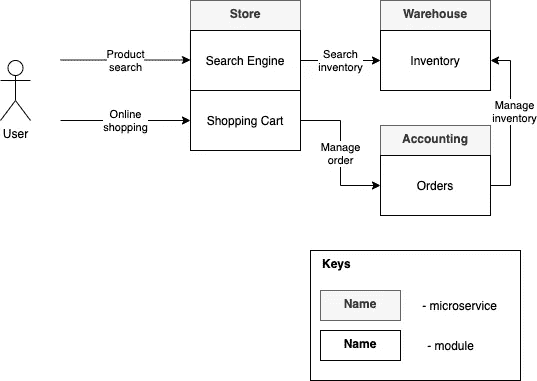

# 是不是每个工程师都要懂 UML？

> 原文：<https://medium.com/geekculture/does-every-engineer-have-to-know-uml-9995da132d48?source=collection_archive---------25----------------------->

## 如何在记录软件设计时保持平衡

软件文档是最保守的话题之一，尤其是在敏捷世界中。敏捷宣言说，你必须拥有超越全面文档的工作软件。但是这是否意味着你根本不需要为你的软件编写文档呢？相当没有

所有种类的软件文档都需要覆盖涉众的需求，但这并不意味着你的项目需要在所有方面都被记录。此外，这很可能意味着您只需要记录重要的和不明显的决策。

大多数时候，工程师和建筑师使用图表以最方便的方式来表达他们的设计。当我说到图表时，我首先想到的是 UML。但是，这是唯一可以用来记录软件的符号吗？当然没有

# 记号

记录你的设计有三个符号。UML 是最熟悉的符号之一，但即使考虑到它有许多不同的图类型，并且对每种类型中的块和关系有非常清楚的定义，它也是**半形式化**符号。

这意味着你不能从文档本身自动生成任何软件的工作片段，但是它被广泛使用，因为 UML 给了我们一个结构化的和清晰的方法来描述我们的架构和它的方面。正式的符号是什么？有很多与**正式**类相关的符号，但是在所有项目中使用它是相当昂贵的，而且没有意义。其中一个你可以读到的是 [AADL](https://en.wikipedia.org/wiki/Architecture_Analysis_%26_Design_Language)

当然，我们的文档有一个非正式的符号。我想你至少听说过一次框图和线图。如果没有——你刚刚读到过:)但是如果我们认真地谈，这是最广泛使用的图表类型。它没有任何限制，可以应用于你想要的各种信息。但是如果它很酷，我们为什么需要 UML 呢？

# 块和线

首先，让我们简单地看一下非正式符号，以了解我们可以用它做什么，以及它的组成部分是什么。正如在任何符号中一样，在非正式符号中，我们有**块**——组件、模块、环境等，以及它们之间的关系——**行**。

正如你所看到的，即使没有 UML，我们也可以构建一个很好的图表来显示用户和系统之间的交互，但是有些东西仍然不清楚。积木是什么意思？模块和类？服务和组件？这里有假设的空间，我们唯一忘记的是键，为了让我们的图更清晰。关键字应该描述特定图片中的块和线的含义。

在这里，好多了。让我们回到我们的问题，如果我们可以使用非正式符号，为什么我们需要知道 UML？

# 结论

非正式符号在制作图表时给了你一些自由，但是有了这种自由，你必须承诺描述你选择的所有类型的块和线，以给你的利益相关者一个你想要展示给他们的清晰的视觉。

另一方面，UML 给你已经定义的框架，很可能你的涉众已经知道，或者至少他们可以自由地找到它的描述。像 OOD 模式一样，它给你一个字典，你可以使用它，并确保它被广泛使用和识别。

老实说，选择哪一个取决于你，没有一个正确的方法。对于 99%的非正式符号就足够了，但是没有哪种情况下你不能应用 UML 来代替方块图和线图，所以如果你不知道 UML——你已经知道如何处理你的图来使它们变得清晰，但是如果你想让你的生活变得更容易并且发展你的文档技能——UML 是一个很好的方法。

> 感谢您阅读本文！
> 
> 如果你想让我继续写关于软件文档、设计、SDLC 和所有相关主题的文章，请随意鼓掌，订阅并留下你的评论。