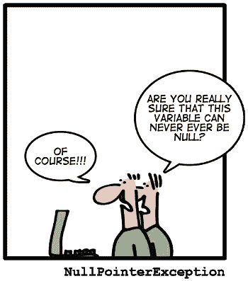

# java.util.Optional 是单子吗？

> 原文：<https://medium.com/geekculture/does-java-util-optional-is-monad-492911fb66ee?source=collection_archive---------1----------------------->

## 简短的回答是:是的(差不多)。但这是意想不到的结果。



让我们从什么是单子的定义开始:

“我们可以将*单子*定义为:

*   一个参数化的类型`M<T>`:用 Java 术语来说就是`public class M<T>`。
*   一个*单元*函数，这是一个工厂函数，用于从元素`public <T> M<T> unit(T element)`中生成*单子*。
*   一个*绑定*操作，该方法采用一个*单子*以及一个将元素映射到*单子*的函数，并返回将该函数应用于包装在*单子*中的值的结果:

```
public static <T, U> M<U> bind(M<T> monad, Function<T, M<U>> f) {
    return f.apply(monad.wrappedValue());
}
```

*   这就是关于*单子*的全部知识吗？不完全是，但是现在已经足够了。

…

`Optional` *本身* [使](http://mail.openjdk.java.net/pipermail/lambda-dev/2013-February/008314.html)有资格成为*单子*，尽管[在 *Java 8* 库团队中遇到一些阻力](http://mail.openjdk.java.net/pipermail/lambda-dev/2013-February/008305.html)。让我们看看它如何符合上述 3 个属性:

*   `M<T>`是`Optional<T>`。
*   单元功能是`Optional.ofNullable`。
*   绑定操作是`Optional.flatMap`。

这样看来`Optional`确实是*单子*对吧？没那么快。

…

任何职业，要真正成为一个单子，都必须遵守三条法则:

1.  *左恒等式*，将单位函数应用到一个值上，然后将得到的*单子*绑定到函数`f`上，与对同一个值调用`f`是一样的:让`f`是一个函数，返回一个*单子*，然后`bind(unit(value), f) === f(value)`。
2.  *右恒等式*，将单元函数绑定到一个*单子*并不会改变*单子*:假设`m`是一个单子值(一个`M<T>`的实例)，那么`bind(m, unit) === m`。
3.  *结合律*，如果我们有一个一元函数应用的链，它们如何嵌套并不重要:`bind(bind(m, f), g) === bind(m, x -> g(f(x)))`。

左右恒等保证了对一个值应用一个*单子*将会包装它:这个值不会改变，也不会改变*单子*。最后一个法则保证一元合成是结合的。所有的法则一起使代码更有弹性，防止反直觉的程序行为，这种行为依赖于如何和何时创建*单子*以及如何和以何种顺序组成将用于映射*单子*的函数。

……`Optional<T>`有这些属性吗？

让我们通过检查属性 1，*左标识*:【否，上下文示例】来了解一下

```
Function<Integer, Optional<Integer>> f = x -> {
    if (x == null) {
        x = -1;
    } else if (x == 2) {
        x = null;
    } else {
        x = x + 1;
    }
    return Optional.ofNullable(x);
};
// true, Optional[2] === Optional[2]
Optional.of(1).flatMap(f).equals(f.apply(1));
// true, Optional.empty === Optional.empty
Optional.of(2).flatMap(f).equals(f.apply(2)); 
```

这适用于空结果和非空结果。用`null`喂两边怎么样？

```
// **false [counter-example!]**Optional.ofNullable((Integer) null).flatMap(f)
                                   .equals(f.apply(null));
```

这有点出乎意料。让我们看看会发生什么:

```
// prints "Optional.empty"
System.out.println(Optional.ofNullable((Integer) null).flatMap(f));     
// prints "Optional[-1]"
System.out.println(f.apply(null));
```

所以，总而言之，`Optional`到底是不是*单子*？严格地说，它不是一个行为良好的单子，因为它不遵守单子定律。然而，因为它确实[满足了*单子*的定义](http://mail.openjdk.java.net/pipermail/lambda-dev/2013-February/008314.html)，它可以被认为是一个单子，尽管它有一些错误的方法。

…

如果你认为我们在`flatMap`上运气不好，那就等着看`map`会发生什么吧。

***当我们在使用***`***Optional.map***`*`***null***`***的时候也被映射成*** `***Optional.empty.***` **假设我们把第一次映射的结果再映射成另一个函数。那么当第一个函数返回** `**null**` **时，第二个函数根本不会被调用。相反，如果我们将初始的** `**Optional**` **映射到两个函数的组合中，结果会大不相同。**【粗体是我的】看看这个例子来澄清一下:*

```
*Function<Integer, Integer> f = x -> (x % 2 == 0) ? null : x;
Function<Integer, String > g = y -> y == null ? "no value" 
                                              : y.toString();// A value that f maps to null - this breaks .map
Optional<Integer> opt = Optional.of(2);opt.map(f).map(g);      // Optional.emptyopt.map(f.andThen(g));  // "no value"*
```

***通过组合函数** `**f**` **和** `**g**` **(使用方便的** `[**Function::andThen**](https://docs.oracle.com/javase/8/docs/api/java/util/function/Function.html#andThen-java.util.function.Function-)` **)我们得到的结果与我们逐个应用它们得到的结果不同**【粗体是我的】。一个更明显的例子是，如果参数是`null`，第一个函数返回`null`，第二个函数抛出`NullPointerException`。然后，重复的`map`工作正常，因为第二个方法从未被调用，但是组合抛出了异常。*

*所以，`Optional::map`打破了结合律。这比`flatMap`破左同一律还要惨…*

# *`Optional`有什么蹊跷？*

*问题是，按设计非空的`Optional` s 不能容纳`null`。毕竟，你可能会合理地反对它被设计来摆脱`null`:事实上`Optional.of(null)`将抛出一个`NullPointerException`。当然`null`值仍然是常见的，所以引入`ofNullable`是为了避免我们在所有代码中重复相同的 if-null-then- `empty` -else- `of`检查。然而——这是所有邪恶的本质——`Optional.ofNullable(null)`被翻译成`Optional.empty`。*

*最终结果是，如上所示，以下两种情况会导致不同的结果:*

*   *在将一个值包装到`Optional`之前应用一个函数；*
*   *首先将值包装到一个`Optional`中，然后将其映射到同一个函数中。*

*这听起来很糟糕:这意味着我们应用函数的顺序很重要。当我们使用`map`时，正如我们看到的，情况变得更糟，因为我们也失去了结合不变性，甚至函数的组成方式也很重要。*

*反过来，这些问题使得在重构过程中添加 bug 不仅可能，甚至容易得令人害怕。*

*…*

# *实际影响*

*除了关于`Optional`性质的理论争议外，`Optional::map`和`Optional::flatMap`违反单子定律的事实还有很多实际后果。这反过来又阻止了我们自由地应用函数组合，因为如果我们一个接一个地应用两个函数，或者直接应用它们的组合，我们会得到相同的结果。*

*这意味着我们不能再自由地重构我们的代码，并确保结果不会改变:可怕的后果可能不仅出现在您的代码库中，而且——甚至更糟——出现在您客户的代码中。在重组你的代码之前，你需要知道每个人的代码中使用的 *anywhere* 函数是否处理`null`，否则你可能会引入错误。*

*[https://www . site point . com/how-optional-breaks-the-monad-laws-and-why-it-matters/](https://www.sitepoint.com/how-optional-breaks-the-monad-laws-and-why-it-matters/)*

*请随意参考上面的链接，获取真实的例子。还有一些被跳过的部分。*