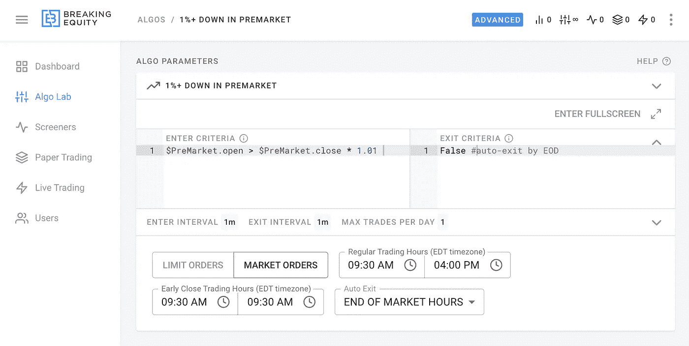
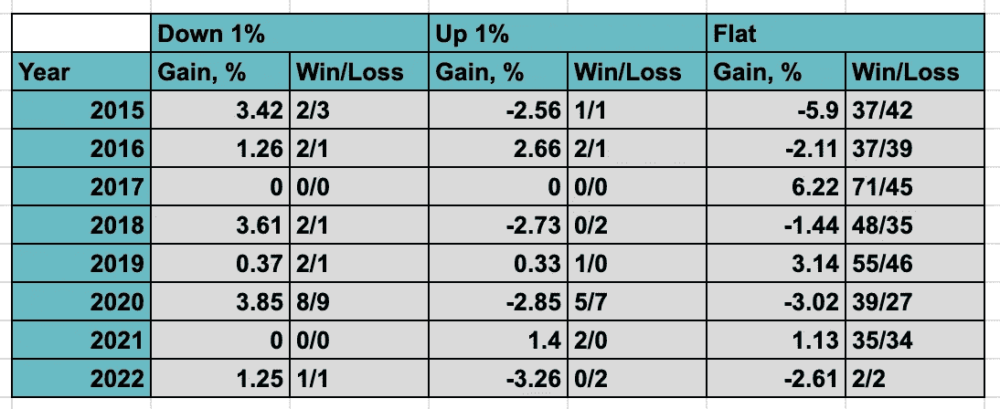

# 盘前价格行为能告诉你什么吗:一项股票交易研究

> 原文：<https://medium.com/geekculture/does-pre-market-price-action-tell-you-anything-a-stock-trading-study-f405e8aa73aa?source=collection_archive---------20----------------------->

## 在这项研究中，我探索了盘前的股票价格运动是否可以提供一天将会如何的任何迹象。

# 为什么要上市前？

盘前是一个激动人心的时刻，当你开始看着你的屏幕，看看发生了什么。有很多信息可以消费:新闻、报告、图表……你可以继续列举。在这项研究中，我探索了盘前市场的价格变动是否能提供一天将会如何的任何迹象。

# 设置

至于如何建立这样的研究，有无限的可能性，但我决定把重点放在$SPY 上，它通常被用作市场整体表现的近似值。

**从 2015 年到 2022 年共测试了 3 种设置**

*   上市前增长 1%以上
*   上市前下跌 1%以上
*   盘前持平(开盘和收盘误差在 0.1%以内)

**交易条件**

*   每天交易 10，000 美元
*   仅交易$SPY
*   如果条件满足，在 9:30 买入
*   不要在收盘前交易

Strategy setup in [https://www.breakingequity.com/](https://www.breakingequity.com/)

**结果**

显然，市场不喜欢盘前下跌 1%以上，并试图在过去 7 年的大部分交易时段恢复。其余的似乎只是与今年的牛熊情绪相关。

Annual Performance 2015–2022 (so far)

*所有的计算都是使用*[*https://www.breakingequity.com/*](https://www.breakingequity.com/)*进行的。*[*Breaking Equity*](http://breakingequity.com/)*是散户用来建立、买卖策略的算法交易平台和市场。它通过让算法变得更加实惠和包容，确保散户投资者利用对冲基金的技术和数据，从而创造了公平的竞争环境。*